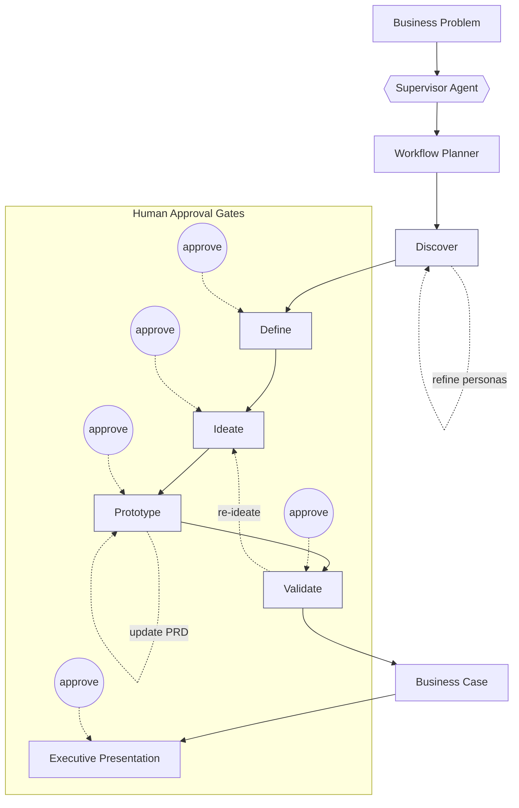
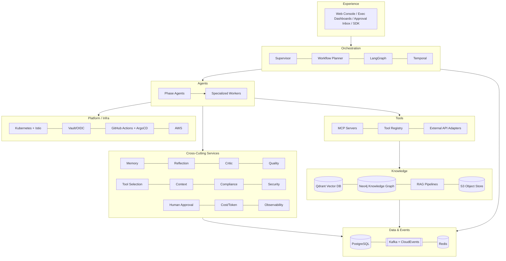

# Enterprise Design Thinking AI Platform (EDT Platform)

> Autonomously execute the complete Design Thinking lifecycle — **Discover → Define →
> Ideate → Prototype → Validate** — with a fleet of collaborating AI agents coordinated
> by a Supervisor Agent, turning a raw business problem into validated product concepts,
> an MVP prototype, and executive-ready documentation.

Built to Fortune-500 standards: planning, layered memory, reflection, critique,
self-correction, human-approval checkpoints, RAG, MCP tools, A2A inter-agent
communication, a knowledge graph + vector DB, durable workflow orchestration,
enterprise security, Responsible AI, and full explainability.

---

## 1. What it does

Feed the platform a business problem. The Supervisor plans a run, fans out to
specialized agents per phase, critiques and self-corrects their work, pauses at
human-approval gates, loops when validation demands it, and emits ~30 governed
artifacts — from personas and journey maps to a PRD, prototype, business case, and
executive summary.



## 2. Architecture at a glance

Eight layers, ~95 agents, all independently deployable as **A2A** services.



Details: [`docs/01-architecture.md`](docs/01-architecture.md).

## 3. Technology stack

| Concern | Choice |
|---|---|
| Agent runtime | **Anthropic Claude** (Opus 4.8 reasoning · Sonnet 5 default · Haiku 4.5 fast) via the Claude Agent SDK / Messages API |
| Agent graph / durable workflow | **LangGraph** (stateful graphs, loops, checkpoints) + **Temporal** (durable runs, human-approval signals) |
| API | **FastAPI** + Pydantic v2 · SSE for live progress |
| Inter-agent | **A2A protocol** (Agent Cards + JSON-RPC) · tools via **MCP** |
| Events | **Kafka** + **CloudEvents 1.0** + Schema Registry |
| Stores | **PostgreSQL** · **Qdrant** (vector) · **Neo4j** (graph) · **Redis** · **S3** |
| RAG | Hybrid (BM25 + Voyage dense) + Anthropic **Contextual Retrieval** + rerank + **GraphRAG** |
| Guardrails / RAI | PII redaction (Presidio) · injection/jailbreak screening · JSON-schema output contracts |
| Observability | **OpenTelemetry** · **Langfuse** · Prometheus/Grafana · Loki · structlog |
| Evaluation | **promptfoo** · **DeepEval** · **RAGAS** · LLM-as-Judge panels |
| Delivery | **Docker** · **Kubernetes/Helm** · **Istio** · **KEDA** · **ArgoCD** · **Terraform** on AWS |

## 4. Quickstart

```bash
# 1. Install (Python 3.11+)
make dev                      # pip install -e ".[dev]"

# 2. Run the offline test suite (no external services, fakes injected)
make test                     # 5 tests: full lifecycle runs end-to-end

# 3a. Launch the WEB DASHBOARD — no API key needed (demo mode)
make dashboard                # open http://localhost:8080
#     → enter a problem, watch all 5 phases execute live, inspect artifacts,
#       approve/reject human-approval gates. See §4.1.

# 3b. Watch a lifecycle in the terminal instead
make demo                     # pretty-prints every artifact by phase

# 4. Run a real lifecycle with Claude (needs an Anthropic key)
export EDT_LLM_ANTHROPIC_API_KEY=sk-ant-...
make run                      # edt run "<problem>" --depth lite

# 5. Full local stack (Postgres, Redis, Qdrant, Neo4j, Kafka, MinIO + API)
make stack && curl localhost:8080/healthz
```

The reference implementation runs the **entire five-phase pipeline** against in-memory
fakes so you can see the orchestration, reflection/critique loops, approval gates, and
feedback loops without any infrastructure — then swap in real backends via env vars.

### 4.1 The dashboard — visualize & execute the whole cycle

**No setup? Open the browser demo.** [`web/index.html`](web/index.html) is a
self-contained, single-file version that runs the whole lifecycle client-side — open it
in any browser, or host it on GitHub Pages via the [`pages`](.github/workflows/pages.yml)
workflow (Settings → Pages → Source: GitHub Actions → served at
`https://<owner>.github.io/<repo>/`). See [`web/README.md`](web/README.md).

**Full backend.** `make dashboard` serves the single-page **Design Thinking Command
Center** at `http://localhost:8080` (from `src/edt_platform/api/dashboard.html`, served by
the FastAPI control plane). It works in **demo mode with no API key** and switches to
**live** automatically when `EDT_LLM_ANTHROPIC_API_KEY` is set.
> Note: `localhost:8080` is the machine running `make dashboard`. In a remote/cloud
> session that's the container, not your laptop — run it locally, or use the browser demo
> above.

What you can do in it:

- **Kick off a run** from any business problem, choosing depth (`lite`/`standard`/`deep`)
  and whether to enforce human-approval gates.
- **Watch the five phases execute live** — phase cards light up as each runs (fed by real
  CloudEvents over Server-Sent Events), with a streaming event log.
- **See artifacts appear per phase** and click any one to open a drawer showing its full
  content, producing agent, model tier, and confidence score.
- **Approve or reject** each human-approval gate interactively; the run blocks until you
  decide, then continues (or halts on reject).
- **Live token/cost meter**: tokens and estimated cost animate upward as each agent
  completes, alongside status, artifact count, and loop count.
- **Run-history sidebar**: every run is listed and **persisted** (survives restarts —
  SQLite by default, PostgreSQL in production); click one to revisit its artifacts and
  metrics read-only.
- **Compare runs**: pick any two runs and see them side by side — metrics and per-phase
  artifact counts.
- **Export**: download the whole run as a Markdown report, artifacts as JSON, or a
  polished **server-rendered PDF** (ReportLab: cover, per-phase sections, artifact content).

The dashboard is backed by these control-plane endpoints (all in `api/app.py`):
`POST /v1/runs` · `GET /v1/runs` (history) · `GET /v1/runs/{id}` ·
`GET /v1/runs/{id}/artifacts` · `GET /v1/runs/{id}/events` (SSE) ·
`POST /v1/runs/{id}/approvals` · `GET /v1/runs/{id}/export` (Markdown) ·
`GET /v1/runs/{id}/export.pdf` (native PDF).

**Persistence** is configured by `EDT_STORE_HISTORY_URL` — defaults to
`sqlite+aiosqlite:///./data/edt.db` (zero infra); set it to a
`postgresql+asyncpg://…` DSN for a shared, HA history store in production.

## 5. Repository map

```
docs/            20 numbered, implementation-ready deliverables + openapi.yaml
prompts/         Versioned, eval-gated prompt library (per phase)
src/edt_platform Orchestrator + agents + memory/RAG/tools/MCP/A2A + API + security + eval
mcp_servers/     Reference MCP tool servers
deploy/          Dockerfile, docker-compose, Helm chart, Terraform (AWS)
tests/           Offline pytest suite (full-lifecycle smoke)
```

Full breakdown: [`docs/09-folder-structure.md`](docs/09-folder-structure.md).

## 6. The 20 deliverables

| # | Deliverable | Doc |
|---|---|---|
| 1 | Overall Architecture | [01-architecture](docs/01-architecture.md) |
| 2 | Agent Catalog (all ~95 agents) | [02-agent-catalog](docs/02-agent-catalog.md) |
| 3 | Workflow Diagrams | [03-workflow](docs/03-workflow.md) |
| 4 | Agent Interaction Sequences | [04-agent-interaction-sequence](docs/04-agent-interaction-sequence.md) |
| 5 | Memory Architecture | [05-memory-architecture](docs/05-memory-architecture.md) |
| 6 | RAG Architecture | [06-rag-architecture](docs/06-rag-architecture.md) |
| 7 | MCP Architecture | [07-mcp-architecture](docs/07-mcp-architecture.md) |
| 8 | Tool Architecture | [08-tool-architecture](docs/08-tool-architecture.md) |
| 9 | Folder Structure | [09-folder-structure](docs/09-folder-structure.md) |
| 10 | Prompt Library | [10-prompt-library](docs/10-prompt-library.md) |
| 11 | Agent Specifications (25-field) | [11-agent-specifications](docs/11-agent-specifications.md) |
| 12 | API Specification | [12-api-specification](docs/12-api-specification.md) · [openapi.yaml](docs/openapi.yaml) |
| 13 | Data Model | [13-data-model](docs/13-data-model.md) |
| 14 | Event Model | [14-event-model](docs/14-event-model.md) |
| 15 | Deployment Architecture | [15-deployment-architecture](docs/15-deployment-architecture.md) |
| 16 | Evaluation Framework | [16-evaluation-framework](docs/16-evaluation-framework.md) |
| 17 | Example Execution | [17-example-execution](docs/17-example-execution.md) |
| 18 | Sample Outputs | [18-sample-outputs](docs/18-sample-outputs.md) |
| 19 | Future Enhancements | [19-future-enhancements](docs/19-future-enhancements.md) |
| 20 | Production Readiness Checklist | [20-production-readiness-checklist](docs/20-production-readiness-checklist.md) |

## 7. System principles → components

| Principle | Where it lives |
|---|---|
| Agentic AI / Planning | `orchestration/` Supervisor + Workflow Planner; `BaseAgent.plan()` |
| Memory (long-term) | `memory/memory_agent.py` — 5 layers (working/episodic/semantic/procedural/graph) |
| Reflection / Critique / Self-correction | `BaseAgent.reflect/critique/self_correct`; `agents/crosscutting/critic.py` |
| Human approval | `orchestration/supervisor.py` gates + Temporal approval signals |
| RAG | `rag/retriever.py` (hybrid + GraphRAG) |
| MCP / Tool calling | `mcp/client.py` + `tools/registry.py` |
| A2A communication | `a2a/agent_card.py` (Agent Cards + JSON-RPC tasks) |
| Knowledge Graph / Vector DB | Neo4j + Qdrant adapters; `knowledge/`, `memory/` |
| Workflow orchestration | LangGraph graphs + Temporal durable workflow |
| Enterprise security | `security/guardrails.py`, Vault/OIDC, Istio mTLS |
| Responsible AI / Explainability | `Provenance` + `Confidence` on every artifact; Responsible-AI agent; guardrails |
| Cost / Token optimization | `core/llm.py` model routing + cost accounting; governance budgets |

## 8. Quality bar built in

The platform **thinks before acting**, challenges assumptions, flags missing information,
asks clarifying questions only when required, self-critiques and iterates, scores
confidence on every artifact, explains its reasoning via provenance/citations, and
enforces enterprise governance at every gate. See
[`docs/16-evaluation-framework.md`](docs/16-evaluation-framework.md).

## 9. Status

This repository is an **implementation-ready reference**: the full orchestration loop,
core agent runtime, two specialized agents, the Critic, memory/RAG/tools/MCP/A2A
interfaces, guardrails, evaluation harness, control-plane API, and deployment assets are
implemented and pass an offline end-to-end test. The remaining specialized agents are
scaffolded as prompt-driven generic workers and are filled in incrementally against the
specs in [`docs/11-agent-specifications.md`](docs/11-agent-specifications.md) — without
changing the orchestrator.

## License
Apache-2.0 — see [LICENSE](LICENSE).
