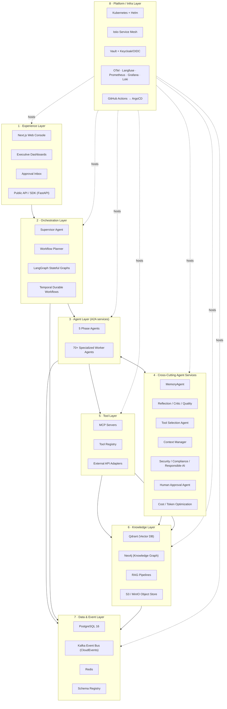
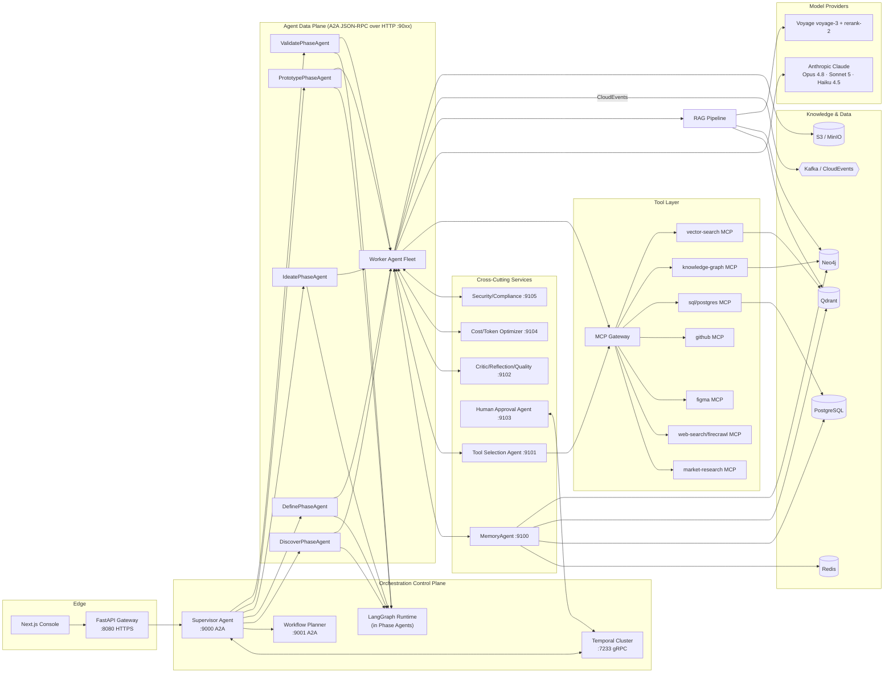
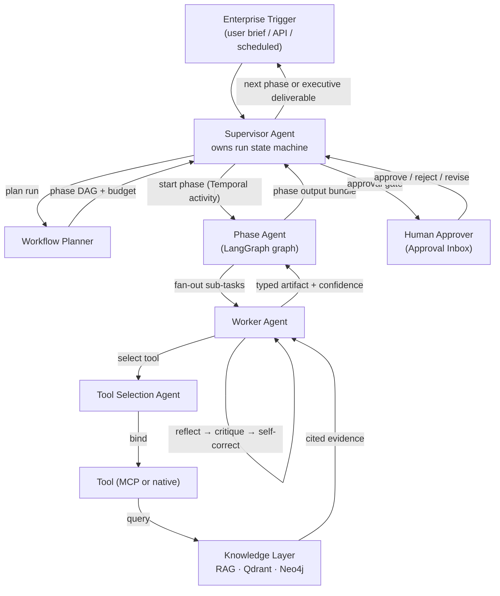
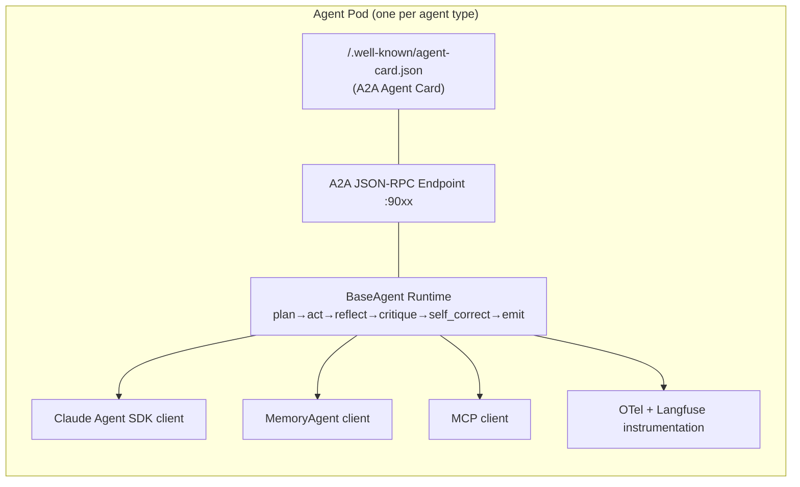
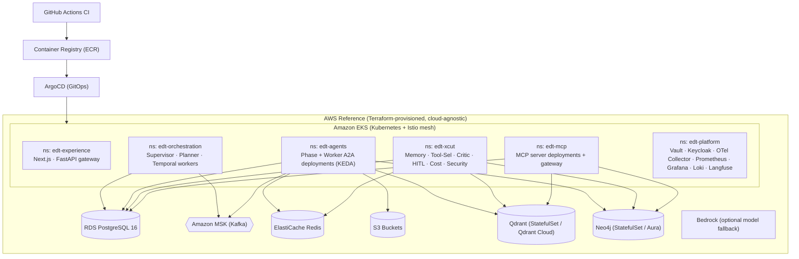

# 01 — Overall Architecture

> **Product:** Enterprise Design Thinking AI Platform (`edt_platform`)
> **Scope:** System-of-systems architecture for autonomously executing the Design Thinking
> lifecycle (Discover → Define → Ideate → Prototype → Validate) with collaborating,
> independently deployable AI agents.
>
> **Related docs:** [04 — Agent Interaction Sequences](./04-agent-interaction-sequence.md) ·
> [05 — Memory Architecture](./05-memory-architecture.md) ·
> [06 — RAG Architecture](./06-rag-architecture.md) ·
> [07 — MCP Architecture](./07-mcp-architecture.md) ·
> [08 — Tool Architecture](./08-tool-architecture.md)

---

## 1. Architectural North Star

The EDT Platform is a **multi-agent, event-driven, durable-workflow system**. A run is a
long-lived business process (hours to days, spanning human approvals) that must be
resumable, auditable, cost-governed, and secure to Fortune-500 standards. Three
non-negotiable properties shape every decision:

1. **Durability over cleverness** — every phase transition, human gate, and agent turn
   survives process restarts. Temporal owns the durable spine; LangGraph owns the
   in-phase reasoning graph.
2. **Agents as products** — each agent is an independently deployable **A2A service**
   (own container, own Agent Card, own scaling profile) so teams can ship, version, and
   scale agents without redeploying the platform.
3. **Everything is evidence** — every artifact carries `confidence`, `provenance`, and
   `approvals[]`; every retrieval carries citations; every decision is traced (OTel +
   Langfuse). Explainability is a first-class output, not an afterthought.

---

## 2. The Eight Architecture Layers



| # | Layer | Responsibility | Canonical Tech |
|---|-------|----------------|----------------|
| 1 | **Experience** | Human interaction, approvals, dashboards, programmatic access | Next.js, FastAPI, Uvicorn, Pydantic v2 |
| 2 | **Orchestration** | Run lifecycle, planning, durable execution, phase transitions | Supervisor Agent, Workflow Planner, LangGraph, Temporal |
| 3 | **Agent** | Domain work: 5 Phase Agents + specialized Worker Agents | Claude Agent SDK, A2A protocol |
| 4 | **Cross-Cutting Agent Services** | Memory, reflection, critique, quality, security, HITL, cost | MemoryAgent, Reflection/Critic/Quality agents, Tool Selection Agent |
| 5 | **Tool** | Tool exposure, discovery, permissioning, external integration | MCP servers, Tool Registry, adapters |
| 6 | **Knowledge** | Semantic + graph knowledge, RAG, artifacts | Qdrant, Neo4j, GraphRAG, S3/MinIO |
| 7 | **Data & Event** | System of record, event backbone, cache, contracts | PostgreSQL 16, Kafka, Redis, Schema Registry |
| 8 | **Platform / Infra** | Runtime, mesh, secrets, identity, observability, CI/CD | K8s, Istio, Vault, Keycloak, OTel, ArgoCD |

---

## 3. Top-Level Component Diagram



---

## 4. Supervisor → Phase → Worker → Tool → Knowledge → Enterprise Flow

The canonical execution path for producing any artifact. It is intentionally uniform so
observability, cost accounting, and guardrails apply at every hop.



**Hop-by-hop contract**

1. **Enterprise → Supervisor:** a `RunRequest` (brief, org, constraints, budget cap) enters
   via FastAPI, is persisted to Postgres, and starts a **Temporal `DesignThinkingRun`
   workflow**. The Supervisor Agent is the workflow's decision brain.
2. **Supervisor → Workflow Planner:** the planner decomposes the run into a phase DAG,
   assigns model tiers per task, sets per-phase token/cost budgets, and returns a plan the
   Supervisor stores as the run's execution graph.
3. **Supervisor → Phase Agent:** each phase runs as a Temporal child workflow that hosts a
   **LangGraph** graph. The Phase Agent owns intra-phase state, loops, and checkpoints.
4. **Phase → Worker:** the Phase Agent fans out to Worker Agents over **A2A** (JSON-RPC 2.0).
   Each worker is independently deployable and horizontally scaled.
5. **Worker → Tool:** the worker asks the **Tool Selection Agent** to bind the best tool for
   the sub-task; tools resolve to **MCP servers** or native functions (see
   [08 — Tool Architecture](./08-tool-architecture.md)).
6. **Tool → Knowledge:** tools read/write the **Knowledge Layer** — hybrid RAG over Qdrant,
   GraphRAG over Neo4j, artifacts in S3 (see [06 — RAG](./06-rag-architecture.md)).
7. **Worker self-improvement:** every worker runs `reflect() → critique() → self_correct()`
   before emitting. Below-threshold confidence triggers retry or escalation.
8. **Phase → Supervisor → Human:** phase output bundles hit an **approval gate** implemented
   as a **Temporal signal** (see [04 — Sequences](./04-agent-interaction-sequence.md)).

---

## 5. Agents as Independently Deployable A2A Services

Every agent — the Supervisor, the 5 Phase Agents, all Worker Agents, and every cross-cutting
service — is a standalone microservice implementing the **Agent2Agent (A2A) protocol**:
JSON-RPC 2.0 over HTTP, an **Agent Card** for discovery, and `tasks`/`messages` semantics.



**Agent Card (example — `CustomerResearchAgent`)**

```json
{
  "protocolVersion": "0.2",
  "name": "CustomerResearchAgent",
  "description": "Synthesizes qualitative customer research into pain points and needs.",
  "url": "https://agents.edt.internal/customer-research",
  "provider": { "organization": "EDT Platform", "phase": "discover" },
  "version": "3.4.1",
  "capabilities": { "streaming": true, "pushNotifications": true, "stateTransitionHistory": true },
  "defaultInputModes": ["application/json", "text/plain"],
  "defaultOutputModes": ["application/json"],
  "skills": [
    {
      "id": "extract-pain-points",
      "name": "Extract Pain Points",
      "description": "Extract and cluster customer pain points from interview transcripts.",
      "inputModes": ["text/plain", "application/json"],
      "outputModes": ["application/json"],
      "tags": ["discover", "voc", "pain-points"]
    }
  ],
  "securitySchemes": { "oidc": { "type": "openIdConnect", "openIdConnectUrl": "https://keycloak.edt.internal/realms/edt/.well-known/openid-configuration" } }
}
```

**Why A2A per agent (design rationale)**

- **Independent lifecycle:** ship `IdeaCriticAgent v2` without touching the Prototype phase.
- **Independent scaling:** the `MarketResearchAgent` (I/O-bound, MCP-heavy) and the
  `IdeaScoringAgent` (compute/LLM-bound) get separate KEDA profiles.
- **Polyglot & partner extensibility:** a partner or another BU can register a conformant
  A2A agent by publishing an Agent Card — no shared codebase required.
- **Blast-radius isolation:** an Istio circuit breaker on one agent doesn't cascade.

Contrast with **MCP**: MCP connects an agent to *tools/data/resources*; A2A connects
*agents to each other*. They compose — a worker uses MCP to reach a patent database and A2A
to hand its findings to the `ResearchSynthesizerAgent`. See
[07 — MCP Architecture](./07-mcp-architecture.md).

---

## 6. Deployment Topology at a Glance



- **Autoscaling:** HPA on CPU/latency for stateless agents; **KEDA** scales worker
  deployments on **Kafka consumer lag** (`edt.*` topics) and Temporal task-queue depth.
- **Traffic:** Istio mTLS between all pods; north-south via ALB → Istio ingress gateway.
- **State:** Postgres = system of record; Redis = working memory/locks/rate-limits; Qdrant +
  Neo4j = knowledge; S3 = artifact blobs. Temporal persists workflow state independently.
- **Environments:** `dev` (Redpanda, MinIO, single-node Qdrant/Neo4j) → `staging` → `prod`
  (MSK, S3, HA Qdrant/Neo4j), promoted by ArgoCD.

---

## 7. Quality Attributes

| Attribute | Mechanisms | Targets / Notes |
|-----------|-----------|-----------------|
| **Scalability** | Stateless A2A agents behind K8s; KEDA on Kafka lag + Temporal queue depth; per-agent scaling; Qdrant sharding; Neo4j read replicas; Redis cluster | 500+ concurrent runs; linear worker scale-out; back-pressure via Kafka |
| **Resilience** | Temporal durable execution + retries + saga/compensation; Istio circuit breakers, retries, outlier detection; idempotent CloudEvents (dedupe keys); DLQs; multi-AZ | Run survives pod/node loss; RPO≈0 for run state (Temporal + Postgres); RTO < 5 min |
| **Security** | Keycloak OIDC/OAuth2, RBAC/ABAC; Vault secrets + dynamic DB creds; Istio mTLS; Presidio PII redaction; guardrails (Llama-Guard-style + NeMo-style policy); audit log of every tool call & approval | Zero standing DB credentials; least-privilege per-agent tool scopes; full audit trail |
| **Cost** | Model routing (Opus/Sonnet/Haiku) by task complexity; prompt caching; token budgets per run/phase; Cost & Token Optimization agents; Haiku for extraction, Opus only for critique/deep reasoning | Per-run budget cap enforced; Langfuse cost dashboards; cache hit-rate SLO |
| **Observability** | OTel traces across A2A + MCP hops; Langfuse LLM traces/evals; Prometheus metrics; Grafana dashboards; Loki logs; structlog | End-to-end trace per run_id; token/cost/latency per agent turn |
| **Explainability** | Provenance on every artifact; citations on every retrieval; reasoning traces stored; confidence scores; Responsible-AI checks in Validate | Executive deliverables carry evidence chains |
| **Governance / Responsible AI** | Compliance Agent, Responsible AI Agent, human approval gates, bias/fairness checks, model/data lineage | Gate before every executive deliverable |

---

## 8. Key Design Decisions (ADR summary)

| # | Decision | Rationale | Rejected Alternative |
|---|----------|-----------|----------------------|
| ADR-01 | **Temporal for the durable spine; LangGraph inside phases** | Runs span days + human gates; need crash-safe resumable state. LangGraph gives ergonomic in-phase loops/checkpoints but isn't a durable enterprise workflow engine. | Pure LangGraph (loses cross-restart durability & saga); pure Temporal (clumsy for tight reasoning loops) |
| ADR-02 | **Every agent is an A2A microservice** | Independent deploy/scale/version; partner extensibility; blast-radius isolation. | Monolithic agent process (couples releases, single scaling profile) |
| ADR-03 | **MCP for all tool/data access** | Standardized tool contracts, discoverability, auth boundary; swap providers without agent code changes. | Bespoke SDK calls per integration (brittle, no uniform auth/audit) |
| ADR-04 | **Kafka + CloudEvents event backbone** | Decoupled agents, replayable audit log = episodic memory, KEDA autoscaling signal. | Synchronous-only calls (tight coupling, no replay) |
| ADR-05 | **Qdrant primary vector DB, Neo4j for GraphRAG** | Best-of-breed: Qdrant for hybrid dense+sparse ANN; Neo4j for entity/relationship reasoning. pgvector kept as fallback. | Single store for both (weak at one) |
| ADR-06 | **Model routing across Opus 4.8 / Sonnet 5 / Haiku 4.5** | 5–20× cost delta; match tier to task complexity; Opus reserved for critique/deep reasoning. | Single-tier (either too costly or too weak) |
| ADR-07 | **Anthropic Contextual Retrieval + hybrid + rerank** | Materially higher retrieval precision on enterprise corpora; reduces hallucination. | Naive top-k dense retrieval |
| ADR-08 | **Human approval as Temporal signals** | Durable wait for humans without holding compute; auditable gate. | Polling/DB-flag hacks (fragile, non-durable) |
| ADR-09 | **Custom MemoryAgent over 5 layered stores** | Design Thinking needs cross-project reuse (semantic) + graph reasoning + replayable episodes; no single off-the-shelf store fits. | Single vector store as "memory" (loses graph + procedural + episodic) |
| ADR-10 | **Confidence + provenance on every artifact** | Enables self-correction thresholds, human trust, and explainable executive deliverables. | Opaque outputs |

---

## 9. System Principles → Concrete Component Mapping

Every mandated system principle maps to a named, buildable component.

| # | System Principle | Concrete Component / Mechanism | Layer | Deep-dive doc |
|---|------------------|--------------------------------|-------|---------------|
| 1 | **Agentic AI** | `BaseAgent` runtime (`plan→act→reflect→critique→self_correct→emit`); 5 Phase + 70+ Worker A2A agents | 3 | — |
| 2 | **Planning** | Workflow Planner (run DAG, budgets, model routing) + per-agent `plan()` (ReAct + Plan-and-Solve) | 2/3 | [04](./04-agent-interaction-sequence.md) |
| 3 | **Memory** | MemoryAgent over 5 layers (Redis/Postgres+Kafka/Qdrant/procedural registry/Neo4j) | 4/6/7 | [05](./05-memory-architecture.md) |
| 4 | **Reflection** | `reflect()` step (Reflexion pattern); Reflection Agent service `:9102` | 3/4 | [04](./04-agent-interaction-sequence.md) |
| 5 | **Critique** | Critic Agent (Opus 4.8) + Idea Critic; `critique()` step scoring quality/risk | 3/4 | [04](./04-agent-interaction-sequence.md) |
| 6 | **Self-correction** | `self_correct()` loop; confidence-threshold-driven retry inside LangGraph | 3 | [04](./04-agent-interaction-sequence.md) |
| 7 | **Human approval** | Human Approval Agent + Approval Inbox + Temporal signal gates after each phase | 1/2/4 | [04](./04-agent-interaction-sequence.md) |
| 8 | **RAG** | Hybrid retrieval (BM25+dense) + Contextual Retrieval + rerank over Qdrant | 6 | [06](./06-rag-architecture.md) |
| 9 | **MCP** | MCP servers + MCP Gateway (stdio + streamable-HTTP); Tool Registry surfaces via MCP | 5 | [07](./07-mcp-architecture.md) |
| 10 | **A2A** | Agent2Agent protocol (JSON-RPC 2.0, Agent Cards) between all agents | 3/4 | [04](./04-agent-interaction-sequence.md) |
| 11 | **Tool calling** | Tool Registry + Tool Selection Agent + Claude tool-use; native + MCP tools | 5 | [08](./08-tool-architecture.md) |
| 12 | **Knowledge graph** | Neo4j (Problem/Persona/Insight/Opportunity/Idea/Requirement/Risk ontology) + GraphRAG | 6 | [06](./06-rag-architecture.md) |
| 13 | **Vector DB** | Qdrant (primary, hybrid dense+sparse), pgvector fallback; Voyage `voyage-3` embeddings | 6 | [06](./06-rag-architecture.md) |
| 14 | **Workflow orchestration** | Temporal durable workflows + LangGraph in-phase graphs; Supervisor Agent | 2 | [04](./04-agent-interaction-sequence.md) |
| 15 | **Long-term memory** | Semantic (Qdrant) + Knowledge-Graph (Neo4j) + Procedural (playbook registry) memory | 6 | [05](./05-memory-architecture.md) |
| 16 | **Enterprise security** | Keycloak OIDC/OAuth2, Vault, RBAC/ABAC, Istio mTLS, Presidio, Security Agent | 8/4 | — |
| 17 | **Responsible AI** | Responsible AI Agent + Compliance Agent + guardrails (Llama-Guard/NeMo-style) + bias checks | 4 | — |
| 18 | **Explainability** | Provenance + citations + reasoning traces + confidence scores; Langfuse; Grafana | 4/6/8 | [06](./06-rag-architecture.md) |

---

## 10. Repository Mapping

| Concern | Path |
|---------|------|
| Python package | `src/edt_platform/` |
| Orchestration (Supervisor/Planner/Temporal/LangGraph) | `src/edt_platform/orchestration/` |
| Phase + worker agents | `src/edt_platform/agents/{discover,define,ideate,prototype,validate,crosscutting,supervisor}/` |
| A2A protocol impl | `src/edt_platform/a2a/` |
| Memory | `src/edt_platform/memory/` — see [05](./05-memory-architecture.md) |
| RAG / knowledge | `src/edt_platform/rag/`, `src/edt_platform/knowledge/` — see [06](./06-rag-architecture.md) |
| MCP clients/servers | `src/edt_platform/mcp/`, `mcp_servers/` — see [07](./07-mcp-architecture.md) |
| Tools | `src/edt_platform/tools/` — see [08](./08-tool-architecture.md) |
| Security/guardrails | `src/edt_platform/security/` |
| Observability | `src/edt_platform/observability/` |
| Deploy (docker/k8s/helm/terraform) | `deploy/` |
| Prompts | `prompts/` |
| CI/CD | `.github/workflows/` |

This document is the anchor; each sibling doc drills into one layer's internals.
