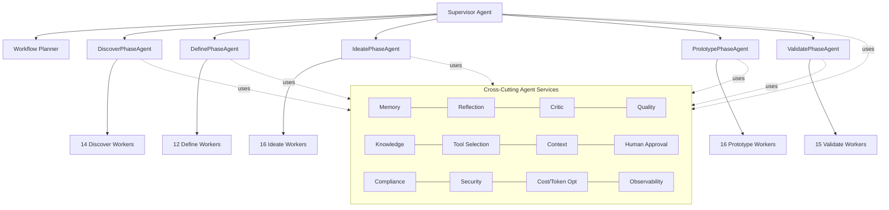

# 02 — Agent Catalog

**Enterprise Design Thinking AI Platform (EDT Platform)** — complete registry of every agent that participates in the autonomous Design Thinking lifecycle (Discover → Define → Ideate → Prototype → Validate).

This catalog is the authoritative index of agents. Detailed 25-field specifications for representative agents live in [`docs/11-agent-specifications.md`](./11-agent-specifications.md); the full prompt bodies live in `prompts/` and the runtime implementations live in `src/edt_platform/agents/`.

---

## 1. Agent Taxonomy — Supervisor → Phase → Worker → Cross-Cutting

EDT Platform is a hierarchical multi-agent system. Every agent is an **independently deployable Agent2Agent (A2A) service** exposing an **Agent Card** (JSON-RPC 2.0 over HTTP) and implementing the standard `BaseAgent` contract: `plan() → act() → reflect() → critique() → self_correct() → emit(artifact)`.

The hierarchy has four tiers:

1. **Supervisor tier (orchestration).** The **Supervisor Agent** and **Workflow Planner** own the end-to-end run. They decompose the enterprise brief into a phase plan, route work over **LangGraph** stateful graphs, drive **Temporal** durable workflows (retries, human-in-the-loop approval signals, saga/compensation), and enforce phase gates.

2. **Phase tier (phase ownership).** Five **Phase Agents** (`DiscoverPhaseAgent`, `DefinePhaseAgent`, `IdeatePhaseAgent`, `PrototypePhaseAgent`, `ValidatePhaseAgent`) each own one phase of the lifecycle. A Phase Agent plans its phase, dispatches to its Worker Agents (in parallel where the dependency graph allows), aggregates their typed artifacts, runs a phase-level critique/quality pass, and requests the human approval gate before advancing.

3. **Worker tier (the work).** ~73 **Specialized Worker Agents** perform the actual Design Thinking activities (problem discovery, persona building, root-cause analysis, HMW framing, SCAMPER ideation, PRD authoring, ROI modeling, go/no-go decisions, …). Each worker consumes upstream artifacts and emits one or more **typed, versioned Pydantic artifacts** (Postgres metadata + S3 blobs, indexed in Qdrant, linked in Neo4j), each carrying a `confidence` score.

4. **Cross-Cutting tier (platform services).** 17 always-on **Cross-Cutting Agents** (memory, reflection, critic, quality, knowledge, tool selection, context, compliance, security, human approval, logging, monitoring, observability, cost/token optimization, plus Supervisor and Workflow Planner) provide shared capabilities invoked by any agent at any tier via A2A/MCP.

**Model-tier routing.** Every row lists a *Primary Model Tier*, assigned by the Cost/Token Optimization layer against task complexity: **Opus 4.8** (`claude-opus-4-8`) for deep reasoning, synthesis, critique and high-stakes decisions; **Sonnet 5** (`claude-sonnet-5`) as the default workhorse for structured generation; **Haiku 4.5** (`claude-haiku-4-5`) for cheap/fast extraction, classification and formatting. Tiers may be escalated at runtime on low-confidence retries.

**Reasoning-strategy legend.** `ReAct` = reason+act tool loop; `PaS` = Plan-and-Solve; `Reflexion` = self-reflective retry; `ToT` = Tree-of-Thought (divergent); `CoT` = chain-of-thought; `Debate` = multi-perspective self-debate; `MapReduce` = fan-out/aggregate synthesis.

---

## 2. Discover Phase — Agent Catalog

Owner: **`DiscoverPhaseAgent`**. Outputs: Problem Space, Pain Points, Personas, Journey Maps, Insights, Opportunity Areas.

| Agent | Purpose (1 line) | Key Inputs | Key Outputs | Primary Model Tier | Key Tools / MCP | Reasoning Strategy |
|---|---|---|---|---|---|---|
| **DiscoverPhaseAgent** | Owns the Discover phase; plans, dispatches, aggregates, and gates discovery work. | Enterprise brief, business goals, prior run memory | Discover phase package + confidence-scored artifact set | Opus 4.8 | `orchestration-mcp`, A2A dispatch, memory-mcp | PaS + ReAct |
| **Problem Discovery Agent** | Frames the raw problem space and candidate problems from the brief and signals. | Brief, stakeholder inputs, market signals | Problem Space doc, candidate problem list | Opus 4.8 | web-research-mcp, memory-mcp, kg-mcp | ReAct + ToT |
| **Customer Research Agent** | Synthesizes primary/secondary customer research into evidence. | Interview notes, surveys, CRM data | Research findings, evidence log | Sonnet 5 | crm-mcp, web-research-mcp, rag-mcp | ReAct |
| **Voice of Customer Agent** | Extracts themes/sentiment from verbatim customer feedback. | Reviews, NPS verbatims, transcripts | VoC theme clusters, sentiment map | Haiku 4.5 | rag-mcp, sentiment-mcp | MapReduce |
| **Support Ticket Analyzer** | Mines support tickets for recurring pain and failure clusters. | Zendesk/ServiceNow tickets | Pain clusters, top-defect list | Haiku 4.5 | ticketing-mcp, rag-mcp | MapReduce |
| **Market Research Agent** | Sizes and characterizes the market (TAM/SAM/SOM, trends). | Industry reports, web, analyst data | Market sizing brief | Sonnet 5 | web-research-mcp, finance-mcp | ReAct |
| **Competitive Intelligence Agent** | Maps competitors, positioning, and gaps. | Competitor sites, filings, news | Competitive landscape matrix | Sonnet 5 | web-research-mcp, kg-mcp | ReAct |
| **Technology Trend Agent** | Identifies relevant emerging tech and adoption curves. | Analyst reports, papers, repos | Tech trend radar | Sonnet 5 | web-research-mcp, arxiv-mcp | ReAct |
| **Patent Research Agent** | Surveys patent/IP landscape and freedom-to-operate signals. | Patent DBs (USPTO/EPO/Google Patents) | Patent landscape, IP risk notes | Sonnet 5 | patent-mcp, web-research-mcp | ReAct |
| **Industry Benchmark Agent** | Benchmarks metrics/practices against industry standards. | Benchmark datasets, analyst KPIs | Benchmark comparison table | Haiku 4.5 | finance-mcp, rag-mcp | ReAct |
| **Persona Builder** | Synthesizes evidence into validated, quantified user personas. | Research findings, VoC, tickets, journeys | Persona artifacts (goals/pains/JTBD) | Sonnet 5 | rag-mcp, kg-mcp, memory-mcp | PaS + Reflexion |
| **Journey Mapping Agent** | Builds end-to-end customer journeys with pain/emotion curves. | Personas, research, VoC | Journey map artifacts | Sonnet 5 | kg-mcp, diagram-mcp | PaS |
| **Stakeholder Analysis Agent** | Maps stakeholders, influence/interest, and needs. | Org charts, brief, interviews | Stakeholder map (power/interest) | Haiku 4.5 | crm-mcp, kg-mcp | ReAct |
| **Business Context Agent** | Captures strategic/financial/regulatory context and constraints. | Strategy docs, financials, policy | Business context brief | Sonnet 5 | finance-mcp, compliance-mcp, rag-mcp | ReAct |
| **Research Synthesizer** | Fuses all Discover outputs into insights and opportunity areas. | All Discover worker artifacts | Insight set, opportunity areas | Opus 4.8 | rag-mcp, kg-mcp, memory-mcp | MapReduce + Reflexion |

---

## 3. Define Phase — Agent Catalog

Owner: **`DefinePhaseAgent`**. Outputs: Root Causes, Problem Statements, Prioritized Opportunities, JTBD, HMW.

| Agent | Purpose (1 line) | Key Inputs | Key Outputs | Primary Model Tier | Key Tools / MCP | Reasoning Strategy |
|---|---|---|---|---|---|---|
| **DefinePhaseAgent** | Owns the Define phase; converges discovery into framed problems. | Discover package, memory | Define phase package | Opus 4.8 | orchestration-mcp, memory-mcp | PaS + ReAct |
| **Insight Synthesizer** | Distills cross-source insights into crisp, prioritized statements. | Discover insights, personas, journeys | Ranked insight statements | Opus 4.8 | rag-mcp, kg-mcp | MapReduce + Reflexion |
| **Affinity Mapping Agent** | Clusters raw observations into affinity themes. | Insights, VoC, pain points | Affinity clusters | Haiku 4.5 | rag-mcp, diagram-mcp | MapReduce |
| **Root Cause Agent** | Identifies underlying root causes behind symptoms. | Pain points, tickets, insights | Root-cause tree, ranked causes | Opus 4.8 | kg-mcp, rag-mcp | ToT + Reflexion |
| **5-Why Agent** | Runs iterative 5-Whys to trace causal chains. | Selected problem/symptom | 5-Why causal chains | Sonnet 5 | kg-mcp | CoT |
| **Fishbone Agent** | Builds Ishikawa cause-and-effect (6M) diagrams. | Problem statement, causes | Fishbone diagram artifact | Sonnet 5 | diagram-mcp, kg-mcp | PaS |
| **Problem Statement Agent** | Authors sharp, testable problem statements. | Root causes, insights, personas | Problem statement artifacts | Sonnet 5 | rag-mcp, memory-mcp | PaS + Reflexion |
| **JTBD Agent** | Formulates Jobs-To-Be-Done (functional/emotional/social). | Personas, journeys, insights | JTBD statements | Sonnet 5 | rag-mcp, kg-mcp | PaS |
| **POV Generator** | Crafts user-centric Point-of-View statements. | Personas, needs, insights | POV statements | Sonnet 5 | rag-mcp | PaS |
| **How-Might-We Generator** | Reframes problems into generative HMW questions. | Problem statements, POV, JTBD | Scored HMW question set | Sonnet 5 | rag-mcp, memory-mcp | ToT |
| **Opportunity Prioritization Agent** | Scores/ranks opportunities (impact/effort/RICE). | Opportunities, business context | Prioritized opportunity backlog | Opus 4.8 | finance-mcp, kg-mcp | PaS + Debate |
| **Risk Discovery Agent** | Surfaces early risks/assumptions to be validated. | Problem space, constraints | Risk & assumption register | Sonnet 5 | compliance-mcp, kg-mcp | ReAct |
| **Constraint Agent** | Captures technical/business/regulatory constraints. | Business context, architecture hints | Constraint set | Haiku 4.5 | compliance-mcp, rag-mcp | ReAct |

---

## 4. Ideate Phase — Agent Catalog

Owner: **`IdeatePhaseAgent`**. Outputs: 100+ concepts, ranked opportunities.

| Agent | Purpose (1 line) | Key Inputs | Key Outputs | Primary Model Tier | Key Tools / MCP | Reasoning Strategy |
|---|---|---|---|---|---|---|
| **IdeatePhaseAgent** | Owns the Ideate phase; drives divergence then convergence. | Define package, HMW, memory | Ideate phase package | Opus 4.8 | orchestration-mcp, memory-mcp | PaS + ToT |
| **Brainstorm Agent** | Generates broad divergent idea volume per HMW. | HMW questions, personas | Raw idea pool | Sonnet 5 | rag-mcp, memory-mcp | ToT |
| **SCAMPER Agent** | Applies SCAMPER lenses to transform seed ideas. | Seed ideas, HMW | SCAMPER-derived ideas | Sonnet 5 | rag-mcp | ToT |
| **TRIZ Agent** | Applies TRIZ inventive principles to contradictions. | Constraints, contradictions | TRIZ solution directions | Opus 4.8 | rag-mcp, kg-mcp | ToT + CoT |
| **First Principles Agent** | Decomposes to fundamentals and rebuilds novel solutions. | Problem statements, constraints | First-principles concepts | Opus 4.8 | kg-mcp, rag-mcp | ToT |
| **Blue Ocean Agent** | Finds uncontested-market moves (ERRC grid). | Competitive landscape, market | Blue-ocean strategy moves | Opus 4.8 | web-research-mcp, finance-mcp | Debate |
| **Reverse Thinking Agent** | Inverts problems to reveal non-obvious ideas. | Problem statements, HMW | Inversion-derived ideas | Sonnet 5 | rag-mcp | ToT |
| **Innovation Agent** | Injects cross-industry analogies and innovation patterns. | Idea pool, trend radar | Analogy-driven concepts | Sonnet 5 | web-research-mcp, kg-mcp | ToT |
| **AI Opportunity Agent** | Identifies where AI/ML uniquely creates value. | Ideas, tech trends, data map | AI-opportunity concepts | Opus 4.8 | rag-mcp, kg-mcp | ReAct + CoT |
| **Business Model Agent** | Frames ideas into business-model canvases. | Concepts, market, pricing hints | Business model canvases | Sonnet 5 | finance-mcp, rag-mcp | PaS |
| **Idea Merger Agent** | Combines complementary ideas into stronger concepts. | Idea pool, clusters | Merged composite concepts | Sonnet 5 | rag-mcp | CoT |
| **Idea Cluster Agent** | Groups ideas into coherent thematic clusters. | Raw idea pool | Idea clusters/themes | Haiku 4.5 | rag-mcp, diagram-mcp | MapReduce |
| **Idea Ranking Agent** | Orders ideas by weighted multi-criteria rank. | Scored ideas, criteria | Ranked idea list | Sonnet 5 | finance-mcp | PaS |
| **Idea Scoring Agent** | Scores ideas on desirability/feasibility/viability. | Concepts, constraints, market | Scored idea matrix | Sonnet 5 | finance-mcp, rag-mcp | CoT |
| **Idea Critic Agent** | Adversarially stress-tests ideas for weaknesses. | Candidate concepts | Critique + risk notes per idea | Opus 4.8 | rag-mcp, memory-mcp | Reflexion + Debate |
| **Idea Refiner Agent** | Improves ideas using critique feedback. | Concepts + critiques | Refined concepts | Sonnet 5 | rag-mcp, memory-mcp | Reflexion |
| **Idea Selector Agent** | Selects the portfolio of concepts to prototype. | Ranked/scored/refined ideas | Selected concept shortlist | Opus 4.8 | finance-mcp, kg-mcp | PaS + Debate |

---

## 5. Prototype Phase — Agent Catalog

Owner: **`PrototypePhaseAgent`**. Outputs: PRD, Wireframes, Architecture, Prototype, User Stories.

| Agent | Purpose (1 line) | Key Inputs | Key Outputs | Primary Model Tier | Key Tools / MCP | Reasoning Strategy |
|---|---|---|---|---|---|---|
| **PrototypePhaseAgent** | Owns the Prototype phase; turns concepts into buildable artifacts. | Selected concepts, constraints | Prototype phase package | Opus 4.8 | orchestration-mcp, memory-mcp | PaS + ReAct |
| **Solution Architect Agent** | Defines the end-to-end solution approach and components. | Selected concept, constraints | Solution architecture brief | Opus 4.8 | kg-mcp, rag-mcp | PaS + ReAct |
| **UX Architect Agent** | Defines UX strategy, IA principles, interaction model. | Personas, journeys, concept | UX architecture spec | Sonnet 5 | figma-mcp, rag-mcp | PaS |
| **Information Architecture Agent** | Structures content, navigation, and taxonomy. | UX spec, content inventory | Sitemap / IA model | Sonnet 5 | figma-mcp, kg-mcp | PaS |
| **Wireframe Agent** | Produces low/mid-fidelity wireframes of key screens. | IA model, user flows | Wireframe set | Sonnet 5 | figma-mcp, diagram-mcp | ReAct |
| **Figma Generator Agent** | Emits Figma-ready design files/components. | Wireframes, UI system | Figma design artifacts | Sonnet 5 | figma-mcp | ReAct |
| **UI Designer Agent** | Applies visual/design-system styling to screens. | Wireframes, brand system | High-fidelity UI screens | Sonnet 5 | figma-mcp | ReAct |
| **User Flow Agent** | Maps task/user flows and state transitions. | Concept, IA, personas | User flow diagrams | Sonnet 5 | diagram-mcp, figma-mcp | PaS |
| **PRD Generator** | Authors the executive-grade Product Requirements Document. | Concept, UX, architecture, JTBD | PRD artifact | Opus 4.8 | rag-mcp, memory-mcp, kg-mcp | PaS + Reflexion |
| **User Story Agent** | Decomposes PRD into INVEST user stories. | PRD, personas, flows | User story backlog | Sonnet 5 | jira-mcp, rag-mcp | PaS |
| **Acceptance Criteria Agent** | Writes testable Gherkin acceptance criteria. | User stories | Acceptance criteria (Given/When/Then) | Haiku 4.5 | jira-mcp | CoT |
| **Architecture Agent** | Specifies technical architecture, deployment, NFRs. | Solution brief, constraints | Technical architecture doc | Opus 4.8 | kg-mcp, rag-mcp | PaS + ReAct |
| **API Designer Agent** | Designs API contracts (OpenAPI) and interfaces. | Architecture, data model | OpenAPI spec | Sonnet 5 | openapi-mcp, kg-mcp | PaS |
| **Data Model Agent** | Designs logical/physical data models and schemas. | Architecture, requirements | ERD / schema artifacts | Sonnet 5 | db-mcp, kg-mcp | PaS |
| **Prototype Generator Agent** | Assembles an interactive clickable prototype. | Wireframes, flows, UI | Interactive prototype | Sonnet 5 | figma-mcp, sandbox-mcp | ReAct |
| **React Generator Agent** | Generates a working React/TypeScript prototype app. | UI screens, API spec | React/TS codebase | Sonnet 5 | code-sandbox-mcp, github-mcp | ReAct + Reflexion |
| **No-Code Builder Agent** | Builds a no-code/low-code equivalent prototype. | Flows, data model, UI | No-code app config | Haiku 4.5 | nocode-mcp | ReAct |

---

## 6. Validate Phase — Agent Catalog

Owner: **`ValidatePhaseAgent`**. Outputs: Validation Report, Business Case, ROI, Roadmap, Executive Summary.

| Agent | Purpose (1 line) | Key Inputs | Key Outputs | Primary Model Tier | Key Tools / MCP | Reasoning Strategy |
|---|---|---|---|---|---|---|
| **ValidatePhaseAgent** | Owns the Validate phase; tests concepts and drives the decision. | Prototype package, market data | Validate phase package | Opus 4.8 | orchestration-mcp, memory-mcp | PaS + ReAct |
| **Customer Simulator Agent** | Simulates realistic customer reactions to the concept. | Prototype, personas | Simulated reaction transcripts | Opus 4.8 | rag-mcp, persona-mcp | ReAct + Debate |
| **Persona Simulation Agent** | Role-plays specific personas to pressure-test fit. | Personas, prototype, tasks | Per-persona feedback | Sonnet 5 | persona-mcp, rag-mcp | ReAct |
| **Survey Generator Agent** | Designs validation surveys and measurement plans. | Hypotheses, personas | Survey instrument | Haiku 4.5 | survey-mcp | PaS |
| **Interview Generator Agent** | Produces interview guides and discussion scripts. | Hypotheses, JTBD | Interview guide | Haiku 4.5 | rag-mcp | PaS |
| **Feedback Analyzer Agent** | Analyzes validation feedback into signals/verdicts. | Survey/interview/sim results | Feedback analysis report | Sonnet 5 | rag-mcp, sentiment-mcp | MapReduce |
| **Market Validation Agent** | Tests demand and product-market-fit signals. | Market data, feedback | Market validation verdict | Opus 4.8 | web-research-mcp, finance-mcp | ReAct + Debate |
| **Financial Analysis Agent** | Builds cost/revenue models and unit economics. | Business model, market sizing | Financial model | Opus 4.8 | finance-mcp, db-mcp | CoT + PaS |
| **Pricing Agent** | Recommends pricing strategy and packaging. | Financials, competitors, WTP | Pricing recommendation | Sonnet 5 | finance-mcp, web-research-mcp | Debate |
| **ROI Agent** | Computes ROI/NPV/IRR and payback. | Financial model, costs | ROI analysis | Opus 4.8 | finance-mcp | CoT |
| **Risk Agent** | Assesses residual delivery/market/execution risk. | Risk register, validation data | Risk assessment matrix | Sonnet 5 | compliance-mcp, kg-mcp | ReAct |
| **Compliance Agent (Validate)** | Checks regulatory/legal/policy compliance of the concept. | Concept, jurisdiction, policies | Compliance verdict | Opus 4.8 | compliance-mcp, legal-mcp | ReAct |
| **Responsible AI Agent** | Evaluates fairness, safety, and AI ethics of the solution. | Concept, data, AI usage | Responsible-AI assessment | Opus 4.8 | responsible-ai-mcp, rag-mcp | ReAct + Debate |
| **Go/No-Go Agent** | Renders the investment go/no-go decision with rationale. | All validation artifacts | Go/No-Go decision record | Opus 4.8 | finance-mcp, kg-mcp, memory-mcp | Debate + Reflexion |
| **Recommendation Agent** | Produces prioritized recommendations and next steps. | Go/No-Go, validation report | Recommendation set | Sonnet 5 | rag-mcp, memory-mcp | PaS |
| **Roadmap Agent** | Builds the phased delivery roadmap and milestones. | Recommendations, backlog, ROI | Roadmap artifact | Sonnet 5 | jira-mcp, diagram-mcp | PaS |

---

## 7. Cross-Cutting Agent Services — Catalog

Always-on platform agents invoked by any tier via A2A/MCP.

| Agent | Purpose (1 line) | Key Inputs | Key Outputs | Primary Model Tier | Key Tools / MCP | Reasoning Strategy |
|---|---|---|---|---|---|---|
| **Supervisor Agent** | Orchestrates the full run; routes, monitors, and enforces gates. | Enterprise brief, run state | Run plan, routing decisions, run status | Opus 4.8 | orchestration-mcp, temporal-mcp, memory-mcp | PaS + ReAct |
| **Workflow Planner** | Decomposes goals into a dependency-ordered agent/task plan. | Brief, capability registry | Executable workflow DAG | Opus 4.8 | orchestration-mcp, kg-mcp | PaS + ToT |
| **Memory Agent** | Manages 5-layer memory: write/consolidate/forget/retrieve. | Artifacts, events, queries | Memory reads/writes, consolidations | Sonnet 5 | memory-mcp, qdrant-mcp, kg-mcp, redis-mcp | ReAct |
| **Reflection Agent** | Reflects on agent outputs to improve before emit (Reflexion). | Draft artifact, task context | Reflection notes, revision guidance | Opus 4.8 | rag-mcp, memory-mcp | Reflexion |
| **Critic Agent** | Independent adversarial critique of any artifact. | Artifact, acceptance criteria | Critique report, pass/fail + score | Opus 4.8 | rag-mcp, kg-mcp | Debate + Reflexion |
| **Quality Agent** | Enforces quality bars, rubrics, and artifact completeness. | Artifact, rubric, schema | Quality score, defect list | Sonnet 5 | rag-mcp, schema-mcp | CoT |
| **Knowledge Agent** | Serves retrieval/GraphRAG across the knowledge layer. | Query, scope, filters | Retrieved evidence + citations | Sonnet 5 | rag-mcp, qdrant-mcp, kg-mcp | ReAct |
| **Tool Selection Agent** | Chooses the right tools/MCP servers for a task. | Task, tool registry | Tool plan / bindings | Haiku 4.5 | tool-registry-mcp | ReAct |
| **Context Manager Agent** | Assembles and budgets the working context window. | Task, memory, token budget | Curated context bundle | Haiku 4.5 | memory-mcp, redis-mcp | PaS |
| **Compliance Agent** | Enforces regulatory/policy compliance across artifacts. | Artifact, policy set, jurisdiction | Compliance verdict + log | Opus 4.8 | compliance-mcp, legal-mcp | ReAct |
| **Security Agent** | Enforces security, secrets, PII redaction, and access. | Requests, artifacts, identity | Security/PII findings, allow-deny | Sonnet 5 | security-mcp, vault-mcp, presidio-mcp | ReAct |
| **Human Approval Agent** | Manages human-in-the-loop approval gates and signals. | Approval request, artifact | Approval decision, gate signal | Sonnet 5 | approval-mcp, temporal-mcp, notify-mcp | ReAct |
| **Logging Agent** | Captures structured logs of agent turns and decisions. | Agent events, spans | Structured log stream | Haiku 4.5 | loki-mcp, otel-mcp | ReAct |
| **Monitoring Agent** | Watches health, SLAs, and anomaly signals. | Metrics, traces, thresholds | Alerts, health status | Haiku 4.5 | prometheus-mcp, otel-mcp | ReAct |
| **Observability Agent** | Correlates traces/metrics/logs into run explainability. | OTel + Langfuse data | Run trace narrative, eval traces | Sonnet 5 | otel-mcp, langfuse-mcp | ReAct |
| **Cost Optimization Agent** | Optimizes spend via routing, caching, batching. | Usage, budgets, task complexity | Model-routing & cost decisions | Haiku 4.5 | cost-mcp, langfuse-mcp | PaS |
| **Token Optimization Agent** | Minimizes tokens via compression, caching, pruning. | Prompts, context, history | Compressed context, cache plan | Haiku 4.5 | token-mcp, redis-mcp | PaS |

---

## 8. Summary — Agents per Phase

| Group | Phase / Owner Agent | Worker Agents | Total Agents |
|---|---|---|---|
| Discover | DiscoverPhaseAgent | 14 | 15 |
| Define | DefinePhaseAgent | 12 | 13 |
| Ideate | IdeatePhaseAgent | 16 | 17 |
| Prototype | PrototypePhaseAgent | 16 | 17 |
| Validate | ValidatePhaseAgent | 15 | 16 |
| Cross-Cutting | — (17 platform services) | 17 | 17 |
| **Total** | **5 phase agents** | **73 workers + 17 cross-cutting** | **95** |

---

## 9. Naming & Deployment Convention

- **One agent = one independently deployable A2A microservice.** Each agent ships as its own container image, Helm release, and Kubernetes Deployment behind an Istio virtual service, autoscaled by **KEDA** on Kafka lag / request load.
- **Agent Card.** Every agent publishes an A2A **Agent Card** at `/.well-known/agent.json` describing its `name`, `version`, capabilities/skills, input/output artifact schemas, supported model tiers, required MCP servers, auth (Keycloak/OIDC), and endpoint. Agents discover and call each other via **A2A (JSON-RPC 2.0 over HTTP)**; tasks and messages are typed.
- **Package & code layout.** Implementations live under `src/edt_platform/agents/<phase>/<agent_name>.py` (e.g. `src/edt_platform/agents/discover/persona_builder.py`); prompt bodies under `prompts/<phase>/<agent_name>.md`; MCP tool servers under `mcp_servers/`.
- **Naming.** Class names are PascalCase and end in `Agent` (e.g. `PersonaBuilderAgent`); the A2A service/DNS name is kebab-case (`persona-builder`); CloudEvents use dotted lowercase types (`edt.discover.persona.created`).
- **Standard contract.** Every agent extends `BaseAgent` and implements `plan() → act() → reflect() → critique() → self_correct() → emit(artifact)`, is config-driven (model tier, tools, MCP servers, memory scopes, guardrails, retry policy, confidence threshold, escalation rules), emits CloudEvents to Kafka, writes to memory via the Memory Agent, and is traced end-to-end via OpenTelemetry + Langfuse.
- **Artifacts.** Outputs are typed, versioned Pydantic models with `id, run_id, phase, type, version, producer_agent, confidence, provenance, created_at, approvals[]`, persisted to Postgres (metadata) + S3 (blobs), indexed in Qdrant, and linked in Neo4j.

> Detailed 25-field specifications for 12 representative agents are in [`docs/11-agent-specifications.md`](./11-agent-specifications.md). All remaining agents follow the identical template; their prompt bodies live in `prompts/` and implementations in `src/edt_platform/agents/`.
