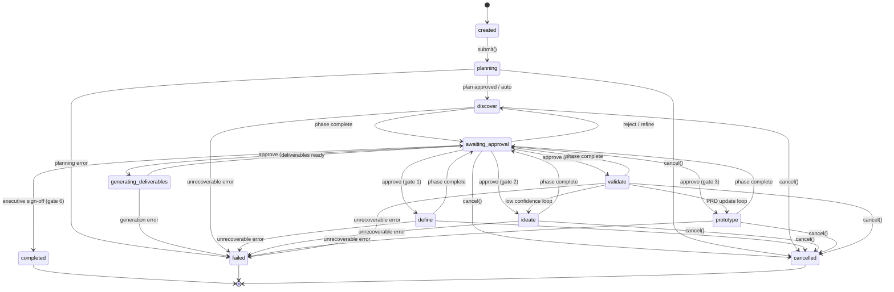
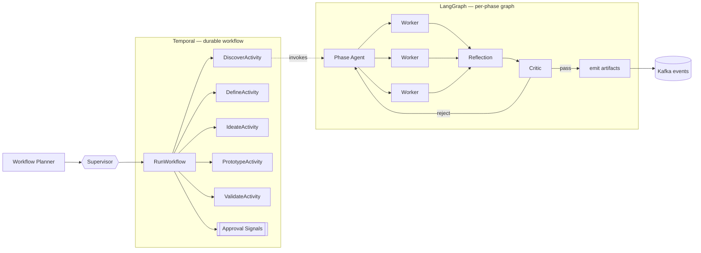
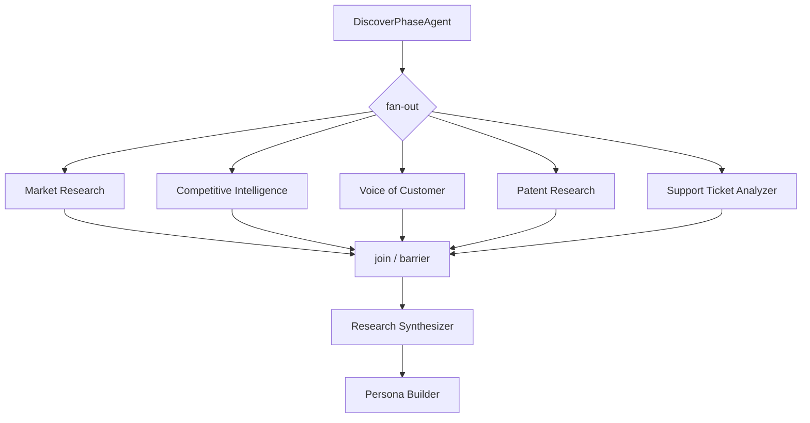
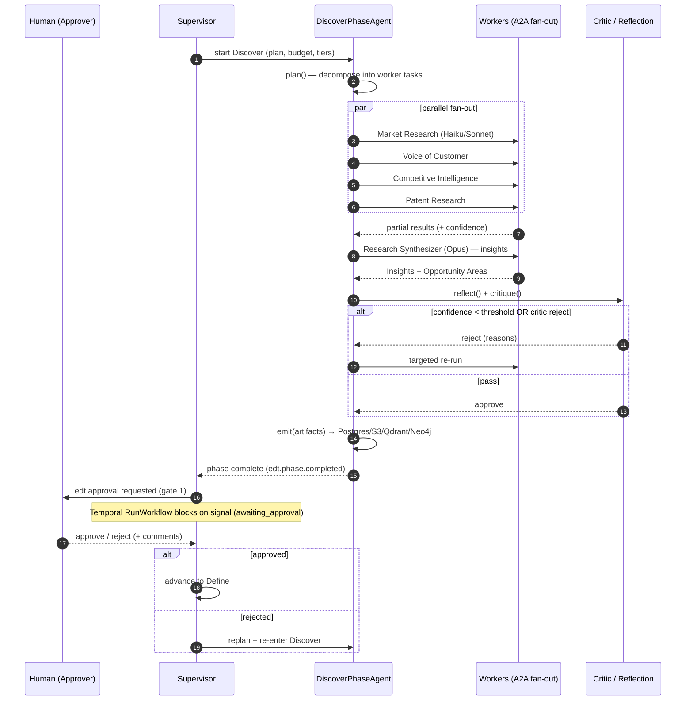

# 03 — Workflow & Diagrams

> **EDT Platform** (`edt_platform`) — Enterprise Design Thinking AI Platform.
> This document is the canonical description of the end-to-end run lifecycle, the
> orchestration model, human-approval gates, feedback loops, and the artifact catalog.
>
> **Related docs:** [`02-architecture.md`](./02-architecture.md) ·
> [`12-api-specification.md`](./12-api-specification.md) ·
> [`13-data-model.md`](./13-data-model.md) ·
> [`14-event-model.md`](./14-event-model.md) ·
> [`10-agents.md`](./10-agents.md) · [`11-memory.md`](./11-memory.md)

---

## 1. Overview

A **Run** is one execution of the Design Thinking lifecycle against a **Business Problem**
for a **Project** in an **Organization**. The lifecycle proceeds through five phases —
**Discover → Define → Ideate → Prototype → Validate** — followed by deliverable generation
(**Business Case → Executive Presentation**). Phases are separated by **human-approval gates**
and connected by **feedback loops** driven by confidence thresholds, critic rejections, and
human feedback.

The lifecycle is orchestrated by the **Supervisor Agent** and **Workflow Planner** over
**LangGraph** (stateful agent graphs, loops, checkpoints) and **Temporal** (durable execution,
retries, human-in-the-loop signals, saga/compensation). Every meaningful transition emits a
**CloudEvents 1.0** event on **Kafka** (see [`14-event-model.md`](./14-event-model.md)).

---

## 2. Full Lifecycle Flowchart

```mermaid
flowchart TD
    BP([Business Problem Intake]) --> PLAN[Workflow Planner<br/>build phase plan + budget]
    PLAN --> SUP{{Supervisor Agent<br/>orchestrates}}

    SUP --> D1

    subgraph DISCOVER["1 · DISCOVER"]
        D1[Problem Discovery + Research<br/>VoC, Market, Competitive, Patents] --> D2[Persona Builder]
        D2 --> D3[Journey Mapping + Stakeholder]
        D3 --> D4[Research Synthesizer<br/>Insights + Opportunity Areas]
    end

    D4 --> G1{{Human Gate 1<br/>approve research?}}
    G1 -->|reject / refine| D1
    G1 -->|approve| DEF1

    subgraph DEFINE["2 · DEFINE"]
        DEF1[Affinity + Root Cause + 5-Why + Fishbone] --> DEF2[Problem Statement + JTBD]
        DEF2 --> DEF3[POV + How-Might-We]
        DEF3 --> DEF4[Opportunity Prioritization + Risk/Constraint]
    end

    DEF4 --> G2{{Human Gate 2<br/>approve problem framing?}}
    G2 -->|reject| DEF1
    G2 -->|refine personas| D2
    G2 -->|approve| ID1

    subgraph IDEATE["3 · IDEATE"]
        ID1[Divergent: Brainstorm, SCAMPER, TRIZ,<br/>First Principles, Blue Ocean, Reverse] --> ID2[Idea Merger + Cluster]
        ID2 --> ID3[Idea Scoring + Ranking]
        ID3 --> IDC{Idea Critic<br/>quality >= threshold?}
        IDC -->|reject| ID1
        IDC -->|pass| ID4[Idea Refiner + Selector]
    end

    ID4 --> G3{{Human Gate 3<br/>approve selected concepts?}}
    G3 -->|reject| ID1
    G3 -->|approve| PR1

    subgraph PROTOTYPE["4 · PROTOTYPE"]
        PR1[Solution + UX + Information Architecture] --> PR2[Wireframe + Figma + UI Designer]
        PR2 --> PR3[PRD + User Story + Acceptance Criteria]
        PR3 --> PR4[API Designer + Data Model + Architecture]
        PR4 --> PR5[Prototype / React / No-Code Generator]
    end

    PR5 --> G4{{Human Gate 4<br/>approve prototype + PRD?}}
    G4 -->|reject| PR1
    G4 -->|approve| VAL1

    subgraph VALIDATE["5 · VALIDATE"]
        VAL1[Customer + Persona Simulation] --> VAL2[Survey + Interview + Feedback Analyzer]
        VAL2 --> VAL3[Market Validation + Financial + Pricing + ROI]
        VAL3 --> VALC{Validation confidence<br/>>= threshold?}
        VALC -->|low confidence| ID1
        VALC -->|update requirements| PR3
        VALC -->|pass| VAL4[Risk + Compliance + Responsible AI + Go/No-Go]
    end

    VAL4 --> G5{{Human Gate 5<br/>approve validation?}}
    G5 -->|reject| VAL1
    G5 -->|approve| DELIV

    subgraph DELIVER["6 · DELIVERABLES"]
        DELIV[Recommendation + Roadmap] --> BC[Business Case]
        BC --> ES[Executive Presentation]
    end

    ES --> G6{{Human Gate 6<br/>executive sign-off}}
    G6 -->|revise| BC
    G6 -->|sign-off| DONE([Run Completed])

    %% continuous improvement loops back into memory
    DONE -.->|learnings| MEM[(MemoryAgent<br/>semantic + graph memory)]
    MEM -.->|reuse cross-project| PLAN

    classDef gate fill:#fde68a,stroke:#b45309,color:#111;
    classDef loop fill:#fecaca,stroke:#b91c1c,color:#111;
    class G1,G2,G3,G4,G5,G6 gate;
    class IDC,VALC loop;
```

**Feedback loops (explicit):**

| Loop | Trigger | Effect |
|------|---------|--------|
| Validate → Ideate | Validation confidence `< 0.7` or Go/No-Go = "No-Go" | Re-enter divergent ideation with validation learnings injected |
| Validate → Prototype (PRD update) | Feedback Analyzer flags feature gaps | Re-run `PRD/User Story/Acceptance` with revised requirements |
| Define → refine Personas (Discover) | Problem framing exposes persona gaps | Re-run Persona Builder with new evidence |
| Ideate critic rejection | `IdeaCriticAgent` rejects (score below bar) | Re-brainstorm / SCAMPER pass |
| Continuous improvement | Run completion | MemoryAgent consolidates insights → semantic/graph memory for future runs |

---

## 3. Run State Diagram

A Run is a durable Temporal workflow. Its lifecycle state is checkpointed in Postgres
(`run.state`) and mirrored in LangGraph state.

> **Note:** `awaiting_approval` is a single logical state parameterized by the *pending gate*
> (`gate_1`…`gate_6`) recorded on the `approval` row. Rejections route back to the phase that
> produced the artifact; the Temporal workflow blocks on an approval **signal**.

State reference:

| State | Meaning | Owner |
|-------|---------|-------|
| `created` | Run row persisted, not yet started | Control plane |
| `planning` | Workflow Planner building phase plan + budget | Workflow Planner |
| `discover` / `define` / `ideate` / `prototype` / `validate` | Phase executing | Phase Agent + Workers |
| `awaiting_approval` | Blocked on a human gate signal | Human Approval Agent |
| `generating_deliverables` | Business Case + Executive Presentation | Deliverable workers |
| `completed` | Executive sign-off received | Supervisor |
| `failed` | Unrecoverable error after retries/compensation | Temporal |
| `cancelled` | Operator/user cancellation | Control plane |

---

## 4. Orchestration: Supervisor + Workflow Planner + Temporal + LangGraph

### 4.1 Responsibilities

| Component | Role |
|-----------|------|
| **Supervisor Agent** | Top-level conductor. Decides which phase runs next, dispatches to Phase Agents, enforces global budget/confidence policy, handles escalations, decides when a feedback loop is warranted. |
| **Workflow Planner** | Turns a Business Problem into a concrete phase plan: which workers, model tiers, tool budget, expected artifacts, gate placement. Replans when a loop fires. |
| **Temporal** | Durable execution backbone. One `RunWorkflow` per run; each phase is a child workflow/activity. Owns retries, timeouts, heartbeats, saga compensation, and **human-approval signals** (blocks `awaiting_approval` until `ApproveSignal`/`RejectSignal`). |
| **LangGraph** | In-phase agent graph. Nodes = agent steps (`plan → act → reflect → critique → self_correct → emit`); edges include conditional loops; state is checkpointed so a phase can resume after interruption. |

### 4.2 Layered coordination

**Flow:** The Supervisor starts the Temporal `RunWorkflow`. For each phase, Temporal launches
a phase activity that hosts the LangGraph graph for that Phase Agent. Workers fan out (A2A
calls), reflect, and pass through the Critic. On phase completion, the workflow raises an
approval request and **blocks on a Temporal signal** until the Human Approval Agent relays the
human decision. On approval it proceeds; on rejection or a triggered loop, the Supervisor asks
the Workflow Planner to replan and re-enters the target phase.

### 4.3 Human-approval gates

- Gates exist after **every phase** and before **executive deliverables** (6 gates total).
- Implemented as a Temporal **signal channel**: `RunWorkflow.await_approval(gate_id)` suspends
  the workflow (state → `awaiting_approval`) and emits `edt.approval.requested`.
- The **Human Approval Agent** surfaces the request in the approval inbox; a reviewer with the
  `approver` role calls `POST /v1/approvals/{id}/approve|reject` (see
  [`12-api-specification.md`](./12-api-specification.md)).
- Decision signal (`edt.approval.granted` / `edt.approval.rejected`) resumes the workflow.
- Gate timeouts (default 72h) escalate per the run's escalation policy.

### 4.4 Parallel worker fan-out

Within a phase, independent workers execute concurrently. Example (Discover):

- Fan-out is a Temporal parallel-activity pattern (bounded concurrency; KEDA scales A2A worker
  pods on Kafka lag). Each worker is an independently deployable **A2A** service.
- A **join barrier** waits for all required workers; optional workers can be `best_effort`.
- The **Cost/Token Optimization** layer assigns model tiers per worker (Haiku for extraction,
  Sonnet default, Opus for synthesis/critique).

### 4.5 How loops are triggered

| Signal | Source | Threshold / Rule | Action |
|--------|--------|------------------|--------|
| Confidence | Artifact `confidence` (0–1) | `< run.confidence_threshold` (default 0.7) | Reflect → retry; if still low, escalate or loop to prior phase |
| Critic rejection | Critic Agent / Idea Critic | verdict = `reject` | Return to divergent step in same phase |
| Human feedback | Approval gate `reject` | reviewer decision + comments | Replan and re-enter target phase with feedback injected |
| Validation gap | Feedback Analyzer / Go-No-Go | feature gap or "No-Go" | Loop to Prototype (PRD update) or Ideate |
| Budget guard | Cost Optimization | cost > run budget cap | Pause → `edt.cost.threshold.exceeded` → human decision |

---

## 5. Output Artifacts (30) mapped to phases

Every artifact is a typed, versioned Pydantic model persisted in Postgres (metadata) + S3
(blobs), indexed in Qdrant, linked in Neo4j (see [`13-data-model.md`](./13-data-model.md)).

| # | Artifact | Type | Phase | Primary Producer |
|---|----------|------|-------|------------------|
| 1 | Problem Space Definition | `problem_space` | Discover | Problem Discovery |
| 2 | Pain Point Catalog | `pain_points` | Discover | Support Ticket Analyzer / VoC |
| 3 | Persona Set | `personas` | Discover | Persona Builder |
| 4 | Journey Maps | `journey_maps` | Discover | Journey Mapping |
| 5 | Stakeholder Map | `stakeholder_map` | Discover | Stakeholder Analysis |
| 6 | Market & Competitive Landscape | `market_landscape` | Discover | Market Research / Competitive Intelligence |
| 7 | Research Insight Set | `insights` | Discover | Research Synthesizer |
| 8 | Opportunity Areas | `opportunity_areas` | Discover | Research Synthesizer |
| 9 | Affinity Clusters | `affinity_map` | Define | Affinity Mapping |
| 10 | Root Cause Analysis | `root_causes` | Define | Root Cause / 5-Why / Fishbone |
| 11 | Problem Statements | `problem_statements` | Define | Problem Statement |
| 12 | Jobs-To-Be-Done | `jtbd` | Define | JTBD |
| 13 | POV Statements | `pov` | Define | POV Generator |
| 14 | How-Might-We Questions | `hmw` | Define | How-Might-We Generator |
| 15 | Prioritized Opportunities | `prioritized_opportunities` | Define | Opportunity Prioritization |
| 16 | Risk & Constraint Register (early) | `risk_register` | Define | Risk Discovery / Constraint |
| 17 | Concept Backlog (100+ ideas) | `idea_backlog` | Ideate | Brainstorm + SCAMPER + TRIZ + … |
| 18 | Clustered Idea Themes | `idea_clusters` | Ideate | Idea Cluster / Merger |
| 19 | Ranked & Scored Ideas | `idea_ranking` | Ideate | Idea Scoring / Ranking |
| 20 | Selected Concepts | `selected_concepts` | Ideate | Idea Selector / Refiner |
| 21 | Solution & Information Architecture | `solution_architecture` | Prototype | Solution Architect / IA |
| 22 | Wireframes | `wireframes` | Prototype | Wireframe / Figma Generator |
| 23 | UI Design & Flows | `ui_design` | Prototype | UI Designer / User Flow |
| 24 | Product Requirements Document (PRD) | `prd` | Prototype | PRD Generator |
| 25 | User Stories & Acceptance Criteria | `user_stories` | Prototype | User Story / Acceptance Criteria |
| 26 | Technical Architecture + API + Data Model | `tech_architecture` | Prototype | Architecture / API Designer / Data Model |
| 27 | Working Prototype (React / No-Code) | `prototype_app` | Prototype | Prototype / React / No-Code Generator |
| 28 | Validation Report | `validation_report` | Validate | Feedback Analyzer / Market Validation |
| 29 | Financials: ROI · Pricing · Business Case | `business_case` | Validate → Deliverables | Financial Analysis / Pricing / ROI |
| 30 | Recommendation · Roadmap · Executive Presentation | `executive_package` | Deliverables | Recommendation / Roadmap / Go-No-Go |

---

## 6. Swimlane — One Phase (Discover)

Actors: **Human**, **Supervisor**, **Phase Agent**, **Workers**. Shows fan-out, reflect/critic
loop, artifact emit, and the approval gate.

---

## 7. Cross-references

- Event names and payloads for every transition above → [`14-event-model.md`](./14-event-model.md).
- Artifact schemas, persistence, and graph links → [`13-data-model.md`](./13-data-model.md).
- REST/A2A/SSE contracts for starting runs and acting on approvals → [`12-api-specification.md`](./12-api-specification.md).
- Agent contracts and the 25-field agent spec → [`10-agents.md`](./10-agents.md).
