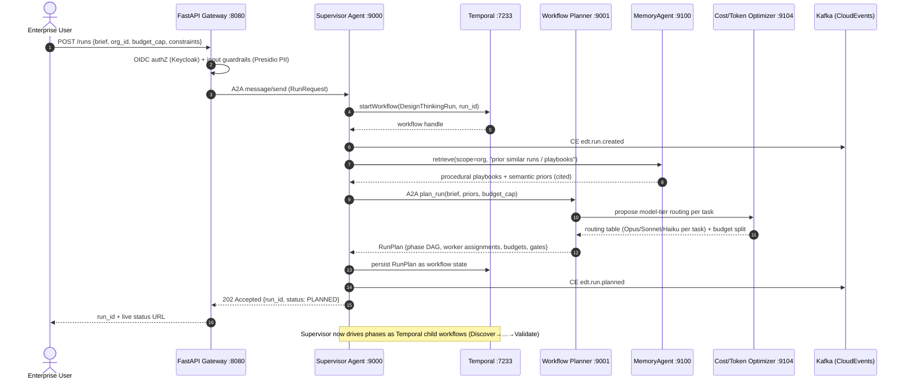
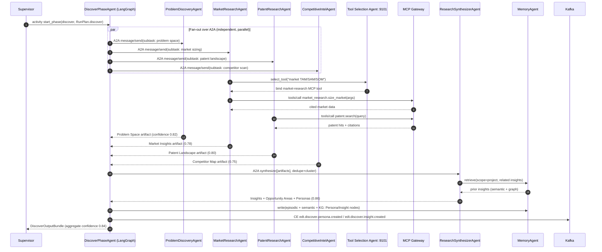
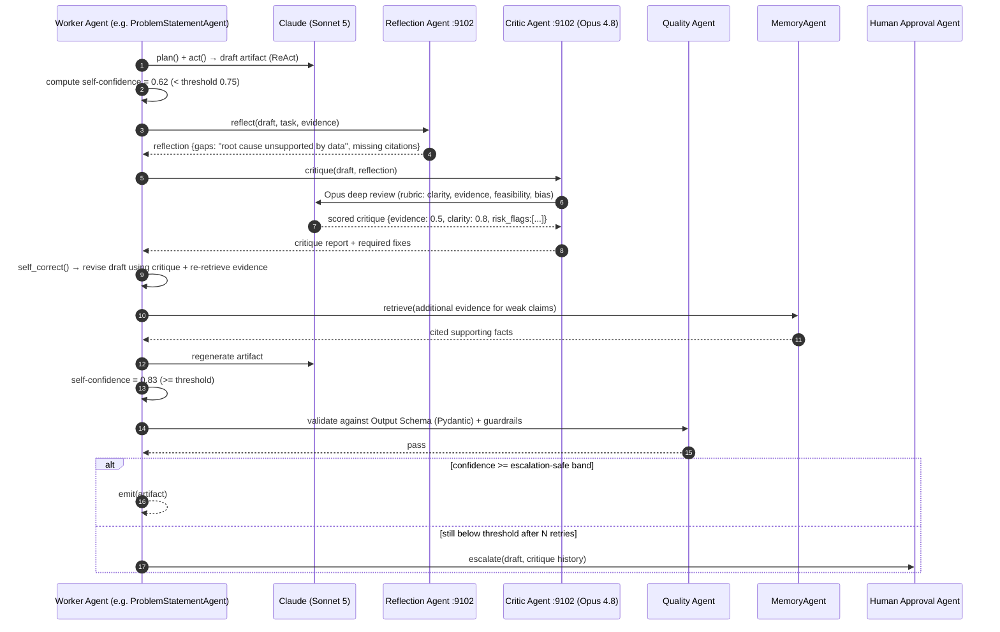
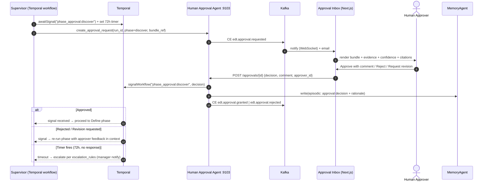
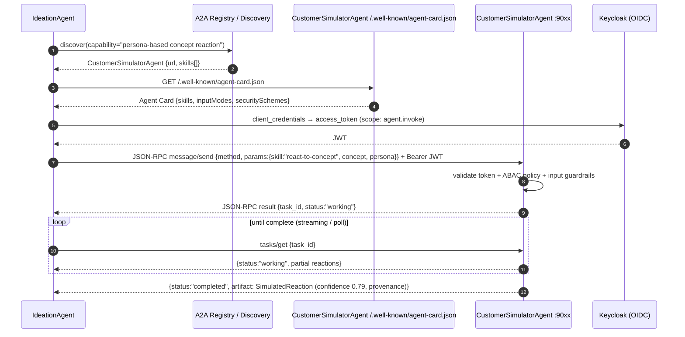

# 04 — Agent Interaction Sequences

> **Scope:** Concrete runtime interactions between the Supervisor, Workflow Planner, Phase
> Agents, Worker Agents, and cross-cutting services. Every diagram is a buildable contract
> using the canonical stack (A2A JSON-RPC, Temporal signals, Kafka CloudEvents, MCP).
>
> **Related docs:** [01 — Architecture](./01-architecture.md) ·
> [05 — Memory](./05-memory-architecture.md) · [06 — RAG](./06-rag-architecture.md) ·
> [07 — MCP](./07-mcp-architecture.md) · [08 — Tools](./08-tool-architecture.md)

**Conventions used below**
- `A2A` = JSON-RPC 2.0 over HTTP to an agent's `:90xx` endpoint (`message/send`, `tasks/get`).
- `CE` = CloudEvents 1.0 published to Kafka (e.g. `edt.discover.persona.created`).
- `signal` = Temporal workflow signal; `activity` = Temporal activity invocation.
- Every LLM call is traced via OTel + Langfuse; every artifact carries `confidence` +
  `provenance` + `approvals[]`.

---

## (a) End-to-End Run Kickoff: Supervisor + Workflow Planner



**Explanation.** The Supervisor is the Temporal workflow's decision brain, not a request
handler — it survives restarts. Before planning it pulls **procedural + semantic memory**
([05](./05-memory-architecture.md)) so the planner reuses prior playbooks. The **Cost/Token
Optimizer** assigns model tiers up front (Haiku for extraction, Sonnet default, Opus for
critique) and splits the budget cap per phase. The `RunPlan` is durably stored as workflow
state; the run then proceeds phase by phase.

---

## (b) Discover-Phase Worker Fan-Out + Research Synthesizer Aggregation



**Explanation.** The Phase Agent is a **LangGraph** graph whose nodes fan out to independent
Worker A2A services in parallel (`par`). Workers reach external data only through the **Tool
Selection Agent → MCP Gateway** path ([07](./07-mcp-architecture.md),
[08](./08-tool-architecture.md)), so all access is permissioned and audited. The
**Research Synthesizer** de-duplicates and clusters across workers, enriches with project
memory, and the Phase Agent persists results into **episodic, semantic, and knowledge-graph**
memory before emitting CloudEvents. Aggregate confidence gates whether the phase proceeds or
loops.

---

## (c) Reflection → Critique → Self-Correction Loop (single agent)



**Explanation.** This is the `plan → act → reflect → critique → self_correct → emit` contract
from `BaseAgent`. **Reflection** (Reflexion pattern) is cheap self-diagnosis; **Critique** is
an independent, higher-tier (**Opus 4.8**) adversarial review against a rubric;
**self-correction** re-retrieves evidence ([06](./06-rag-architecture.md)) and regenerates.
The loop is bounded by a retry budget (`retry_policy`); exhausting it escalates to a human
rather than emitting a low-confidence artifact. Quality Agent enforces the Pydantic output
schema and guardrails before emit.

---

## (d) Human-Approval Checkpoint (Temporal Signal)



**Explanation.** Approval is a **durable wait** — the workflow parks on
`awaitSignal` and consumes **no compute** while waiting, yet survives restarts and can wait
days. The gate carries full evidence (confidence + citations + provenance) so the human
decision is informed and auditable. Rejection feeds approver comments back into the phase's
context for a targeted re-run. A timer enforces SLAs and triggers escalation. Gates exist
after **every phase** and **before every executive deliverable** (per canonical conventions).

---

## (e) A2A Message Exchange Between Two Agents (with Agent Cards)



**Explanation.** Inter-agent calls are **capability-discovered, not hard-coded**. An agent
finds a peer via the registry, fetches its **Agent Card** to learn skills/IO modes/security,
obtains an OIDC token (Keycloak) scoped to `agent.invoke`, then issues a JSON-RPC
`message/send`. The callee enforces token + ABAC + guardrails before working. Long tasks use
A2A `tasks/get` polling or streaming. This is how agents in *different deployments* collaborate
without shared code — see [01 §5](./01-architecture.md).

---

## (f) Validation → Ideation Feedback Loop

```mermaid
sequenceDiagram
    autonumber
    participant SUP as Supervisor
    participant VPA as ValidatePhaseAgent
    participant FA as FeedbackAnalyzerAgent
    participant GNG as Go/No-Go Agent (Opus 4.8)
    participant IPA as IdeatePhaseAgent
    participant IRef as IdeaRefinerAgent
    participant MEM as MemoryAgent
    participant BUS as Kafka

    VPA->>FA: analyze(validation results: sim reactions, market, ROI, risk)
    FA-->>VPA: findings {concept C3 fails pricing, C7 weak differentiation}
    VPA->>GNG: decide(concepts, thresholds)
    GNG-->>VPA: NO-GO for C3/C7; CONDITIONAL for C5 (needs refinement)
    VPA->>MEM: write(KG: Risk + Insight edges; episodic: validation verdict)
    VPA->>BUS: CE edt.validate.nogo / edt.validate.conditional
    alt Concepts salvageable → loop back to Ideate
        VPA->>SUP: request_reentry(phase=ideate, feedback)
        SUP->>IPA: re-open Ideate with validation feedback in context
        IPA->>IRef: refine(C5, constraints from validation)
        IRef->>MEM: retrieve(root causes + JTBD from Define)
        MEM-->>IRef: cited context
        IRef-->>IPA: refined concept C5' (confidence 0.85)
        IPA-->>SUP: updated concept set → re-enter Prototype/Validate
    else All concepts validated
        VPA-->>SUP: ValidationReport + BusinessCase + ROI + Roadmap
        SUP->>BUS: CE edt.run.completed
    end
```

**Explanation.** Design Thinking is iterative, not linear. When validation surfaces failing or
conditional concepts, the **Go/No-Go Agent** (Opus 4.8) applies decision criteria, and the
Supervisor **re-opens an earlier phase** (Temporal supports re-entry as child-workflow
re-invocation). Validation feedback is injected into the Ideate context, and the
**Idea Refiner** pulls Define-phase root causes/JTBD from memory to fix the concept rather
than start over. The loop terminates when concepts pass thresholds, producing the executive
deliverables. Every loop iteration is bounded by the run budget and its own approval gate.

---

## Cross-Cutting Interaction Notes

- **Observability:** every A2A hop and MCP `tools/call` propagates the OTel trace context
  (`traceparent`); Langfuse captures the LLM spans (prompt, tokens, cost, latency) keyed by
  `run_id`/`agent`/`turn`.
- **Idempotency:** CloudEvents carry a dedupe key (`run_id + agent + logical_step`); consumers
  are idempotent so Kafka at-least-once delivery is safe.
- **Back-pressure:** worker deployments scale on Kafka lag + Temporal task-queue depth (KEDA);
  the Supervisor throttles fan-out to respect the run's cost budget.
- **Memory on every step:** reads/writes go through the MemoryAgent APIs
  (`retrieve/write/consolidate/forget`) detailed in [05](./05-memory-architecture.md).
