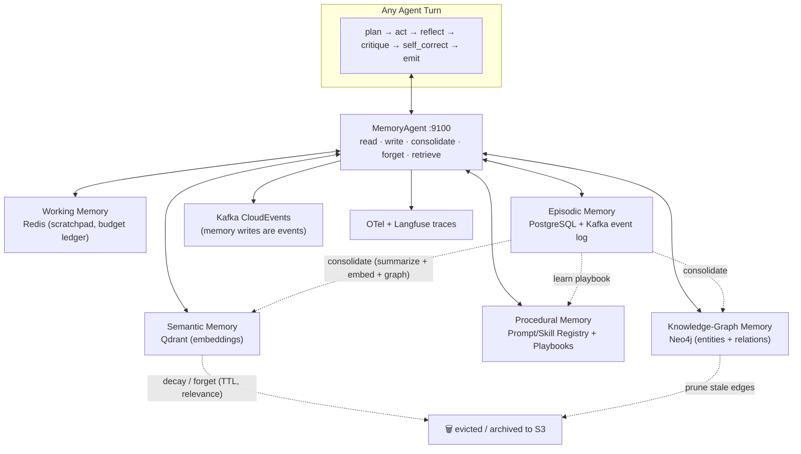
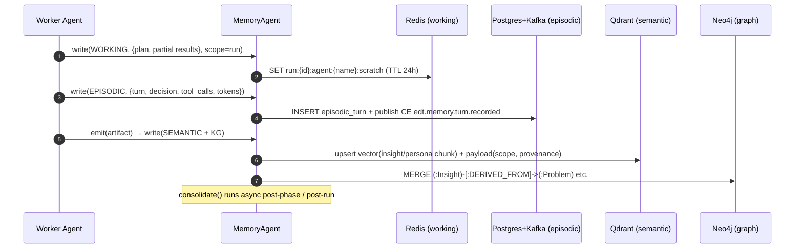
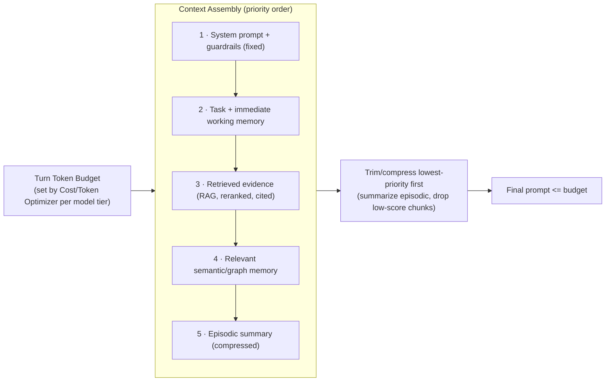
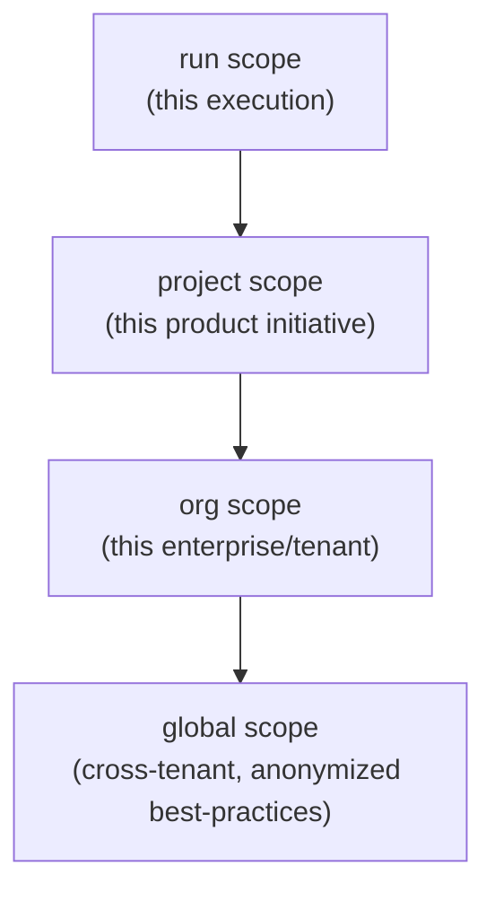
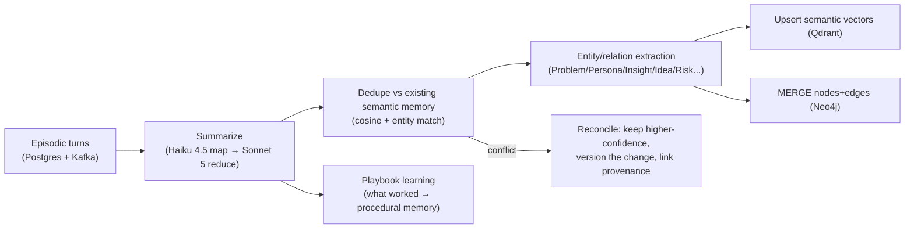

# 05 — Memory Architecture

> **Scope:** The five-layer memory system and the `MemoryAgent` that governs it. Memory is
> what lets EDT reuse insights across projects, resume long runs, ground reasoning, and
> explain decisions.
>
> **Related docs:** [01 — Architecture](./01-architecture.md) ·
> [04 — Sequences](./04-agent-interaction-sequence.md) · [06 — RAG](./06-rag-architecture.md) ·
> [07 — MCP](./07-mcp-architecture.md) · [08 — Tools](./08-tool-architecture.md)
>
> **Package:** `src/edt_platform/memory/`

---

## 1. The Five Memory Layers

| Layer | Store | Holds | Written when | Read by | Lifetime |
|-------|-------|-------|--------------|---------|----------|
| **Working** | **Redis** (`db=working`) | Current task scratchpad, in-flight plan, tool results, context-window budget ledger | Every agent turn / tool result | The active agent turn | Ephemeral — run/session TTL (default 24h) |
| **Episodic** | **PostgreSQL** (`episodic.*` tables) + **Kafka** event log | Run history, agent turns, decisions, approvals, tool calls | On every CloudEvent / decision / artifact emit | Supervisor replay, audit, debugging, consolidation | Retained per policy (default 400d hot, then archive to S3) |
| **Semantic** | **Qdrant** (collections `edt_semantic_*`) | Embedded insights, personas, learnings, playbook outcomes for cross-project reuse | On consolidation / artifact approval | Any agent via RAG; MemoryAgent `retrieve` | Long-term; TTL/decay by scope + relevance |
| **Procedural** | **Prompt/Skill Registry** (Postgres + Git-versioned `prompts/`) + **learned playbooks** | Prompts, skills, reasoning strategies, learned workflows ("how to run a Discover for fintech") | On playbook learning / prompt version bump | Planner, Supervisor, agents at plan time | Versioned; superseded not deleted |
| **Knowledge-Graph** | **Neo4j** (`edt` graph) | Entities (Problem, Persona, Insight, Opportunity, Idea, Requirement, Risk) + relationships + ontology | On artifact creation / synthesis | GraphRAG, MemoryAgent `retrieve`, reasoning | Long-term; pruned by consolidation/forget |



---

## 2. What Is Written When



- **Working** is written continuously during a turn (plan, intermediate tool outputs) and
  read only within that turn; it is the agent's scratchpad and the **context-window budget
  ledger** lives here.
- **Episodic** is append-only: every turn, decision, tool call, approval, and CloudEvent is
  recorded — this *is* the replayable audit log and the raw material for consolidation.
- **Semantic** and **Knowledge-Graph** are written when an artifact is **emitted/approved**,
  so long-term memory reflects validated knowledge, not scratch.
- **Procedural** is written by the consolidation job when a run's approach proves successful
  (a new/updated playbook) or by engineers via versioned prompt commits.

---

## 3. MemoryAgent APIs

The MemoryAgent is a cross-cutting A2A service (`:9100`) and a Python client library. All
methods are scope-aware, traced, and emit CloudEvents.

```python
# src/edt_platform/memory/agent.py  (interface sketch)
class MemoryAgent:

    def read(self, layer: MemoryLayer, key: str, *, scope: Scope) -> MemoryRecord | None:
        """Direct key lookup (mainly WORKING/PROCEDURAL). No embedding."""

    def write(self, layer: MemoryLayer, record: MemoryRecord, *, scope: Scope,
              ttl: timedelta | None = None) -> str:
        """Persist to the layer's store; embeds for SEMANTIC, MERGEs nodes for KG,
           appends + emits CloudEvent for EPISODIC. Returns record_id."""

    def retrieve(self, query: str, *, scopes: list[Scope], layers: list[MemoryLayer],
                 k: int = 12, filters: dict | None = None) -> RetrievalResult:
        """Semantic + graph retrieval with provenance & citations.
           Fuses Qdrant hybrid search + Neo4j GraphRAG (see 06-rag-architecture.md)."""

    def consolidate(self, run_id: str, *, level: str = "phase") -> ConsolidationReport:
        """Summarize episodic turns → durable semantic/graph memory; extract entities to
           Neo4j; learn/refresh playbooks (procedural). Runs async post-phase & post-run."""

    def forget(self, *, scope: Scope, policy: ForgetPolicy) -> ForgetReport:
        """Apply TTL/decay/redaction; evict low-relevance vectors, prune stale KG edges,
           archive episodic to S3, honor GDPR/right-to-be-forgotten requests."""
```

| API | Purpose | Touches | Typical caller |
|-----|---------|---------|----------------|
| `read` | Fast key lookup | Redis, Registry | Active agent turn |
| `write` | Persist a record to the right layer | Redis/Postgres/Kafka/Qdrant/Neo4j | Every agent |
| `retrieve` | Semantic + graph recall with citations | Qdrant + Neo4j (via RAG) | Every agent, Synthesizers |
| `consolidate` | Episodic → long-term; learn playbooks | Postgres → Qdrant/Neo4j/Registry | Async job post-phase/run |
| `forget` | TTL/decay/redaction/compliance | All stores + S3 archive | Scheduler, Compliance Agent |

---

## 4. Context-Window Budgeting

The Context Manager (cross-cutting) + MemoryAgent enforce a per-turn token budget so prompts
stay within model limits and cost caps.



- Budget is derived from the routed model tier (Opus 4.8 largest window, Haiku smallest) and
  the run's remaining cost cap.
- **Priority eviction:** if over budget, the Context Manager compresses episodic summaries,
  then drops lowest-reranked RAG chunks — never the system prompt/guardrails.
- **Prompt caching:** stable system prompts + retrieved corpora use Anthropic prompt caching
  to cut cost; cache keys tracked in the working-memory budget ledger.
- The ledger records `tokens_in`, `tokens_out`, `cache_hits`, `cost` per turn → Langfuse.

---

## 5. Memory Scoping



| Scope | Visibility | Example content | Isolation |
|-------|-----------|-----------------|-----------|
| `run` | Single run | Working memory, this run's episodic turns | Hard — deleted/archived at run end |
| `project` | All runs of an initiative | Personas, insights, root causes reused across iterations | Tenant + project ACL |
| `org` | Whole enterprise tenant | Org playbooks, brand context, prior product learnings | Tenant-isolated (row-level + Qdrant payload filter + Neo4j label) |
| `global` | Cross-tenant, **anonymized only** | Generic Design-Thinking playbooks, method heuristics | PII-stripped; opt-in; no tenant data leaks |

Every store enforces scope: Qdrant payload filters (`scope`, `tenant_id`), Neo4j node labels
+ property filters, Postgres row-level security keyed by `tenant_id`. `retrieve` accepts an
ordered `scopes` list and merges results with scope-priority tie-breaking.

---

## 6. Consolidation & Summarization Strategy

Consolidation turns noisy episodic logs into durable, reusable knowledge — modeled on
LangMem / mem0 patterns.



- **Triggers:** async after each phase (`level="phase"`) and at run end (`level="run"`);
  nightly org-level rollups.
- **Map-reduce summarization:** cheap **Haiku 4.5** summarizes individual turns; **Sonnet 5**
  reduces into a coherent phase/run summary; conflicting facts are reconciled by confidence
  and versioned (never silently overwritten).
- **Dedup/reconcile:** new insights are matched against existing semantic vectors + KG
  entities; duplicates merge (bump `access_count`), conflicts create a versioned update with
  provenance so history is explainable.
- **Playbook learning:** successful run patterns (phase sequences, tool choices, prompts) are
  distilled into procedural playbooks the Workflow Planner reuses ([04(a)](./04-agent-interaction-sequence.md)).

---

## 7. Forgetting / TTL / Decay

| Mechanism | Applies to | Rule |
|-----------|-----------|------|
| **Hard TTL** | Working memory | Redis TTL 24h (run-session); evicted automatically |
| **Episodic retention** | Episodic | 400d hot in Postgres → archived to S3 (Parquet) → cold |
| **Relevance decay** | Semantic | Score = `f(recency, access_count, confidence)`; below floor → evicted/archived |
| **Graph pruning** | Knowledge-graph | Stale, orphaned, or superseded nodes/edges pruned during consolidation |
| **Compliance forget** | All | Right-to-be-forgotten / PII redaction via `forget()` + Presidio; tenant-scoped purge |
| **Supersession** | Procedural | New playbook/prompt versions supersede; old versions retained read-only for audit |

`forget()` is also invoked by the **Compliance Agent** to honor data-subject deletion
requests: it purges matching records across Redis/Postgres/Qdrant/Neo4j/S3 and records the
deletion itself as an (anonymized) episodic event for auditability.

---

## 8. Example Memory Record Schemas

**Episodic turn record (Postgres `episodic.turns`)**

```json
{
  "record_id": "ep_01J8ZQ2",
  "layer": "episodic",
  "run_id": "run_7f3a",
  "project_id": "proj_retail_ai",
  "tenant_id": "org_acme",
  "phase": "discover",
  "agent": "MarketResearchAgent",
  "turn_index": 14,
  "action": "tool_call",
  "detail": {
    "tool": "market-research.size_market",
    "args": {"segment": "SMB fintech", "region": "NA"},
    "result_ref": "s3://edt-artifacts/run_7f3a/market_size.json"
  },
  "decision": "adopt TAM=$4.2B (source: Gartner 2025)",
  "tokens": {"in": 3120, "out": 640, "cache_hits": 2},
  "cost_usd": 0.021,
  "confidence": 0.78,
  "cloudevent_type": "edt.discover.market.sized",
  "trace_id": "0af7651916cd43dd8448eb211c80319c",
  "created_at": "2026-07-17T14:02:11Z"
}
```

**Semantic memory record (Qdrant point payload)**

```json
{
  "record_id": "sem_01J8ZR5",
  "layer": "semantic",
  "scope": "project",
  "tenant_id": "org_acme",
  "project_id": "proj_retail_ai",
  "type": "insight",
  "text": "SMB fintech users abandon onboarding when KYC exceeds 3 steps.",
  "embedding_model": "voyage-3",
  "vector_dim": 1024,
  "source_artifact_id": "art_persona_02",
  "provenance": [
    {"source": "voc_interviews", "citation": "Interview #12, ts 04:31"},
    {"source": "support_tickets", "citation": "TICKET-88213"}
  ],
  "confidence": 0.86,
  "recency": "2026-07-17T14:05:00Z",
  "access_count": 3,
  "decay_score": 0.91,
  "ttl_policy": "relevance-decay"
}
```

**Knowledge-graph memory (Neo4j — Cypher upsert)**

```json
{
  "record_id": "kg_01J8ZS9",
  "layer": "knowledge_graph",
  "scope": "project",
  "cypher": "MERGE (i:Insight {id:'ins_44', tenant:'org_acme'}) SET i.text=$text, i.confidence=0.86 MERGE (p:Persona {id:'per_02'}) MERGE (pr:Problem {id:'prob_01'}) MERGE (i)-[:DERIVED_FROM]->(pr) MERGE (i)-[:AFFECTS]->(p)",
  "entities": ["Insight:ins_44", "Persona:per_02", "Problem:prob_01"],
  "relationships": ["DERIVED_FROM", "AFFECTS"],
  "provenance_ref": "sem_01J8ZR5",
  "created_at": "2026-07-17T14:05:03Z"
}
```

**Procedural playbook record (Registry)**

```json
{
  "record_id": "proc_discover_fintech_v3",
  "layer": "procedural",
  "scope": "org",
  "name": "Discover playbook — fintech SMB",
  "version": "3.0.0",
  "steps": ["VoC intake", "support-ticket clustering", "market sizing", "patent scan", "synthesis"],
  "recommended_tools": ["market-research", "patent", "web-search"],
  "model_routing": {"extraction": "claude-haiku-4-5", "synthesis": "claude-sonnet-5"},
  "learned_from_runs": ["run_5a1", "run_7f3a"],
  "success_metric": "avg artifact confidence 0.85, 1.2 human revisions",
  "supersedes": "proc_discover_fintech_v2"
}
```

Retrieval mechanics (hybrid + GraphRAG) that back `retrieve()` are specified in
[06 — RAG Architecture](./06-rag-architecture.md); the tools agents use to reach these stores
are in [07 — MCP](./07-mcp-architecture.md) and [08 — Tools](./08-tool-architecture.md).
