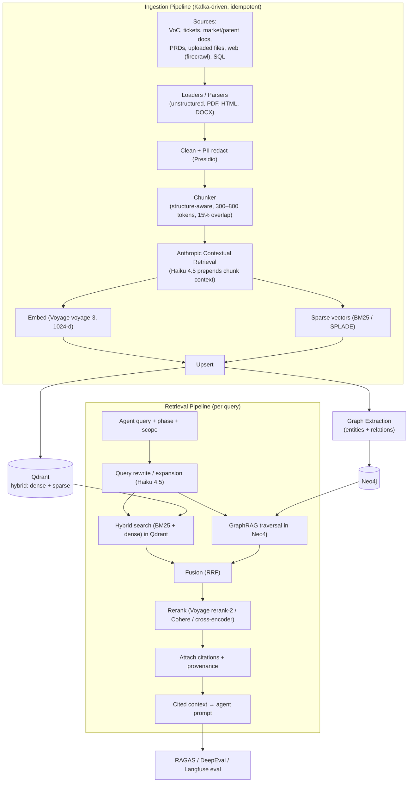
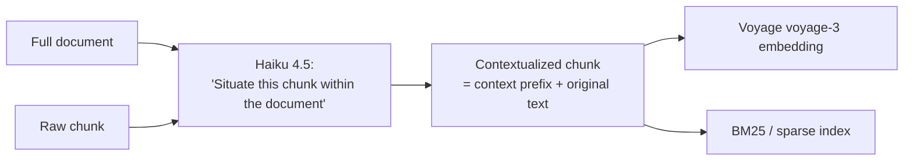
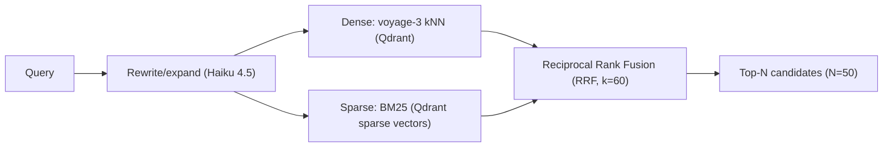
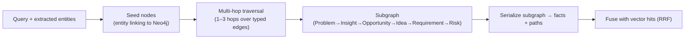
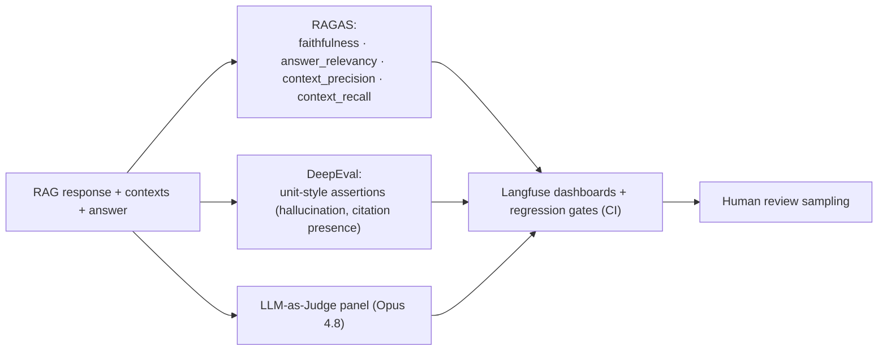

# 06 — RAG Architecture

> **Scope:** Retrieval-Augmented Generation for the EDT Platform — ingestion, chunking,
> Anthropic Contextual Retrieval, hybrid + reranked retrieval, GraphRAG over Neo4j,
> per-phase knowledge sources, citations/provenance, and evaluation.
>
> **Related docs:** [01 — Architecture](./01-architecture.md) ·
> [05 — Memory](./05-memory-architecture.md) · [07 — MCP](./07-mcp-architecture.md) ·
> [08 — Tools](./08-tool-architecture.md)
>
> **Package:** `src/edt_platform/rag/` + `src/edt_platform/knowledge/`

---

## 1. Design Goals

RAG grounds every agent claim in cited evidence. For a Fortune-500 platform the bar is:
**high precision** (wrong evidence = wrong strategy), **provenance on every fact**, **tenant
isolation**, and **measurable faithfulness** (RAGAS). We combine lexical + dense retrieval,
Anthropic **Contextual Retrieval** to preserve chunk context, cross-encoder **reranking**,
and **GraphRAG** for multi-hop reasoning the vector store alone can't do.

---

## 2. End-to-End Pipeline



---

## 3. Ingestion Pipeline

- **Trigger:** ingestion is event-driven — an `edt.knowledge.ingest.requested` CloudEvent (or
  MCP tool `filesystem/artifact` upload) enqueues a document; workers consume from Kafka so
  ingestion autoscales (KEDA) and is idempotent (dedupe on `source_hash`).
- **Loaders/parsers:** `unstructured`-based parsing for PDF/HTML/DOCX/PPTX/CSV; web content
  via the **firecrawl MCP server** ([07](./07-mcp-architecture.md)); relational context via
  the **sql/postgres MCP**.
- **Cleaning + compliance:** **Presidio** redacts PII before anything is embedded or stored;
  tenant + scope tags attached (`tenant_id`, `scope`, `project_id`) for isolation
  ([05 §5](./05-memory-architecture.md)).
- **Provenance capture:** each chunk records `source_uri`, `doc_id`, `page/section`,
  `char_span`, `ingested_at`, `source_hash` — the basis for citations.

---

## 4. Chunking

| Parameter | Value | Rationale |
|-----------|-------|-----------|
| Strategy | Structure-aware (headings/sections first, then token windows) | Preserves semantic units |
| Target size | 300–800 tokens (default 512) | Balances recall vs precision |
| Overlap | ~15% | Avoids boundary loss |
| Table/code | Kept intact as atomic chunks | Prevents fragmentation |
| Metadata | `doc_id, section, span, tenant, scope, phase_hint` | Filtering + citation |

Structure-aware chunking respects document hierarchy (a persona doc's sections stay whole),
falling back to sentence-boundary token windows for prose.

---

## 5. Anthropic Contextual Retrieval

Standard chunks lose their document context ("it grew 40%" — what grew?). Following
Anthropic's **Contextual Retrieval** method, a cheap **Haiku 4.5** call prepends a short,
document-aware context string to each chunk *before* embedding and BM25 indexing.



- Produces **contextual embeddings** + **contextual BM25** — both indexed in Qdrant (dense +
  sparse vectors on the same point).
- The context prefix is stored but **excluded from the cited snippet** shown to users (the
  original span is the citation), preserving faithful provenance.
- Prompt-cached document context keeps the added cost minimal at ingestion time.

---

## 6. Hybrid Retrieval (BM25 + Dense)



- **Dense** (Voyage `voyage-3`, 1024-d) captures semantics; **sparse BM25** captures exact
  terms (product names, error codes, patent numbers) dense retrieval misses.
- Fused with **Reciprocal Rank Fusion** into a top-N candidate set. Qdrant filters enforce
  `tenant_id`/`scope`/`phase` so retrieval never crosses tenant boundaries.
- Fallback: if Qdrant is unavailable, **pgvector** serves dense-only retrieval (degraded).

---

## 7. Reranking

- Top-N (50) candidates are reranked to top-k (default 8–12) by a cross-encoder:
  **Voyage `rerank-2`** (primary) → **Cohere Rerank** → local cross-encoder (fallback chain).
- Reranking scores query-document relevance jointly, sharply improving precision@k and
  cutting the tokens sent to the model (cost + faithfulness win).
- Rerank scores are retained on each chunk and feed the Context Manager's budget trimming
  ([05 §4](./05-memory-architecture.md)) and the citation confidence.

---

## 8. GraphRAG over Neo4j

Vector search finds *similar* text; GraphRAG answers *connected* questions ("which risks trace
to which root causes for persona P across the initiative?").



- **Ontology:** nodes `Problem, Persona, Insight, Opportunity, Idea, Requirement, Risk`
  (+ `Artifact, Source, Run`); typed edges e.g. `DERIVED_FROM, AFFECTS, ADDRESSES,
  PRIORITIZED_AS, MITIGATES, CITES`.
- **Entity linking:** query entities (extracted by Haiku) are linked to graph nodes; traversal
  gathers a bounded subgraph (1–3 hops) which is serialized into explicit fact paths.
- **Fusion:** graph facts + vector chunks are fused (RRF) and reranked together, giving the
  model both prose evidence and structured relationships. Backs the MemoryAgent `retrieve()`
  ([05 §3](./05-memory-architecture.md)).

---

## 9. Per-Phase Knowledge Sources

| Phase | Primary knowledge sources | RAG emphasis |
|-------|---------------------------|--------------|
| **Discover** | VoC transcripts, support tickets, market/patent/industry reports, web (firecrawl), competitor data | Broad hybrid recall + source diversity |
| **Define** | Discover artifacts, root-cause/JTBD frameworks, prior problem statements | GraphRAG (problem→insight linkage) |
| **Ideate** | Innovation frameworks (SCAMPER/TRIZ/Blue Ocean), analogous solutions, prior ideas | Semantic recall + cross-project reuse |
| **Prototype** | PRD templates, design systems, API/data-model patterns, Figma refs, GitHub code | Structured retrieval + code/spec grounding |
| **Validate** | Market data, pricing/ROI models, compliance/Responsible-AI rules, benchmarks | High-precision + citations for exec sign-off |

Sources map to MCP servers (market-research, patent, firecrawl, figma, github, sql) —
see [07](./07-mcp-architecture.md).

---

## 10. Citation & Provenance

- Every retrieved chunk carries `source_uri`, `doc_id`, `span`, `ingested_at`, `rerank_score`.
- The generation step must attach `citations[]` to each claim; the **Quality Agent** rejects
  artifacts whose claims lack citations (guardrail).
- Provenance flows into the artifact (`provenance[]`), into semantic memory
  ([05 §8](./05-memory-architecture.md)), and into executive deliverables as evidence chains —
  this is the platform's **explainability** guarantee.
- Citations render in the Approval Inbox so humans verify evidence at each gate
  ([04(d)](./04-agent-interaction-sequence.md)).

---

## 11. Evaluation (RAGAS + friends)



- **RAGAS** measures faithfulness, answer relevancy, context precision/recall on a golden set;
  scores below threshold fail the CI regression gate (GitHub Actions).
- **DeepEval** runs unit-style checks (no hallucination, every claim cited, tenant-scope
  respected). **promptfoo** guards prompt/regression drift.
- **LLM-as-Judge** (Opus 4.8) panel + sampled human review close the loop; all logged to
  **Langfuse** keyed by `run_id`.

---

## 12. Retrieval Request / Response JSON Contract

**Request** (`POST /rag/retrieve` — internal; also exposed via `vector-search` MCP)

```json
{
  "query": "Why do SMB fintech users abandon onboarding?",
  "phase": "define",
  "scopes": ["run", "project", "org"],
  "tenant_id": "org_acme",
  "project_id": "proj_retail_ai",
  "run_id": "run_7f3a",
  "retrieval": {
    "mode": "hybrid+graph",
    "dense_model": "voyage-3",
    "sparse": "bm25",
    "top_n": 50,
    "rerank_model": "rerank-2",
    "top_k": 10,
    "graph_hops": 2
  },
  "filters": {"source_type": ["voc", "support_tickets"], "min_confidence": 0.6},
  "require_citations": true
}
```

**Response**

```json
{
  "query_id": "rq_01J8ZT2",
  "answers_context": [
    {
      "chunk_id": "ch_9931",
      "text": "SMB fintech users abandon onboarding when KYC exceeds 3 steps.",
      "score": 0.91,
      "rerank_score": 0.88,
      "retriever": "dense+bm25+graph",
      "citation": {
        "source_uri": "s3://edt-corpus/voc/interview_12.json",
        "doc_id": "voc_interview_12",
        "span": "04:28-04:41",
        "source_type": "voc"
      }
    }
  ],
  "graph_facts": [
    {"path": "(Problem:onboarding_friction)-[:CAUSES]->(Insight:kyc_steps)-[:AFFECTS]->(Persona:smb_owner)",
     "confidence": 0.86}
  ],
  "provenance": ["voc_interview_12", "TICKET-88213"],
  "eval": {"context_precision": 0.9, "faithfulness_estimate": 0.88},
  "trace_id": "0af7651916cd43dd8448eb211c80319c"
}
```

The `vector-search` and `knowledge-graph` MCP servers ([07](./07-mcp-architecture.md)) expose
this retrieval to agents; the Tool Selection Agent ([08](./08-tool-architecture.md)) chooses
between hybrid, graph, or fused modes per sub-task.
