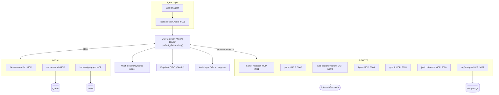
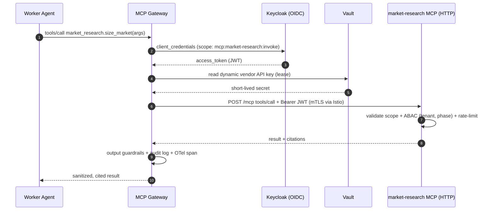
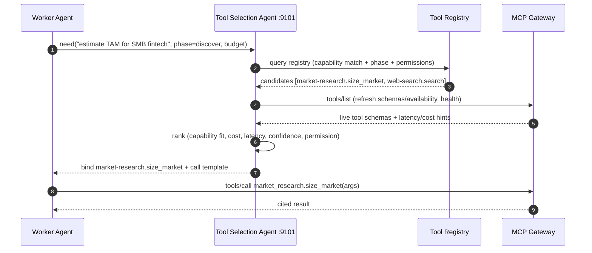

# 07 — MCP Architecture

> **Scope:** How the EDT Platform uses the **Model Context Protocol (MCP)** to give agents
> governed access to tools, data, and resources — server registry, transports, primitives,
> auth, discovery/selection, and configs.
>
> **Related docs:** [01 — Architecture](./01-architecture.md) ·
> [05 — Memory](./05-memory-architecture.md) · [06 — RAG](./06-rag-architecture.md) ·
> [08 — Tools](./08-tool-architecture.md)
>
> **Packages:** `src/edt_platform/mcp/` (clients) · `mcp_servers/` (server implementations)

---

## 1. Why MCP

MCP is the **standard boundary between an agent and the outside world**. Every external
capability — market data, patents, web scraping, Figma, GitHub, SQL, the knowledge graph, the
vector store — is exposed as an MCP server. Benefits:

- **Uniform contract:** tools/resources/prompts primitives; agents don't hand-code each API.
- **Governed access:** one place for auth (OAuth/Vault), rate-limits, audit, and guardrails.
- **Swappable providers:** replace a market-data vendor without touching agent code.
- **Discovery:** agents enumerate `tools/list` at runtime; the **Tool Selection Agent** picks.

MCP handles **agent → tools/data**; **A2A** handles **agent → agent**
([01 §5](./01-architecture.md)). They compose.

---

## 2. Topology



---

## 3. Transports: stdio vs Streamable-HTTP

| Transport | Used for | Why | Auth |
|-----------|----------|-----|------|
| **stdio** | Local, trusted, low-latency servers co-located with the agent (filesystem/artifact, vector-search, knowledge-graph) | No network hop; simplest; runs as sidecar/subprocess in the same pod | Inherits pod identity; Vault-injected creds |
| **Streamable-HTTP** | Remote, shared, independently scaled/versioned servers (market-research, patent, firecrawl, figma, github, jira/confluence, sql) | Horizontal scale, central rate-limits, shared across agents, streaming responses | OAuth2 bearer (Keycloak) + mTLS (Istio) |

- The **MCP Gateway** (`src/edt_platform/mcp`) is a client router: it holds sessions to all
  servers, load-balances remote HTTP servers, injects auth, enforces per-tool rate limits, and
  emits audit + OTel spans for every `tools/call`.
- Streaming (streamable-HTTP) is used for long tools (firecrawl crawls, large SQL) so agents
  get progress and can cancel.

---

## 4. MCP Primitives in Use

| Primitive | Meaning | EDT examples |
|-----------|---------|--------------|
| **Tools** | Model-invocable functions with JSON-Schema input | `market_research.size_market`, `patent.search`, `firecrawl.scrape`, `github.open_pr`, `sql.query`, `kg.traverse`, `vector.retrieve` |
| **Resources** | Readable data the model can load into context | `artifact://run_7f3a/prd.md`, `confluence://space/EDT/page/123`, `figma://file/abc` |
| **Prompts** | Reusable server-provided prompt templates | `market_research.competitor_brief`, `patent.novelty_check` |

Agents call `tools/list`, `resources/list`, `prompts/list` for discovery, then `tools/call`,
`resources/read`, `prompts/get`.

---

## 5. Auth & Security



- **OAuth2/OIDC (Keycloak):** each agent obtains scoped tokens (`mcp:<server>:invoke`);
  servers validate scope + ABAC (tenant, phase, data-class).
- **Vault:** all vendor API keys / DB creds are **dynamic, short-lived leases** — zero standing
  secrets. The Gateway fetches them per call.
- **Transport security:** remote servers are mTLS-protected by Istio; stdio servers inherit
  pod identity.
- **Guardrails:** input validated against tool JSON-Schema; outputs PII-redacted (Presidio) and
  policy-checked before returning to the agent; every call audited ([08](./08-tool-architecture.md)).

---

## 6. MCP Server Registry

| Server | Purpose | Transport | Key tools exposed | Auth | Data sources |
|--------|---------|-----------|-------------------|------|--------------|
| **market-research** `:3001` | Market sizing, segments, competitor briefs | streamable-HTTP | `size_market`, `segment_analysis`, `competitor_brief` | OAuth2 + Vault (vendor keys) | Gartner/Statista/CB Insights APIs |
| **patent** `:3002` | Patent/IP landscape, novelty | streamable-HTTP | `search`, `novelty_check`, `citation_graph` | OAuth2 + Vault | USPTO/EPO/Google Patents |
| **web-search/firecrawl** `:3003` | Web search + scrape/crawl | streamable-HTTP | `search`, `scrape`, `crawl`, `extract` | OAuth2 + Vault (firecrawl key) | Public web |
| **filesystem/artifact** | Read/write typed artifacts + blobs | stdio | `read_artifact`, `write_artifact`, `list`, `put_blob` | Pod identity + Vault (S3 creds) | S3/MinIO + Postgres metadata |
| **figma** `:3004` | Generate/read wireframes & design files | streamable-HTTP | `create_frame`, `get_file`, `export_png`, `apply_component` | OAuth2 (Figma) + Vault | Figma API |
| **github** `:3005` | Repo, PRs, code for prototypes | streamable-HTTP | `create_repo`, `open_pr`, `commit_files`, `read_file` | OAuth2 (GitHub App) + Vault | GitHub |
| **jira/confluence** `:3006` | Backlog, stories, docs sync | streamable-HTTP | `create_issue`, `update_issue`, `create_page`, `read_page` | OAuth2 (Atlassian) + Vault | Jira/Confluence |
| **sql/postgres** `:3007` | Governed relational queries | streamable-HTTP | `query`, `schema`, `explain` | OAuth2 + Vault (dynamic DB creds) | PostgreSQL 16 |
| **knowledge-graph** | GraphRAG traversal / entity ops | stdio | `traverse`, `upsert_entity`, `query_cypher`, `neighbors` | Pod identity + Vault | Neo4j |
| **vector-search** | Hybrid retrieval / semantic memory | stdio | `retrieve`, `upsert`, `hybrid_search` | Pod identity + Vault | Qdrant (+pgvector fallback) |

Read-only servers (market-research, patent, web-search, vector-search, knowledge-graph) are
low-risk; **write-capable** servers (github, figma, jira/confluence, filesystem, sql) require
elevated tool permissions and, for high-impact actions, a human gate
([08 §4](./08-tool-architecture.md)).

---

## 7. Discovery & Selection via the Tool Selection Agent



- The **Tool Registry** ([08](./08-tool-architecture.md)) is the authoritative catalog; MCP
  `tools/list` provides live schemas/health at bind time.
- The **Tool Selection Agent** ranks candidate tools by capability fit, cost (feeds the
  Cost/Token Optimizer), latency, historical success confidence (from procedural memory), and
  the agent's permission scope, then returns a bound tool + call template.

---

## 8. Sample MCP Tool Definition

`market_research.size_market` (as returned by `tools/list`):

```json
{
  "name": "size_market",
  "title": "Estimate Market Size (TAM/SAM/SOM)",
  "description": "Estimate total/serviceable/obtainable market for a segment and region, with cited sources.",
  "inputSchema": {
    "type": "object",
    "properties": {
      "segment": {"type": "string", "description": "Target market segment"},
      "region": {"type": "string", "enum": ["NA", "EMEA", "APAC", "LATAM", "GLOBAL"]},
      "year": {"type": "integer", "minimum": 2024, "maximum": 2030},
      "currency": {"type": "string", "default": "USD"}
    },
    "required": ["segment", "region"]
  },
  "outputSchema": {
    "type": "object",
    "properties": {
      "tam_usd": {"type": "number"},
      "sam_usd": {"type": "number"},
      "som_usd": {"type": "number"},
      "cagr_pct": {"type": "number"},
      "citations": {"type": "array", "items": {"type": "string"}}
    },
    "required": ["tam_usd", "citations"]
  },
  "annotations": {
    "readOnlyHint": true,
    "idempotentHint": true,
    "edt": {"phase": ["discover", "validate"], "permission": "read:external", "cost_tier": "medium"}
  }
}
```

---

## 9. Sample MCP Server Config

Agent-side MCP client config (`src/edt_platform/mcp/servers.yaml`):

```yaml
mcp_servers:
  vector-search:
    transport: stdio
    command: ["python", "-m", "mcp_servers.vector_search"]
    env:
      QDRANT_URL: "http://qdrant.edt-data:6333"
      VAULT_PATH: "secret/edt/qdrant"
    scopes: ["mcp:vector-search:invoke"]

  knowledge-graph:
    transport: stdio
    command: ["node", "mcp_servers/knowledge-graph/dist/index.js"]
    env:
      NEO4J_URI: "bolt://neo4j.edt-data:7687"
      VAULT_PATH: "secret/edt/neo4j"
    scopes: ["mcp:knowledge-graph:invoke"]

  market-research:
    transport: streamable-http
    url: "https://mcp-market-research.edt-mcp.svc:3001/mcp"
    oauth:
      issuer: "https://keycloak.edt.internal/realms/edt"
      client_id: "edt-agent"
      scope: "mcp:market-research:invoke"
    tls: { mode: "istio-mtls" }
    rate_limit: { rps: 5, burst: 10 }
    timeout_s: 30
    vault_secret: "secret/edt/vendors/market-research"

  github:
    transport: streamable-http
    url: "https://mcp-github.edt-mcp.svc:3005/mcp"
    oauth: { issuer: "https://keycloak.edt.internal/realms/edt", client_id: "edt-agent", scope: "mcp:github:invoke" }
    permission: "write:external"          # elevated → guardrails + possible human gate
    tls: { mode: "istio-mtls" }
    timeout_s: 60
    vault_secret: "secret/edt/vendors/github-app"
```

Server-side manifest (`mcp_servers/market_research/mcp.json`):

```json
{
  "name": "market-research",
  "version": "1.4.0",
  "transport": "streamable-http",
  "listen": "0.0.0.0:3001",
  "capabilities": { "tools": true, "resources": true, "prompts": true },
  "tools": ["size_market", "segment_analysis", "competitor_brief"],
  "resources": ["report://{vendor}/{id}"],
  "prompts": ["competitor_brief"],
  "auth": { "type": "oauth2", "introspection_url": "https://keycloak.edt.internal/realms/edt/protocol/openid-connect/token/introspect" },
  "secrets": { "provider": "vault", "path": "secret/edt/vendors/market-research" },
  "observability": { "otel": true, "audit": true }
}
```

How these tools are cataloged, permissioned, and invoked with retries/circuit-breakers is
detailed in [08 — Tool Architecture](./08-tool-architecture.md).
