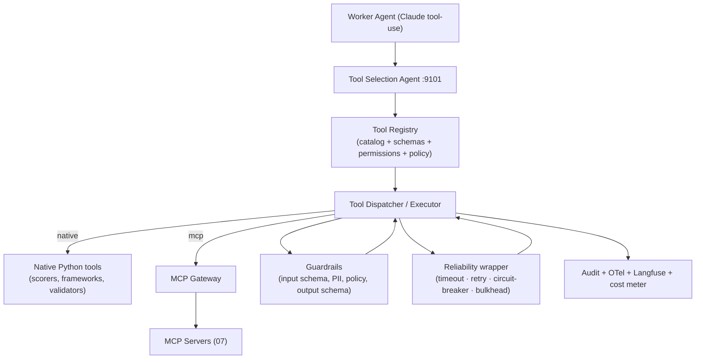
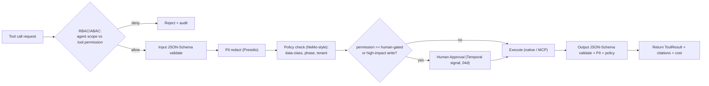
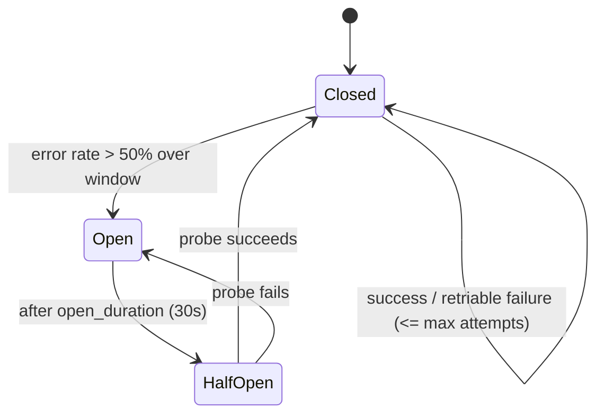
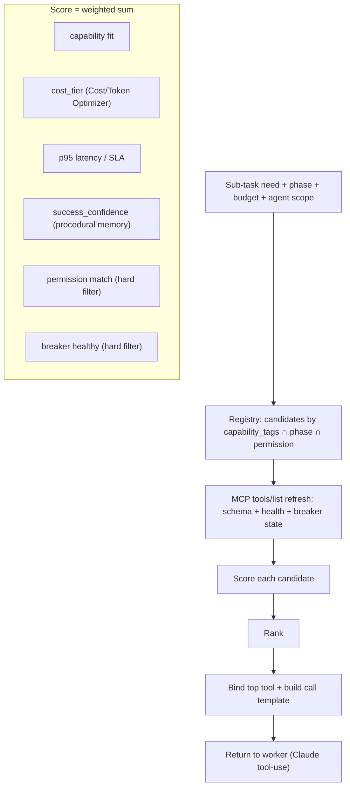

# 08 — Tool Architecture

> **Scope:** The internal Tool Registry, tool contract/schema, the Tool Selection Agent,
> per-tool permissioning/guardrails, reliability (retries/timeouts/circuit-breakers), how
> tools map to MCP servers vs native functions, and the cross-phase tool catalog.
>
> **Related docs:** [01 — Architecture](./01-architecture.md) ·
> [05 — Memory](./05-memory-architecture.md) · [06 — RAG](./06-rag-architecture.md) ·
> [07 — MCP](./07-mcp-architecture.md)
>
> **Package:** `src/edt_platform/tools/`

---

## 1. Tool Model

A **tool** is a governed, model-invocable capability with a typed contract. Tools come in two
flavors, unified behind one registry and one invocation path:

- **MCP tools** — external capabilities served by MCP servers ([07](./07-mcp-architecture.md)):
  market-research, patent, firecrawl, figma, github, jira/confluence, sql, knowledge-graph,
  vector-search.
- **Native tools** — in-process Python functions with no external boundary: scorers, framework
  engines (SCAMPER/TRIZ generators, RICE/ICE prioritizers), formatters, validators, math/ROI
  calculators, Pydantic artifact builders.

Both expose the identical **Tool Contract**, so agents and the Tool Selection Agent treat them
uniformly; only the *executor* differs (MCP Gateway call vs local function call).



---

## 2. Tool Registry

The **Tool Registry** (`src/edt_platform/tools/registry.py`, backed by Postgres + hot Redis
cache) is the authoritative catalog. Each entry holds:

| Field | Meaning |
|-------|---------|
| `tool_id` | Stable unique id (e.g. `market-research.size_market`, `native.rice_score`) |
| `kind` | `mcp` \| `native` |
| `capability_tags` | Semantic tags for selection (`market-sizing`, `prioritization`, `wireframe`) |
| `phases` | Phases where valid (`discover`, `define`, `ideate`, `prototype`, `validate`) |
| `input_schema` / `output_schema` | JSON-Schema contracts (Pydantic-generated) |
| `permission` | `read:internal` \| `read:external` \| `write:internal` \| `write:external` \| `human-gated` |
| `cost_tier` | `free` \| `low` \| `medium` \| `high` (feeds Cost/Token Optimizer) |
| `sla` | `timeout_s`, `p95_latency_ms` |
| `retry_policy` | attempts, backoff, jitter |
| `circuit_breaker` | error-rate threshold, open duration |
| `guardrails` | required input/output validators, PII policy |
| `mcp_ref` / `fn_ref` | Executor binding (server+tool, or import path) |
| `version` | SemVer; old versions retained |
| `success_confidence` | Rolling success score from procedural memory ([05](./05-memory-architecture.md)) |

Registration is declarative (decorator for native, sync from MCP `tools/list` for MCP); CI
validates every schema and rejects tools missing permission/guardrail metadata.

---

## 3. Tool Contract & Interface Sketch

```python
# src/edt_platform/tools/base.py  (interface sketch)
from pydantic import BaseModel

class ToolSpec(BaseModel):
    tool_id: str
    kind: str                       # "mcp" | "native"
    capability_tags: list[str]
    phases: list[str]
    input_schema: dict              # JSON-Schema
    output_schema: dict
    permission: str                 # read:internal | read:external | write:* | human-gated
    cost_tier: str
    timeout_s: float = 30
    retry: "RetryPolicy"
    breaker: "CircuitBreakerPolicy"
    guardrails: "GuardrailPolicy"

class ToolResult(BaseModel):
    ok: bool
    output: dict | None
    citations: list[str] = []
    confidence: float | None = None
    cost_usd: float = 0.0
    latency_ms: int = 0
    error: str | None = None
    trace_id: str | None = None

class Tool(Protocol):
    spec: ToolSpec
    def validate_input(self, args: dict) -> dict: ...       # JSON-Schema + guardrails
    def invoke(self, args: dict, ctx: "InvocationContext") -> ToolResult: ...

# Native tool registration
@register_tool(
    tool_id="native.rice_score",
    capability_tags=["prioritization", "scoring"],
    phases=["define", "ideate"],
    permission="read:internal", cost_tier="free",
)
def rice_score(reach: float, impact: float, confidence: float, effort: float) -> dict:
    score = (reach * impact * confidence) / max(effort, 0.1)
    return {"rice": round(score, 3)}

# Uniform dispatch (native OR mcp) with reliability + guardrails + audit
def dispatch(tool_id: str, args: dict, ctx: InvocationContext) -> ToolResult:
    spec = registry.get(tool_id)
    enforce_permission(ctx.agent, spec.permission)          # RBAC/ABAC
    args = guardrails.check_input(spec, args, ctx.tenant)   # schema + PII (Presidio)
    with reliability(spec.timeout_s, spec.retry, spec.breaker), meter(ctx):
        raw = (execute_native(spec, args) if spec.kind == "native"
               else mcp_gateway.call(spec.mcp_ref, args, ctx))   # see 07
    out = guardrails.check_output(spec, raw)                # output schema + policy + PII
    audit.record(ctx, tool_id, args, out)                  # + OTel span + Langfuse
    return out
```

---

## 4. Permissioning & Guardrails per Tool



| Permission | Meaning | Examples | Controls |
|-----------|---------|----------|----------|
| `read:internal` | Read platform data | vector-search, knowledge-graph, sql read | Scope + tenant filter |
| `read:external` | Read outside data | market-research, patent, firecrawl | OAuth scope + rate-limit + PII on ingest |
| `write:internal` | Mutate platform state | filesystem/artifact write, memory write | Idempotency + audit |
| `write:external` | Mutate external systems | github open_pr, jira create_issue, figma create | Elevated scope + audit |
| `human-gated` | High-impact | publish executive deliverable, external PR merge | Human approval gate ([04d](./04-agent-interaction-sequence.md)) |

- Every agent's Agent Card + config declares allowed tool scopes (least privilege). The
  Dispatcher enforces at call time.
- Guardrails run on **both** input and output: JSON-Schema contracts, Presidio PII redaction,
  and NeMo/Llama-Guard-style policy (data-class, phase legality, tenant isolation). Outputs
  failing schema are rejected → triggers agent self-correction ([04c](./04-agent-interaction-sequence.md)).

---

## 5. Reliability: Retries, Timeouts, Circuit-Breakers



| Control | Default | Notes |
|---------|---------|-------|
| **Timeout** | `timeout_s` per tool (native ~5s, MCP read ~30s, crawl/sql ~60s) | Hard cap; cancels streaming MCP calls |
| **Retry** | 3 attempts, exponential backoff (0.5→1→2s) + full jitter | Only on retriable errors (timeout, 5xx, 429); never on validation/permission errors |
| **Circuit-breaker** | Open at >50% errors over 20-call window; 30s open; half-open probe | Per `tool_id` + per MCP server; prevents cascading failure |
| **Bulkhead** | Per-server concurrency cap | Isolates a slow vendor from starving others |
| **Fallback** | Registry-defined alternative (e.g. Qdrant→pgvector, rerank-2→Cohere→cross-encoder) | Graceful degradation |
| **Idempotency** | Write tools carry idempotency key | Safe under retry / at-least-once events |

When retries + fallback are exhausted, the tool returns `ToolResult(ok=false)`; the calling
agent reflects/self-corrects or escalates per its `escalation_rules`. All failures are audited
and surfaced in Grafana (error-rate, breaker-state, p95 latency per tool).

---

## 6. Native vs MCP Mapping

| Aspect | Native tool | MCP tool |
|--------|-------------|----------|
| Boundary | In-process Python | Cross-process (stdio) / network (HTTP) |
| Examples | scorers (RICE/ICE), framework engines (SCAMPER/TRIZ), ROI calc, validators, artifact builders | market-research, patent, firecrawl, figma, github, jira, sql, kg, vector-search |
| Latency | µs–ms | ms–s |
| Auth | None (trusted) | OAuth2 + Vault ([07 §5](./07-mcp-architecture.md)) |
| When to use | Deterministic logic, pure computation, formatting | Anything crossing a trust/network boundary or 3rd-party |
| Executor | `execute_native` | `mcp_gateway.call` |

Rule of thumb: **if it touches the outside world or shared data stores → MCP** (uniform auth,
audit, rate-limit); **if it's pure deterministic compute → native** (speed, no overhead).

---

## 7. Core Tool Catalog Across Phases

| Phase | Tool (`tool_id`) | Kind | Permission | Purpose |
|-------|------------------|------|-----------|---------|
| Discover | `market-research.size_market` | mcp | read:external | TAM/SAM/SOM sizing |
| Discover | `patent.search` | mcp | read:external | Patent/IP landscape |
| Discover | `web-search.firecrawl.crawl` | mcp | read:external | Competitor/web research |
| Discover | `vector-search.retrieve` | mcp | read:internal | Hybrid RAG recall ([06](./06-rag-architecture.md)) |
| Discover | `native.affinity_cluster` | native | read:internal | Cluster VoC/pain points |
| Define | `knowledge-graph.traverse` | mcp | read:internal | Root-cause / GraphRAG |
| Define | `native.five_why` / `native.fishbone` | native | read:internal | Root-cause frameworks |
| Define | `native.rice_score` / `native.ice_score` | native | read:internal | Opportunity prioritization |
| Define | `native.hmw_generator` | native | read:internal | How-Might-We generation |
| Ideate | `native.scamper` / `native.triz` | native | read:internal | Structured ideation |
| Ideate | `native.blue_ocean` | native | read:internal | Value-innovation canvas |
| Ideate | `native.idea_scorer` | native | read:internal | Score/rank concepts |
| Ideate | `vector-search.retrieve` | mcp | read:internal | Analogous-solution reuse |
| Prototype | `figma.create_frame` | mcp | write:external | Wireframe/UI generation |
| Prototype | `github.commit_files` | mcp | write:external | React prototype scaffolding |
| Prototype | `native.prd_builder` | native | write:internal | PRD artifact assembly |
| Prototype | `native.api_designer` / `native.data_model` | native | write:internal | API/data-model specs |
| Prototype | `jira.create_issue` | mcp | write:external | User stories → backlog |
| Validate | `native.roi_calculator` / `native.pricing_model` | native | read:internal | Financials/ROI |
| Validate | `market-research.competitor_brief` | mcp | read:external | Market validation |
| Validate | `native.responsible_ai_check` | native | read:internal | Bias/fairness/compliance scan |
| Validate | `native.go_no_go` | native | human-gated | Decision + exec deliverable gate |
| All | `filesystem.write_artifact` | mcp | write:internal | Persist typed artifacts (S3+Postgres) |
| All | `sql.query` | mcp | read:internal | Governed relational reads |

---

## 8. Tool Selection Agent Logic



- **Hard filters:** permission match and circuit-breaker health exclude ineligible/unhealthy
  tools before scoring.
- **Soft scoring:** capability fit × cost × latency × historical success (pulled from
  procedural memory, [05 §1](./05-memory-architecture.md)), weighted by the run's budget
  posture (cost-sensitive runs downweight `high` cost_tier tools).
- **Output:** a bound tool and a pre-filled call template the worker executes via Claude
  tool-use; the choice is recorded to episodic memory so future selection learns from
  outcomes. MCP discovery/binding details are in [07 §7](./07-mcp-architecture.md).

---

## 9. Observability & Cost Metering

Every tool invocation emits: an OTel span (linked to the run `trace_id`), a Langfuse
observation (for LLM-backed tools), an audit record (agent, tool, args-hash, permission,
decision), and a cost sample. Grafana dashboards track per-tool p95 latency, error rate,
breaker state, and spend; the Cost/Token Optimizer uses live cost samples to steer future
Tool Selection. This closes the loop: tools are selected, governed, executed, measured, and
their outcomes feed back into selection and procedural memory.
