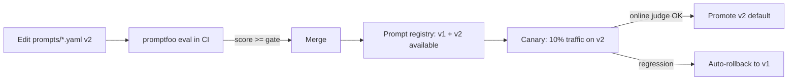

# 10 — Prompt Library

Prompts are **first-class, versioned data** — loaded at runtime, evaluated in CI, and
rolled back independently of code. This decouples "how an agent thinks" from "how the
platform runs," letting prompt engineers iterate without redeploying services.

See also: [11-agent-specifications](11-agent-specifications.md) (long-form canonical prompts) ·
[16-evaluation-framework](16-evaluation-framework.md) (how prompts are scored) ·
`prompts/` (the files themselves).

## 10.1 Design principles (Claude best practices)

| Principle | How we apply it |
|---|---|
| Clear role | Every `system` block opens with "You are the *X* Agent…" and the persona to emulate. |
| Structure with XML tags | Inputs and instruction groups use `<operating_principles>`, `<rules>`, `<business_problem>`, etc., which Claude parses reliably. |
| Think before answering | Reasoning-tier agents use extended thinking; prompts explicitly ask to challenge framing before concluding. |
| Force structured output | Agents emit via a single `emit` tool bound to a JSON Schema — no free-text parsing. |
| Self-critique + confidence | Prompts require a `confidence` object (score + rationale + missing info) that drives loops. |
| Refuse / escalate | Prompts state when to refuse (policy/compliance blockers) and escalate to a human instead of guessing. |
| No fabrication | "Never fabricate facts or citations" appears in every research/analysis prompt. |

## 10.2 File format

One YAML per agent at `prompts/<phase>/<agent>.yaml`:

```yaml
agent: <name>
phase: <discover|define|ideate|prototype|validate|crosscutting>
version: v1                       # bump to release a new prompt; old versions stay pinned
model_tier: claude-opus-4-8       # default tier for this agent (router may downgrade)
output_schema_ref: <module:SYMBOL># the JSON Schema the emit tool enforces
system: |                         # role + instructions (XML-tagged)
task_template: |                  # user turn with {{placeholders}} from AgentInput
eval:                             # promptfoo cases: vars + asserts (llm-rubric, js, contains)
```

### Placeholders
Filled by the agent runtime from `AgentInput`:

| Placeholder | Source |
|---|---|
| `{{task}}` | `AgentInput.task` (the business problem / instruction) |
| `{{upstream}}` | Rendered summary of `AgentInput.upstream_artifacts` |
| `{{retrieved}}` | RAG context (see [06-rag-architecture](06-rag-architecture.md)) |
| `{{constraints}}` | `AgentInput.constraints` |
| `{{critique_feedback}}` / `{{reflection_feedback}}` | Injected on self-correction passes |

## 10.3 Versioning & rollout



- **Pinning**: a running Run pins the prompt version it started with (reproducibility).
- **Registry**: prompt files are packaged and served from an object-store-backed registry;
  `prompt_version` is recorded in every artifact's `provenance` for full traceability.
- **Rollback**: because prompts are data, rollback is a config flip — no code deploy.

## 10.4 Library coverage

The repository ships representative, runnable prompts for the pattern across all phases:

| Phase | Shipped example prompt | Model tier |
|---|---|---|
| Discover | `discover/problem_discovery.yaml` | Opus 4.8 |
| Define | `define/how_might_we.yaml` | Sonnet 5 |
| Ideate | `ideate/scamper.yaml` | Sonnet 5 |
| Prototype | `prototype/prd_generator.yaml` | Opus 4.8 |
| Validate | `validate/go_no_go.yaml` | Opus 4.8 |
| Cross-cutting | `crosscutting/critic.yaml` | Opus 4.8 |

The remaining ~89 agents follow the identical template; the canonical long-form prompts for
12 flagship agents are in [11-agent-specifications](11-agent-specifications.md). New agents are
added per the checklist in [09-folder-structure](09-folder-structure.md).

## 10.5 Prompt-quality gates (CI)

Each prompt file's `eval` block is executed by promptfoo on every PR touching `prompts/`.
A prompt cannot merge unless:

1. All `llm-rubric` assertions pass at ≥ the phase threshold (default 0.7).
2. Deterministic asserts (`javascript`, `contains`) pass 100%.
3. No regression vs. the current default version on the golden set (see
   [16-evaluation-framework](16-evaluation-framework.md)).
4. Guardrail red-team cases (injection, PII, jailbreak) produce refusals.

## 10.6 Example (excerpt)

```yaml
agent: how_might_we
phase: define
version: v1
model_tier: claude-sonnet-5
system: |
  You are the How-Might-We (HMW) Generator ...
  <rules>
  - Each HMW must be actionable, optimistic, and appropriately scoped ...
  </rules>
task_template: |
  <problem_statement>{{task}}</problem_statement>
  <upstream>{{upstream}}</upstream>
eval:
  - description: HMWs are non-prescriptive and diverse
    vars: { task: "Gen-Z users abandon account opening ..." }
    assert:
      - type: llm-rubric
        value: statements start with "How might we", avoid naming solutions, vary in framing
```
