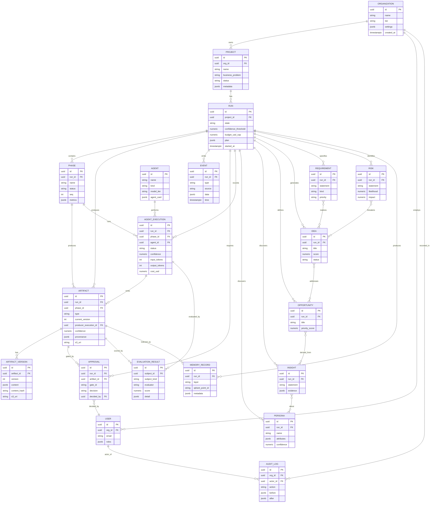

# 13 — Data Model

> **EDT Platform** (`edt_platform`). Canonical data model across the relational store
> (**PostgreSQL 16**), knowledge graph (**Neo4j**), and vector store (**Qdrant**).
>
> **Related docs:** [`03-workflow.md`](./03-workflow.md) ·
> [`12-api-specification.md`](./12-api-specification.md) ·
> [`14-event-model.md`](./14-event-model.md) · [`11-memory.md`](./11-memory.md)

Persistence contract (per canonical brief): artifacts are typed Pydantic v2 models,
**versioned**, stored in **Postgres** (metadata) + **S3/MinIO** (blobs), indexed in **Qdrant**
(semantic memory), and linked in **Neo4j** (knowledge-graph memory). Every artifact carries:
`id, run_id, phase, type, version, producer_agent, confidence, provenance, created_at, approvals[]`.

---

## 1. Entity-Relationship Diagram



---

## 2. PostgreSQL DDL (core tables)

```sql
-- =========================================================================
-- EDT Platform — core relational schema (PostgreSQL 16)
-- Managed via SQLAlchemy 2.x + Alembic. All ids are UUID v7 (time-ordered).
-- =========================================================================
CREATE EXTENSION IF NOT EXISTS "pgcrypto";
CREATE EXTENSION IF NOT EXISTS "vector";     -- pgvector fallback for embeddings

-- ---- Tenancy -------------------------------------------------------------
CREATE TABLE organization (
    id           UUID PRIMARY KEY DEFAULT gen_random_uuid(),
    name         TEXT NOT NULL,
    tier         TEXT NOT NULL DEFAULT 'enterprise',
    settings     JSONB NOT NULL DEFAULT '{}'::jsonb,
    created_at   TIMESTAMPTZ NOT NULL DEFAULT now()
);

CREATE TABLE app_user (
    id           UUID PRIMARY KEY DEFAULT gen_random_uuid(),
    org_id       UUID NOT NULL REFERENCES organization(id) ON DELETE CASCADE,
    email        CITEXT NOT NULL,
    display_name TEXT,
    roles        JSONB NOT NULL DEFAULT '["viewer"]'::jsonb,  -- ["admin","approver",...]
    created_at   TIMESTAMPTZ NOT NULL DEFAULT now(),
    UNIQUE (org_id, email)
);

-- ---- Project / Run / Phase ----------------------------------------------
CREATE TABLE project (
    id               UUID PRIMARY KEY DEFAULT gen_random_uuid(),
    org_id           UUID NOT NULL REFERENCES organization(id) ON DELETE CASCADE,
    name             TEXT NOT NULL,
    business_problem TEXT NOT NULL,
    status           TEXT NOT NULL DEFAULT 'active',
    metadata         JSONB NOT NULL DEFAULT '{}'::jsonb,
    created_at       TIMESTAMPTZ NOT NULL DEFAULT now()
);
CREATE INDEX ix_project_org ON project(org_id);

CREATE TABLE run (
    id                    UUID PRIMARY KEY DEFAULT gen_random_uuid(),
    project_id            UUID NOT NULL REFERENCES project(id) ON DELETE CASCADE,
    state                 TEXT NOT NULL DEFAULT 'created',   -- see 03-workflow §3
    confidence_threshold  NUMERIC(3,2) NOT NULL DEFAULT 0.70,
    budget_usd_cap        NUMERIC(10,2),
    cost_usd_spent        NUMERIC(10,2) NOT NULL DEFAULT 0,
    temporal_workflow_id  TEXT,
    plan                  JSONB NOT NULL DEFAULT '{}'::jsonb,
    started_at            TIMESTAMPTZ,
    completed_at          TIMESTAMPTZ,
    created_at            TIMESTAMPTZ NOT NULL DEFAULT now(),
    CONSTRAINT ck_run_state CHECK (state IN
      ('created','planning','discover','awaiting_approval','define','ideate',
       'prototype','validate','generating_deliverables','completed','failed','cancelled'))
);
CREATE INDEX ix_run_project ON run(project_id);
CREATE INDEX ix_run_state   ON run(state);

CREATE TABLE phase (
    id         UUID PRIMARY KEY DEFAULT gen_random_uuid(),
    run_id     UUID NOT NULL REFERENCES run(id) ON DELETE CASCADE,
    name       TEXT NOT NULL,          -- discover|define|ideate|prototype|validate|deliverables
    seq        SMALLINT NOT NULL,
    status     TEXT NOT NULL DEFAULT 'pending',
    metrics    JSONB NOT NULL DEFAULT '{}'::jsonb,
    started_at TIMESTAMPTZ,
    ended_at   TIMESTAMPTZ,
    UNIQUE (run_id, name)
);
CREATE INDEX ix_phase_run ON phase(run_id);

-- ---- Agents & executions -------------------------------------------------
CREATE TABLE agent (
    id          UUID PRIMARY KEY DEFAULT gen_random_uuid(),
    name        TEXT NOT NULL UNIQUE,        -- e.g. DiscoverPhaseAgent, PersonaBuilder
    kind        TEXT NOT NULL,               -- supervisor|phase|worker|cross_cutting
    model_tier  TEXT NOT NULL DEFAULT 'claude-sonnet-5',
    agent_card  JSONB NOT NULL DEFAULT '{}'::jsonb,  -- A2A Agent Card
    created_at  TIMESTAMPTZ NOT NULL DEFAULT now()
);

CREATE TABLE agent_execution (
    id            UUID PRIMARY KEY DEFAULT gen_random_uuid(),
    run_id        UUID NOT NULL REFERENCES run(id) ON DELETE CASCADE,
    phase_id      UUID REFERENCES phase(id) ON DELETE SET NULL,
    agent_id      UUID NOT NULL REFERENCES agent(id),
    parent_id     UUID REFERENCES agent_execution(id),  -- for fan-out trees
    status        TEXT NOT NULL DEFAULT 'running',       -- running|succeeded|failed|rejected
    confidence    NUMERIC(3,2),
    model         TEXT,
    input_tokens  INTEGER DEFAULT 0,
    output_tokens INTEGER DEFAULT 0,
    cost_usd      NUMERIC(10,4) DEFAULT 0,
    trace_id      TEXT,                                  -- OTel / Langfuse
    started_at    TIMESTAMPTZ NOT NULL DEFAULT now(),
    ended_at      TIMESTAMPTZ
);
CREATE INDEX ix_exec_run   ON agent_execution(run_id);
CREATE INDEX ix_exec_phase ON agent_execution(phase_id);
CREATE INDEX ix_exec_trace ON agent_execution(trace_id);

-- ---- Artifacts + versioning ---------------------------------------------
CREATE TABLE artifact (
    id                     UUID PRIMARY KEY DEFAULT gen_random_uuid(),
    run_id                 UUID NOT NULL REFERENCES run(id) ON DELETE CASCADE,
    phase_id               UUID REFERENCES phase(id) ON DELETE SET NULL,
    type                   TEXT NOT NULL,          -- personas|prd|business_case|...
    title                  TEXT,
    current_version        INTEGER NOT NULL DEFAULT 1,
    producer_execution_id  UUID REFERENCES agent_execution(id),
    producer_agent         TEXT NOT NULL,
    confidence             NUMERIC(3,2),
    provenance             JSONB NOT NULL DEFAULT '{}'::jsonb,  -- sources, tool calls
    s3_uri                 TEXT,                                -- blob pointer
    status                 TEXT NOT NULL DEFAULT 'draft',       -- draft|approved|superseded
    created_at             TIMESTAMPTZ NOT NULL DEFAULT now(),
    updated_at             TIMESTAMPTZ NOT NULL DEFAULT now()
);
CREATE INDEX ix_artifact_run  ON artifact(run_id);
CREATE INDEX ix_artifact_type ON artifact(run_id, type);

CREATE TABLE artifact_version (
    id           UUID PRIMARY KEY DEFAULT gen_random_uuid(),
    artifact_id  UUID NOT NULL REFERENCES artifact(id) ON DELETE CASCADE,
    version      INTEGER NOT NULL,
    content      JSONB NOT NULL,          -- typed Pydantic payload
    content_hash TEXT NOT NULL,           -- sha256 for idempotency/dedupe
    s3_uri       TEXT,
    created_by   UUID REFERENCES agent_execution(id),
    created_at   TIMESTAMPTZ NOT NULL DEFAULT now(),
    UNIQUE (artifact_id, version)
);

-- ---- Approvals ----------------------------------------------------------
CREATE TABLE approval (
    id           UUID PRIMARY KEY DEFAULT gen_random_uuid(),
    run_id       UUID NOT NULL REFERENCES run(id) ON DELETE CASCADE,
    artifact_id  UUID REFERENCES artifact(id) ON DELETE SET NULL,
    gate_id      TEXT NOT NULL,           -- gate_1..gate_6
    decision     TEXT NOT NULL DEFAULT 'pending',  -- pending|approved|rejected
    decided_by   UUID REFERENCES app_user(id),
    comments     TEXT,
    requested_at TIMESTAMPTZ NOT NULL DEFAULT now(),
    decided_at   TIMESTAMPTZ
);
CREATE INDEX ix_approval_run     ON approval(run_id);
CREATE INDEX ix_approval_pending ON approval(decision) WHERE decision = 'pending';

-- ---- Domain entities (also mirrored into Neo4j) -------------------------
CREATE TABLE persona (
    id          UUID PRIMARY KEY DEFAULT gen_random_uuid(),
    run_id      UUID NOT NULL REFERENCES run(id) ON DELETE CASCADE,
    name        TEXT NOT NULL,
    segment     TEXT,
    attributes  JSONB NOT NULL DEFAULT '{}'::jsonb,   -- goals, frustrations, jtbd
    confidence  NUMERIC(3,2),
    created_at  TIMESTAMPTZ NOT NULL DEFAULT now()
);
CREATE INDEX ix_persona_run ON persona(run_id);

CREATE TABLE insight (
    id         UUID PRIMARY KEY DEFAULT gen_random_uuid(),
    run_id     UUID NOT NULL REFERENCES run(id) ON DELETE CASCADE,
    statement  TEXT NOT NULL,
    evidence   JSONB NOT NULL DEFAULT '[]'::jsonb,
    confidence NUMERIC(3,2),
    created_at TIMESTAMPTZ NOT NULL DEFAULT now()
);

CREATE TABLE opportunity (
    id             UUID PRIMARY KEY DEFAULT gen_random_uuid(),
    run_id         UUID NOT NULL REFERENCES run(id) ON DELETE CASCADE,
    title          TEXT NOT NULL,
    description    TEXT,
    priority_score NUMERIC(5,2),
    created_at     TIMESTAMPTZ NOT NULL DEFAULT now()
);

CREATE TABLE idea (
    id         UUID PRIMARY KEY DEFAULT gen_random_uuid(),
    run_id     UUID NOT NULL REFERENCES run(id) ON DELETE CASCADE,
    title      TEXT NOT NULL,
    description TEXT,
    score      NUMERIC(5,2),
    status     TEXT NOT NULL DEFAULT 'candidate',  -- candidate|selected|rejected
    created_at TIMESTAMPTZ NOT NULL DEFAULT now()
);
CREATE INDEX ix_idea_run_status ON idea(run_id, status);

CREATE TABLE requirement (
    id         UUID PRIMARY KEY DEFAULT gen_random_uuid(),
    run_id     UUID NOT NULL REFERENCES run(id) ON DELETE CASCADE,
    statement  TEXT NOT NULL,
    kind       TEXT NOT NULL DEFAULT 'functional', -- functional|nonfunctional
    priority   TEXT NOT NULL DEFAULT 'should',     -- must|should|could|wont (MoSCoW)
    created_at TIMESTAMPTZ NOT NULL DEFAULT now()
);

CREATE TABLE risk (
    id         UUID PRIMARY KEY DEFAULT gen_random_uuid(),
    run_id     UUID NOT NULL REFERENCES run(id) ON DELETE CASCADE,
    statement  TEXT NOT NULL,
    category   TEXT,
    likelihood NUMERIC(3,2),
    impact     NUMERIC(3,2),
    mitigation TEXT,
    created_at TIMESTAMPTZ NOT NULL DEFAULT now()
);

-- ---- Events (episodic memory mirror of Kafka) ---------------------------
CREATE TABLE event (
    id           UUID PRIMARY KEY DEFAULT gen_random_uuid(),
    run_id       UUID REFERENCES run(id) ON DELETE CASCADE,
    type         TEXT NOT NULL,          -- CloudEvents type: edt.*
    source       TEXT NOT NULL,
    subject      TEXT,
    ce_id        TEXT NOT NULL,          -- CloudEvents id (idempotency key)
    data         JSONB NOT NULL DEFAULT '{}'::jsonb,
    time         TIMESTAMPTZ NOT NULL DEFAULT now(),
    UNIQUE (ce_id)
);
CREATE INDEX ix_event_run_time ON event(run_id, time);
CREATE INDEX ix_event_type     ON event(type);

-- ---- Memory index -------------------------------------------------------
CREATE TABLE memory_record (
    id              UUID PRIMARY KEY DEFAULT gen_random_uuid(),
    run_id          UUID REFERENCES run(id) ON DELETE CASCADE,
    org_id          UUID REFERENCES organization(id) ON DELETE CASCADE,
    layer           TEXT NOT NULL,       -- working|episodic|semantic|procedural|graph
    subject_kind    TEXT,                -- artifact|insight|persona|...
    subject_id      UUID,
    qdrant_point_id TEXT,                -- link to Qdrant point
    neo4j_node_id   TEXT,
    metadata        JSONB NOT NULL DEFAULT '{}'::jsonb,
    created_at      TIMESTAMPTZ NOT NULL DEFAULT now()
);
CREATE INDEX ix_memory_scope ON memory_record(org_id, layer);

-- ---- Evaluations --------------------------------------------------------
CREATE TABLE evaluation_result (
    id           UUID PRIMARY KEY DEFAULT gen_random_uuid(),
    subject_kind TEXT NOT NULL,          -- artifact|agent_execution|run
    subject_id   UUID NOT NULL,
    evaluator    TEXT NOT NULL,          -- promptfoo|deepeval|ragas|llm_judge|human
    metric       TEXT NOT NULL,          -- faithfulness|relevancy|quality|...
    score        NUMERIC(5,4),
    passed       BOOLEAN,
    detail       JSONB NOT NULL DEFAULT '{}'::jsonb,
    created_at   TIMESTAMPTZ NOT NULL DEFAULT now()
);
CREATE INDEX ix_eval_subject ON evaluation_result(subject_kind, subject_id);

-- ---- Audit --------------------------------------------------------------
CREATE TABLE audit_log (
    id         UUID PRIMARY KEY DEFAULT gen_random_uuid(),
    org_id     UUID NOT NULL REFERENCES organization(id) ON DELETE CASCADE,
    actor_id   UUID REFERENCES app_user(id),
    actor_kind TEXT NOT NULL DEFAULT 'user',   -- user|agent|system
    action     TEXT NOT NULL,
    entity     TEXT NOT NULL,
    entity_id  UUID,
    before     JSONB,
    after      JSONB,
    created_at TIMESTAMPTZ NOT NULL DEFAULT now()
);
CREATE INDEX ix_audit_org_time ON audit_log(org_id, created_at);
```

---

## 3. Pydantic v2 model sketches

```python
# src/edt_platform/models/artifacts.py
from __future__ import annotations
from datetime import datetime
from enum import StrEnum
from uuid import UUID
from pydantic import BaseModel, Field, ConfigDict


class Phase(StrEnum):
    DISCOVER = "discover"
    DEFINE = "define"
    IDEATE = "ideate"
    PROTOTYPE = "prototype"
    VALIDATE = "validate"
    DELIVERABLES = "deliverables"


class Provenance(BaseModel):
    model_config = ConfigDict(extra="forbid")
    sources: list[str] = Field(default_factory=list)      # URIs, doc ids
    tool_calls: list[str] = Field(default_factory=list)   # MCP tool invocations
    rag_chunks: list[str] = Field(default_factory=list)   # Qdrant point ids
    parent_artifacts: list[UUID] = Field(default_factory=list)


class ArtifactBase(BaseModel):
    """Common envelope for every typed artifact (see canonical brief §Conventions)."""
    model_config = ConfigDict(extra="forbid")
    id: UUID
    run_id: UUID
    phase: Phase
    type: str
    version: int = 1
    producer_agent: str
    confidence: float = Field(ge=0.0, le=1.0)
    provenance: Provenance = Field(default_factory=Provenance)
    created_at: datetime
    approvals: list[UUID] = Field(default_factory=list)   # approval ids


# ---- Persona artifact ---------------------------------------------------
class Persona(BaseModel):
    model_config = ConfigDict(extra="forbid")
    name: str
    segment: str | None = None
    demographics: dict[str, str] = Field(default_factory=dict)
    goals: list[str] = Field(default_factory=list)
    frustrations: list[str] = Field(default_factory=list)
    jobs_to_be_done: list[str] = Field(default_factory=list)
    confidence: float = Field(ge=0.0, le=1.0)


class PersonaSet(ArtifactBase):
    type: str = "personas"
    personas: list[Persona]


# ---- PRD artifact -------------------------------------------------------
class UserStory(BaseModel):
    model_config = ConfigDict(extra="forbid")
    id: str
    persona: str
    story: str                    # "As a <role> I want <goal> so that <benefit>"
    acceptance_criteria: list[str]
    priority: str = "should"      # MoSCoW


class PRD(ArtifactBase):
    type: str = "prd"
    problem_statement: str
    goals: list[str]
    non_goals: list[str] = Field(default_factory=list)
    personas: list[str]
    requirements_functional: list[str]
    requirements_nonfunctional: list[str]
    user_stories: list[UserStory]
    success_metrics: list[str]
    open_questions: list[str] = Field(default_factory=list)


# ---- Business Case artifact --------------------------------------------
class ROIModel(BaseModel):
    model_config = ConfigDict(extra="forbid")
    horizon_years: int = 3
    investment_usd: float
    projected_revenue_usd: list[float]     # per year
    projected_cost_usd: list[float]
    npv_usd: float
    irr_pct: float
    payback_months: int


class BusinessCase(ArtifactBase):
    type: str = "business_case"
    executive_summary: str
    market_size_usd: float
    roi: ROIModel
    pricing_strategy: str
    recommendation: str            # go | no_go | conditional
    key_risks: list[str]
```

---

## 4. Neo4j graph model (GraphRAG / knowledge-graph memory)

### 4.1 Node labels

| Label | Key properties |
|-------|----------------|
| `:Organization` | `id, name` |
| `:Project` | `id, name` |
| `:Run` | `id, state` |
| `:Problem` | `id, statement` |
| `:Persona` | `id, name, segment, confidence` |
| `:Insight` | `id, statement, confidence` |
| `:Opportunity` | `id, title, priority_score` |
| `:Idea` | `id, title, score, status` |
| `:Requirement` | `id, statement, kind, priority` |
| `:Risk` | `id, statement, likelihood, impact` |
| `:Artifact` | `id, type, version, confidence` |

### 4.2 Relationship types

| Relationship | From → To | Meaning |
|--------------|-----------|---------|
| `(:Organization)-[:OWNS]->(:Project)` | org → project | tenancy |
| `(:Project)-[:HAS_RUN]->(:Run)` | project → run | run membership |
| `(:Run)-[:DISCOVERED]->(:Insight)` | run → insight | provenance |
| `(:Insight)-[:ABOUT]->(:Persona)` | insight → persona | who it concerns |
| `(:Opportunity)-[:DERIVED_FROM]->(:Insight)` | opportunity → insight | define step |
| `(:Idea)-[:ADDRESSES]->(:Opportunity)` | idea → opportunity | ideation link |
| `(:Requirement)-[:REALIZES]->(:Idea)` | requirement → idea | prototype link |
| `(:Risk)-[:THREATENS]->(:Idea)` | risk → idea | validation link |
| `(:Persona)-[:EXPERIENCES]->(:Problem)` | persona → problem | journey pain |
| `(:Artifact)-[:REPRESENTS]->(:Idea)` | artifact → entity | typed output |
| `(:Idea)-[:SIMILAR_TO {score}]->(:Idea)` | idea → idea | cross-project reuse |

### 4.3 Cypher sample (GraphRAG traversal)

```cypher
// For a run, find selected ideas, the opportunities/insights that justify them,
// the personas they serve, and any open risks — the graph a Business Case cites.
MATCH (r:Run {id: $run_id})-[:HAS_RUN|DISCOVERED*0..1]->()
MATCH (idea:Idea {status: 'selected'})-[:ADDRESSES]->(opp:Opportunity)
MATCH (opp)-[:DERIVED_FROM]->(ins:Insight)-[:ABOUT]->(persona:Persona)
OPTIONAL MATCH (risk:Risk)-[:THREATENS]->(idea)
WHERE idea.run_id = $run_id
RETURN idea.title            AS idea,
       collect(DISTINCT opp.title)     AS opportunities,
       collect(DISTINCT ins.statement) AS supporting_insights,
       collect(DISTINCT persona.name)  AS personas,
       collect(DISTINCT risk.statement) AS open_risks
ORDER BY idea.score DESC;

// Cross-project semantic reuse: reusable insights from other runs in the org.
MATCH (o:Organization {id: $org_id})-[:OWNS]->(:Project)-[:HAS_RUN]->(prev:Run)
MATCH (prev)-[:DISCOVERED]->(ins:Insight)
WHERE prev.id <> $run_id AND ins.confidence >= 0.8
RETURN ins.statement, prev.id AS source_run
LIMIT 25;
```

---

## 5. Qdrant collections (semantic memory)

Embeddings: **Voyage `voyage-3`** (1024-dim) primary; `text-embedding-3-large` (3072-dim)
fallback. Distance: **cosine**. HNSW index. Each collection is org- and run-scoped via payload
filters and enforced tenant filtering.

| Collection | Vector size | Distance | Purpose |
|------------|-------------|----------|---------|
| `edt_insights` | 1024 | cosine | Insights & learnings for cross-project reuse |
| `edt_personas` | 1024 | cosine | Persona embeddings for similarity/dedupe |
| `edt_artifacts` | 1024 | cosine | Chunked artifact bodies for RAG citation |
| `edt_ideas` | 1024 | cosine | Idea backlog for near-duplicate merge & reuse |
| `edt_knowledge` | 1024 | cosine | Ingested research corpus (VoC, market, patents) |

### 5.1 Collection definition (payload schema)

```json
{
  "collection_name": "edt_insights",
  "vectors": { "size": 1024, "distance": "Cosine" },
  "hnsw_config": { "m": 16, "ef_construct": 128 },
  "optimizers_config": { "default_segment_number": 2 },
  "payload_schema": {
    "org_id":      { "type": "keyword", "index": true },
    "project_id":  { "type": "keyword", "index": true },
    "run_id":      { "type": "keyword", "index": true },
    "phase":       { "type": "keyword", "index": true },
    "subject_kind":{ "type": "keyword", "index": true },
    "subject_id":  { "type": "keyword", "index": true },
    "artifact_type": { "type": "keyword", "index": true },
    "text":        { "type": "text" },
    "confidence":  { "type": "float", "index": true },
    "created_at":  { "type": "integer", "index": true }
  }
}
```

```python
# Upsert example (qdrant-client)
from qdrant_client import QdrantClient
from qdrant_client.models import PointStruct

client.upsert(
    collection_name="edt_insights",
    points=[PointStruct(
        id=str(insight_id),
        vector=voyage_embed(statement),        # 1024-dim
        payload={
            "org_id": str(org_id), "project_id": str(project_id),
            "run_id": str(run_id), "phase": "discover",
            "subject_kind": "insight", "subject_id": str(insight_id),
            "text": statement, "confidence": 0.86,
            "created_at": int(created_at.timestamp()),
        },
    )],
)
```

> **Tenant isolation:** every query MUST include a `must` filter on `org_id` (and usually
> `project_id`/`run_id`) — enforced centrally by the MemoryAgent retrieval wrapper. See
> [`11-memory.md`](./11-memory.md) for the 5-layer memory architecture.

---

## 6. Cross-references

- Lifecycle states that drive `run.state` → [`03-workflow.md`](./03-workflow.md#3-run-state-diagram).
- Events persisted into the `event` table → [`14-event-model.md`](./14-event-model.md).
- API responses shaping these entities → [`12-api-specification.md`](./12-api-specification.md).
