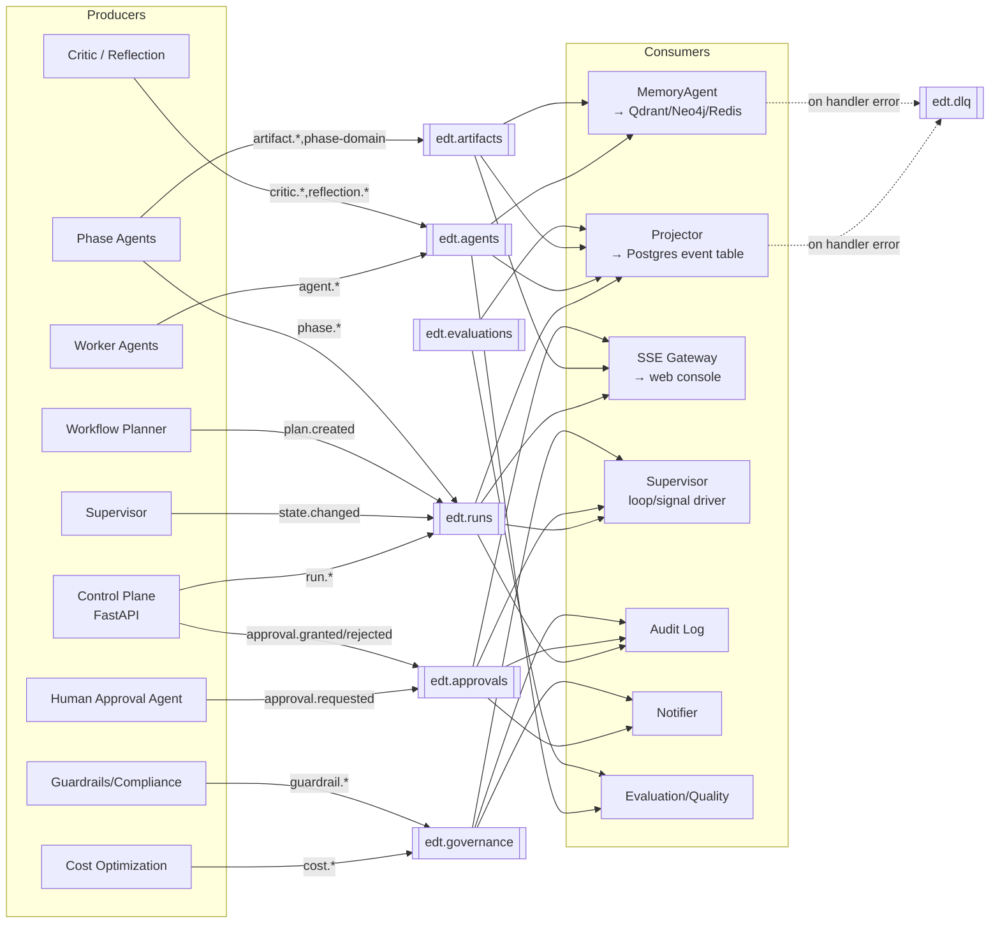

# 14 — Event Model

> **EDT Platform** (`edt_platform`). Platform-wide eventing on **Apache Kafka** (Redpanda in
> dev) using the **CloudEvents 1.0** envelope, JSON Schema / Avro subjects in a **Schema
> Registry**.
>
> **Related docs:** [`03-workflow.md`](./03-workflow.md) ·
> [`13-data-model.md`](./13-data-model.md) ·
> [`12-api-specification.md`](./12-api-specification.md) · [`02-architecture.md`](./02-architecture.md)

Events are the spine of the platform: every agent step, phase transition, approval, and cost
signal is an event. They power episodic memory ([`13-data-model.md`](./13-data-model.md) `event`
table), the SSE live-progress stream ([`12-api-specification.md`](./12-api-specification.md)),
observability, and loop triggers ([`03-workflow.md`](./03-workflow.md#45-how-loops-are-triggered)).

---

## 1. CloudEvents 1.0 envelope

All events are CloudEvents 1.0 in **structured JSON** mode (Kafka value = full CloudEvent;
`ce_id` also mirrored to a Kafka header for cheap dedupe).

| Attribute | Req | Convention |
|-----------|-----|------------|
| `specversion` | yes | `"1.0"` |
| `id` | yes | UUID v7 — **idempotency key** (unique per event) |
| `source` | yes | URI of producer: `/edt/{service}/{agent}` e.g. `/edt/orchestrator/supervisor` |
| `type` | yes | reverse-DNS-ish: `edt.<phase|domain>.<entity>.<action>` |
| `subject` | opt | primary entity id, e.g. `run/{run_id}` or `artifact/{artifact_id}` |
| `time` | yes | RFC3339 UTC |
| `datacontenttype` | yes | `application/json` |
| `dataschema` | yes | Schema Registry URI: `https://schemas.edt/…/{subject}/{version}` |
| `data` | yes | typed payload (validated against `dataschema`) |

**Extension attributes (all events carry these for correlation & tenancy):**

| Extension | Meaning |
|-----------|---------|
| `orgid` | tenant / organization id |
| `runid` | owning run id |
| `phaseid` | phase id (when applicable) |
| `traceid` | OpenTelemetry / Langfuse trace id |
| `correlationid` | causal chain id (equal to the originating command's id) |
| `partitionkey` | Kafka partition key (usually `runid`) |

```json
{
  "specversion": "1.0",
  "id": "018f9c3e-6b2a-7c11-9a3d-2f1e4b5c6d7e",
  "source": "/edt/orchestrator/supervisor",
  "type": "edt.phase.started",
  "subject": "run/018f9b00-1111-7000-8000-000000000001",
  "time": "2026-07-17T09:14:03Z",
  "datacontenttype": "application/json",
  "dataschema": "https://schemas.edt/edt.phase.started/1.2.0",
  "orgid": "org_acme",
  "runid": "018f9b00-1111-7000-8000-000000000001",
  "phaseid": "018f9b00-2222-7000-8000-000000000010",
  "traceid": "4bf92f3577b34da6a3ce929d0e0e4736",
  "correlationid": "018f9b00-aaaa-7000-8000-0000000000ff",
  "partitionkey": "018f9b00-1111-7000-8000-000000000001",
  "data": { "phase": "discover", "seq": 1, "planned_workers": 14 }
}
```

---

## 2. Event catalog

Producers/consumers reference components from [`02-architecture.md`](./02-architecture.md).

| Event `type` | Producer | Consumers | Payload summary |
|--------------|----------|-----------|-----------------|
| `edt.run.created` | Control plane (FastAPI) | Supervisor, Projector, Audit | `run_id, project_id, business_problem` |
| `edt.run.planning.started` | Workflow Planner | Supervisor, SSE gateway | `run_id` |
| `edt.run.plan.created` | Workflow Planner | Supervisor, Cost Optimization | `plan{phases,workers,tiers}, budget_usd_cap` |
| `edt.run.state.changed` | Supervisor | Projector, SSE gateway, Audit | `from, to, reason` |
| `edt.phase.started` | Phase Agent | Supervisor, SSE, Monitoring | `phase, seq, planned_workers` |
| `edt.phase.completed` | Phase Agent | Supervisor, Human Approval, SSE | `phase, artifacts[], avg_confidence` |
| `edt.agent.execution.started` | Any agent | Observability, Cost | `agent, model, phase` |
| `edt.agent.execution.completed` | Any agent | Cost, Projector, Eval | `agent, tokens, cost_usd, confidence` |
| `edt.agent.reflection.completed` | Reflection Agent | Critic, Supervisor | `execution_id, changed, notes` |
| `edt.critic.rejected` | Critic / Idea Critic | Phase Agent (loop), SSE | `subject_id, reasons[], score` |
| `edt.critic.approved` | Critic | Phase Agent, Projector | `subject_id, score` |
| `edt.discover.persona.created` | Persona Builder | Memory, KG writer, SSE | `persona{...}, confidence` |
| `edt.discover.insight.created` | Research Synthesizer | Memory, KG writer | `insight{statement, evidence}` |
| `edt.define.opportunity.created` | Opportunity Prioritization | Memory, KG writer | `opportunity{title, priority_score}` |
| `edt.ideate.idea.created` | Ideate workers | Memory, Idea Cluster | `idea{title}, batch_id` |
| `edt.ideate.ideas.ranked` | Idea Ranking | Supervisor, SSE | `ranking[], top_n` |
| `edt.prototype.prd.created` | PRD Generator | Memory, SSE, Approval | `artifact_id, version` |
| `edt.prototype.app.generated` | React/No-Code Generator | S3, SSE | `artifact_id, s3_uri, framework` |
| `edt.validate.report.created` | Feedback Analyzer | Supervisor, SSE | `artifact_id, confidence, go_no_go` |
| `edt.artifact.created` | Any producer agent | Projector, Memory, Qdrant, Neo4j | `artifact_id, type, version, s3_uri` |
| `edt.artifact.version.created` | Any producer agent | Projector, Memory | `artifact_id, version, content_hash` |
| `edt.approval.requested` | Human Approval Agent | Approval inbox, SSE, Notifier | `approval_id, gate_id, artifact_id` |
| `edt.approval.granted` | Control plane | Supervisor (signal), Audit | `approval_id, gate_id, decided_by` |
| `edt.approval.rejected` | Control plane | Supervisor (loop), Audit | `approval_id, gate_id, comments` |
| `edt.evaluation.completed` | Evaluation Agent | Quality, Projector | `subject_id, evaluator, metric, score, passed` |
| `edt.memory.written` | MemoryAgent | Observability | `layer, subject_kind, subject_id` |
| `edt.cost.threshold.exceeded` | Cost Optimization | Supervisor (pause), SSE, Notifier | `run_id, cost_usd, cap_usd, pct` |
| `edt.guardrail.violation` | Guardrails/Compliance | Security, Supervisor, Audit | `kind, severity, detail` |
| `edt.run.completed` | Supervisor | Projector, Notifier, Memory | `run_id, deliverables[]` |
| `edt.run.failed` | Temporal/Supervisor | Notifier, Audit, SSE | `run_id, error, phase` |
| `edt.run.cancelled` | Control plane | Supervisor, Audit | `run_id, by` |

---

## 3. Kafka topic design

Topics are **domain-grained** (not one-per-event-type) to keep partition counts sane while
preserving per-run ordering via the partition key.

| Topic | Partition key | Partitions | Retention | Cleanup | Schema Registry subjects |
|-------|---------------|-----------|-----------|---------|--------------------------|
| `edt.runs` | `runid` | 24 | 30d | delete | `edt.runs-value` (union: run.* , phase.*) |
| `edt.agents` | `runid` | 48 | 7d | delete | `edt.agents-value` (agent.*, critic.*, reflection.*) |
| `edt.artifacts` | `runid` | 24 | 90d | delete | `edt.artifacts-value` (artifact.*, discover.*, define.*, ideate.*, prototype.*, validate.*) |
| `edt.approvals` | `runid` | 12 | 365d | delete | `edt.approvals-value` (approval.*) |
| `edt.evaluations` | `runid` | 12 | 90d | delete | `edt.evaluations-value` (evaluation.*) |
| `edt.memory` | `orgid` | 12 | 30d | delete | `edt.memory-value` (memory.*) |
| `edt.governance` | `orgid` | 12 | 365d | compact+delete | `edt.governance-value` (cost.*, guardrail.*) |
| `edt.dlq` | original key | 12 | 30d | delete | `edt.dlq-value` (wrapped CloudEvent + error) |

Notes:
- **Ordering** is guaranteed per `runid` because that is the partition key — all events for one
  run land on one partition in emit order. Cross-run ordering is not guaranteed (nor needed).
- **Schema Registry**: subject naming = `TopicNameStrategy` (`<topic>-value`) with the CloudEvent
  as an Avro union of the event data schemas; **backward-compatible** evolution enforced.
- Consumers use **consumer groups** per projector/service; **KEDA** scales workers on lag.
- Governance topic is compacted so the latest cost snapshot per run is always retained.

---

## 4. Event flow



---

## 5. Example payloads

### 5.1 `edt.discover.persona.created`

```json
{
  "specversion": "1.0",
  "id": "018f9c40-aaaa-7c11-9a3d-000000000abc",
  "source": "/edt/agents/persona-builder",
  "type": "edt.discover.persona.created",
  "subject": "persona/018f9c40-1234-7000-8000-000000000001",
  "time": "2026-07-17T09:22:11Z",
  "datacontenttype": "application/json",
  "dataschema": "https://schemas.edt/edt.discover.persona.created/1.0.0",
  "orgid": "org_acme",
  "runid": "018f9b00-1111-7000-8000-000000000001",
  "phaseid": "018f9b00-2222-7000-8000-000000000010",
  "traceid": "4bf92f3577b34da6a3ce929d0e0e4736",
  "correlationid": "018f9b00-aaaa-7000-8000-0000000000ff",
  "partitionkey": "018f9b00-1111-7000-8000-000000000001",
  "data": {
    "persona_id": "018f9c40-1234-7000-8000-000000000001",
    "name": "Regional Operations Lead",
    "segment": "mid-market logistics",
    "goals": ["reduce dispatch latency", "cut fuel spend"],
    "frustrations": ["manual routing", "no real-time visibility"],
    "jobs_to_be_done": ["plan optimal routes each morning"],
    "confidence": 0.86
  }
}
```

### 5.2 `edt.approval.requested`

```json
{
  "specversion": "1.0",
  "id": "018f9c55-bbbb-7c11-9a3d-000000000def",
  "source": "/edt/services/human-approval",
  "type": "edt.approval.requested",
  "subject": "approval/018f9c55-9999-7000-8000-000000000002",
  "time": "2026-07-17T10:03:40Z",
  "datacontenttype": "application/json",
  "dataschema": "https://schemas.edt/edt.approval.requested/1.1.0",
  "orgid": "org_acme",
  "runid": "018f9b00-1111-7000-8000-000000000001",
  "partitionkey": "018f9b00-1111-7000-8000-000000000001",
  "data": {
    "approval_id": "018f9c55-9999-7000-8000-000000000002",
    "gate_id": "gate_1",
    "phase": "discover",
    "artifact_id": "018f9c50-7777-7000-8000-000000000003",
    "artifact_type": "insights",
    "avg_confidence": 0.83,
    "expires_at": "2026-07-20T10:03:40Z"
  }
}
```

### 5.3 `edt.critic.rejected`

```json
{
  "specversion": "1.0",
  "id": "018f9c66-cccc-7c11-9a3d-000000000012",
  "source": "/edt/agents/idea-critic",
  "type": "edt.critic.rejected",
  "subject": "idea/018f9c60-5555-7000-8000-000000000004",
  "time": "2026-07-17T11:20:05Z",
  "datacontenttype": "application/json",
  "dataschema": "https://schemas.edt/edt.critic.rejected/1.0.0",
  "orgid": "org_acme",
  "runid": "018f9b00-1111-7000-8000-000000000001",
  "phaseid": "018f9b00-2222-7000-8000-000000000030",
  "correlationid": "018f9b00-aaaa-7000-8000-0000000000ff",
  "partitionkey": "018f9b00-1111-7000-8000-000000000001",
  "data": {
    "subject_kind": "idea",
    "subject_id": "018f9c60-5555-7000-8000-000000000004",
    "score": 0.41,
    "threshold": 0.60,
    "reasons": ["weak differentiation vs incumbents", "unclear willingness-to-pay"],
    "loop_target": "ideate.divergent"
  }
}
```

### 5.4 `edt.cost.threshold.exceeded`

```json
{
  "specversion": "1.0",
  "id": "018f9c77-dddd-7c11-9a3d-000000000045",
  "source": "/edt/services/cost-optimization",
  "type": "edt.cost.threshold.exceeded",
  "subject": "run/018f9b00-1111-7000-8000-000000000001",
  "time": "2026-07-17T12:45:00Z",
  "datacontenttype": "application/json",
  "dataschema": "https://schemas.edt/edt.cost.threshold.exceeded/1.0.0",
  "orgid": "org_acme",
  "runid": "018f9b00-1111-7000-8000-000000000001",
  "partitionkey": "018f9b00-1111-7000-8000-000000000001",
  "data": {
    "cost_usd": 182.40,
    "cap_usd": 200.00,
    "pct": 0.912,
    "action": "pause_and_notify",
    "top_spenders": [
      {"agent": "ResearchSynthesizer", "model": "claude-opus-4-8", "cost_usd": 44.10}
    ]
  }
}
```

---

## 6. Idempotency, ordering, DLQ, replay

### 6.1 Idempotency
- The CloudEvents `id` is the **idempotency key**. The `event` table has `UNIQUE(ce_id)`
  ([`13-data-model.md`](./13-data-model.md)); the Projector uses `INSERT … ON CONFLICT (ce_id)
  DO NOTHING` so redelivery is a no-op.
- Producers derive `id` deterministically for retryable emissions (e.g.
  `uuid5(execution_id + "artifact.created")`) so at-least-once producer retries dedupe.
- Downstream state mutations are keyed by natural keys (e.g. `content_hash` on
  `artifact_version`) to make handlers idempotent even beyond envelope dedupe.

### 6.2 Ordering
- Per-run ordering guaranteed by partition key = `runid`. Handlers must not assume cross-run
  order.
- Consumers commit offsets **after** successful handling (at-least-once). A monotonic
  `run.sequence` (from the Projector) lets the SSE gateway detect and reorder out-of-window
  gaps for the UI.

### 6.3 Dead-letter queue
- On non-transient handler failure (schema-invalid, poison message, N retries with backoff),
  the consumer publishes the original CloudEvent wrapped with error metadata to `edt.dlq`:

```json
{
  "type": "edt.dlq.wrapped",
  "data": {
    "original": { "...": "full CloudEvent" },
    "consumer_group": "projector",
    "error": "SchemaValidationError: data.confidence out of range",
    "attempts": 5,
    "first_seen": "2026-07-17T12:00:00Z"
  }
}
```

- A **DLQ processor** exposes ops tooling to inspect, fix/skip, and **re-emit** to the source
  topic. Alerts fire (`Prometheus`/Grafana) on DLQ depth > 0.

### 6.4 Replay
- Because `edt.*` topics retain events (7–365d) and the Projector is idempotent, replay =
  reset a consumer group's offsets to a timestamp/offset and reconsume.
- **Rebuild projections:** replay `edt.artifacts` + `edt.runs` into a fresh Postgres schema to
  reconstruct state (event-sourced projection).
- **Rehydrate memory:** replay `edt.artifacts` + `edt.memory` to rebuild Qdrant/Neo4j indexes.
- Replays run against an isolated consumer group to avoid disturbing live signals; approval and
  cost signals are **not** re-actioned on replay (Supervisor guards with `already_processed`
  checks keyed on `ce_id`).

---

## 7. Cross-references

- Which transitions emit which events → [`03-workflow.md`](./03-workflow.md).
- `event` table + memory records → [`13-data-model.md`](./13-data-model.md).
- SSE stream that surfaces these to the UI → [`12-api-specification.md`](./12-api-specification.md#5-streaming-ssewebsocket).
