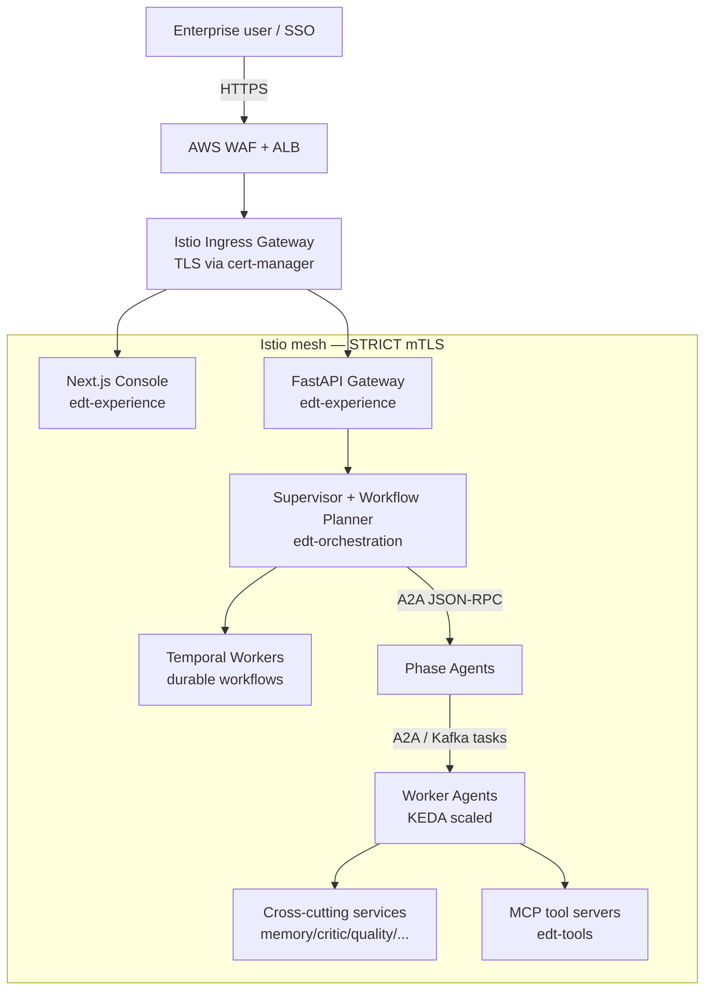
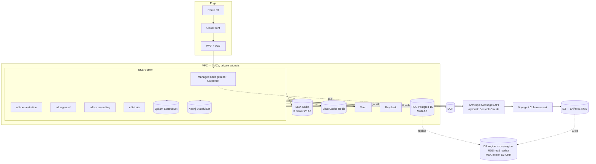
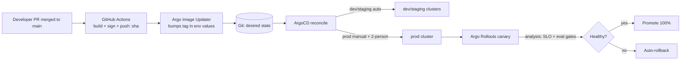
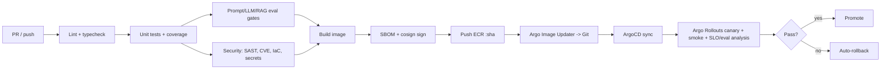

# 15 — Deployment & Cloud Architecture

> **EDT Platform** (`edt_platform`) — Enterprise Design Thinking AI Platform
> Deployment, cloud reference architecture, GitOps, CI/CD, secrets/identity, multi-environment, DR/HA, autoscaling, cost, network security.
>
> **Related docs:** [`03` Architecture Overview] · [`04` Agent Layer] · [`10` Event & Data Layer] · [`16` Evaluation Framework](./16-evaluation-framework.md) · [`19` Future Enhancements](./19-future-enhancements.md) · [`20` Production Readiness Checklist](./20-production-readiness-checklist.md)

---

## 1. Goals & Principles

| Principle | How it is realized |
|---|---|
| **Cloud-agnostic, AWS-reference** | All infra behind Terraform modules and Kubernetes abstractions; AWS is the reference wiring but Qdrant/Neo4j/Postgres/Kafka all run on managed *or* self-hosted backends. |
| **Every agent is independently deployable** | Each A2A worker agent is its own Docker image, Deployment, Service, and Agent Card endpoint. Blast radius is one agent. |
| **GitOps as the only path to prod** | No `kubectl apply` by humans in staging/prod. Desired state lives in Git; **ArgoCD** reconciles. |
| **Scale-to-zero for bursty work** | **KEDA** drives worker replicas from Kafka consumer-group lag; idle phase agents cost ~nothing. |
| **Secure by default** | mTLS everywhere via **Istio**, secrets from **Vault**, identity via **Keycloak/OIDC**, least-privilege IRSA. |
| **Everything observable** | OTel traces/metrics/logs, Langfuse LLM traces, Prometheus/Grafana/Loki (see [`14` Observability]). |

---

## 2. Containerization (Docker)

### 2.1 Image strategy

- **Base images**: `python:3.11-slim` for agent/API services; `node:20-alpine` for MCP servers and the Next.js console; distroless runtime stage for the smallest attack surface.
- **Multi-stage builds**: builder stage installs deps (uv / pip-tools locked `requirements.txt`), runtime stage copies only the venv + app.
- **Non-root**: `USER 10001`, read-only root FS, `--cap-drop=ALL`.
- **One responsibility per image**: `edt-supervisor`, `edt-workflow-planner`, `edt-agent-<name>`, `edt-api`, `edt-mcp-<server>`, `edt-console`.
- **SBOM + signing**: Syft SBOM emitted at build; images signed with **cosign** (keyless, OIDC) and verified by an admission policy (Kyverno/Sigstore policy-controller).

```dockerfile
# deploy/docker/agent.Dockerfile  (shared by all Python A2A agents)
FROM python:3.11-slim AS builder
WORKDIR /app
COPY pyproject.toml uv.lock ./
RUN pip install uv && uv export --frozen --no-dev -o requirements.txt \
    && uv pip install --system -r requirements.txt

FROM gcr.io/distroless/python3-debian12:nonroot AS runtime
WORKDIR /app
COPY --from=builder /usr/local/lib/python3.11/site-packages /usr/local/lib/python3.11/site-packages
COPY src/edt_platform /app/edt_platform
ENV PYTHONPATH=/app OTEL_SERVICE_NAME=${AGENT_NAME}
USER nonroot
# AGENT_MODULE is injected per-agent (e.g. edt_platform.agents.discover.persona_builder)
ENTRYPOINT ["python", "-m", "edt_platform.runtime.a2a_server"]
```

Each agent image is the *same* runtime; behavior is selected by env (`AGENT_NAME`, `AGENT_MODULE`, model tier, MCP servers, memory scopes, guardrail profile) so we build **one** parametrized image family, not 60 bespoke ones. Agent config is mounted from a ConfigMap + Vault.

### 2.2 Image registry & tagging

- Registry: **Amazon ECR** (`<acct>.dkr.ecr.<region>.amazonaws.com/edt/*`), mirrored to GHCR for CI.
- Tags: immutable `:<git-sha>` for deploys; `:<semver>` for releases; `:latest` only in dev.
- Retention: untagged images GC'd after 14 days; release tags kept per compliance retention.

---

## 3. Kubernetes Topology

### 3.1 Namespaces

| Namespace | Contents |
|---|---|
| `edt-experience` | Next.js console, API gateway, approval-inbox BFF |
| `edt-orchestration` | Supervisor, Workflow Planner, LangGraph runners, Temporal workers |
| `edt-agents-discover` … `edt-agents-validate` | Phase agents + worker agents, one namespace per phase for quota + policy isolation |
| `edt-cross-cutting` | Memory, Reflection, Critic, Quality, Tool-Selection, Context, Compliance, Security, Human-Approval, Cost/Token-Optimization services |
| `edt-tools` | MCP servers, Tool Registry, external API adapters |
| `edt-data` | Redis, Schema Registry, Kafka Connect (Postgres/MSK/Qdrant/Neo4j are managed or in their own namespaces/operators) |
| `edt-platform` | Istio control plane, cert-manager, external-secrets, KEDA, ArgoCD, Prometheus/Grafana/Loki, Vault agent injector |
| `temporal-system` | Temporal server (frontend/history/matching/worker) + UI |

Each namespace has a `ResourceQuota`, `LimitRange`, default-deny `NetworkPolicy`, and a dedicated `ServiceAccount` mapped to an AWS IAM role via **IRSA**.

### 3.2 Deployment per agent service

Every A2A agent ships as: `Deployment` + `Service` (ClusterIP) + `ServiceAccount` + `ScaledObject` (KEDA) + `PeerAuthentication` (STRICT mTLS) + `VirtualService`/`DestinationRule` (Istio) + `ServiceMonitor` (Prometheus).

```yaml
# deploy/k8s/agents/persona-builder/deployment.yaml
apiVersion: apps/v1
kind: Deployment
metadata:
  name: agent-persona-builder
  namespace: edt-agents-discover
  labels: { app: agent-persona-builder, edt/phase: discover, edt/tier: worker }
spec:
  replicas: 1                    # baseline; KEDA scales 0..N
  selector: { matchLabels: { app: agent-persona-builder } }
  template:
    metadata:
      labels: { app: agent-persona-builder, edt/phase: discover }
      annotations:
        vault.hashicorp.com/agent-inject: "true"
        vault.hashicorp.com/role: "edt-agent-persona-builder"
        vault.hashicorp.com/agent-inject-secret-anthropic: "kv/data/edt/anthropic"
    spec:
      serviceAccountName: sa-persona-builder      # IRSA -> scoped IAM
      securityContext: { runAsNonRoot: true, seccompProfile: { type: RuntimeDefault } }
      containers:
        - name: agent
          image: <acct>.dkr.ecr.<region>.amazonaws.com/edt/agent:<git-sha>
          env:
            - { name: AGENT_NAME,   value: persona-builder }
            - { name: AGENT_MODULE, value: edt_platform.agents.discover.persona_builder }
            - { name: MODEL_TIER,   value: sonnet-5 }        # routed; may upshift to opus-4-8
            - { name: KAFKA_TOPIC,  value: edt.discover.persona.tasks }
          resources:
            requests: { cpu: "250m", memory: "512Mi" }
            limits:   { cpu: "1",    memory: "1Gi" }
          readinessProbe: { httpGet: { path: /healthz/ready, port: 8080 }, periodSeconds: 5 }
          livenessProbe:  { httpGet: { path: /healthz/live,  port: 8080 }, periodSeconds: 10 }
          securityContext: { readOnlyRootFilesystem: true, allowPrivilegeEscalation: false }
```

### 3.3 Autoscaling — HPA + KEDA on Kafka lag

- **Stateless request-driven services** (API, console, Supervisor HTTP): **HPA** on CPU + custom `requests_in_flight` metric.
- **Event/worker agents** (consume phase task topics): **KEDA `ScaledObject`** on **Kafka consumer-group lag** → scale-to-zero when idle, burst when a run kicks off.

```yaml
# deploy/k8s/agents/persona-builder/scaledobject.yaml
apiVersion: keda.sh/v1alpha1
kind: ScaledObject
metadata: { name: persona-builder, namespace: edt-agents-discover }
spec:
  scaleTargetRef: { name: agent-persona-builder }
  minReplicaCount: 0
  maxReplicaCount: 20
  cooldownPeriod: 120
  triggers:
    - type: kafka
      metadata:
        bootstrapServers: b-1.edt-msk...:9096
        consumerGroup: cg-persona-builder
        topic: edt.discover.persona.tasks
        lagThreshold: "5"          # ~5 pending tasks per replica
        offsetResetPolicy: latest
      authenticationRef: { name: keda-msk-iam }
```

> **Guardrail on concurrency:** an org-wide `maxReplicaCount` budget and a Redis token-bucket rate limiter cap *aggregate* Anthropic API concurrency so KEDA can't stampede the Messages API or blow the cost budget (see §11 and [`16`](./16-evaluation-framework.md)).

### 3.4 Istio service mesh

- **STRICT mTLS** cluster-wide (`PeerAuthentication` in `istio-system`).
- **AuthorizationPolicy** per namespace: e.g., only `edt-orchestration` SAs may call phase-agent A2A endpoints; only cross-cutting Human-Approval may call the approval BFF.
- **Traffic management**: `DestinationRule` with outlier detection (eject agents returning 5xx), retries (`3`, `perTryTimeout: 10s`), circuit breaking on connection pool.
- **Canary/rollout**: Istio `VirtualService` weight-split driven by Argo Rollouts for progressive delivery of the API and Supervisor.
- **Egress control**: `ServiceEntry` + egress gateway allow-list — only `api.anthropic.com`, Voyage/Cohere rerank, and approved external APIs may leave the mesh; everything else is denied (data-exfil control).

### 3.5 Ingress / Gateway

- **Istio Ingress Gateway** behind an AWS **NLB**; **AWS ALB** + WAF in front for L7 rules, geo/IP allow-lists, and OWASP managed rules.
- TLS terminated at the gateway with **cert-manager** (ACME/Let's Encrypt for non-prod, ACM for prod).
- Public surface is minimal: `console.edt.<org>.com`, `api.edt.<org>.com`. Everything else is cluster-internal.



---

## 4. AWS Reference Architecture

| Concern | AWS service | Notes |
|---|---|---|
| Kubernetes | **EKS** (managed control plane, 1.30+) | Managed node groups (Graviton `m7g`/`c7g`) + Karpenter for just-in-time nodes; Fargate for `edt-platform` add-ons |
| Relational | **RDS PostgreSQL 16** (Multi-AZ) | Artifacts metadata, episodic memory, Temporal persistence; `pgvector` available as fallback |
| Event bus | **Amazon MSK** (Kafka) | 3 brokers across AZs; IAM auth; Schema Registry (self-hosted/Glue) |
| Cache/working memory | **ElastiCache Redis** (cluster mode) | Working memory, rate-limit token buckets, distributed locks |
| Object storage | **S3** | Artifact blobs, prototype bundles, exports; SSE-KMS; Object Lock for compliance retention |
| Vector DB | **Qdrant** on EKS (StatefulSet + EBS) *or* Qdrant Cloud | Semantic memory / RAG index |
| Knowledge Graph | **Neo4j** (AuraDB *or* self-managed on EKS StatefulSet) | GraphRAG, entity/relationship memory |
| LLM | **Anthropic Messages API** (primary) | **Bedrock (Claude)** optional for data-residency/VPC-only deployments |
| Secrets | **Vault** (on EKS) + AWS Secrets Manager for bootstrap | External Secrets Operator syncs |
| Identity | **Keycloak** (OIDC) on EKS, federated to enterprise IdP | RBAC/ABAC |
| Registry | **ECR** | Signed images |
| DNS/CDN | **Route 53** + **CloudFront** (console static) | |
| Observability backends | Managed **AMP** (Prometheus) + **AMG** (Grafana) optional; else self-hosted | Loki on S3 |



**VPC layout:** private subnets for EKS nodes and data stores; public subnets only for ALB/NAT; VPC endpoints (S3, ECR, STS, Secrets Manager, MSK) keep traffic off the internet; Anthropic egress only through the egress gateway.

---

## 5. Terraform Module Layout

```
deploy/terraform/
├── modules/
│   ├── network/            # VPC, subnets, NAT, VPC endpoints, SGs
│   ├── eks/                # cluster, node groups, Karpenter, IRSA, addons
│   ├── rds-postgres/       # Multi-AZ instance, params, KMS, backups
│   ├── msk-kafka/          # brokers, IAM auth, configs, topics via provider
│   ├── elasticache-redis/  # cluster-mode, auth token, encryption
│   ├── s3-artifacts/       # buckets, KMS, Object Lock, lifecycle, CRR
│   ├── qdrant/             # helm release + EBS gp3 storageclass
│   ├── neo4j/              # helm release or AuraDB
│   ├── vault/              # HA raft, auto-unseal via KMS
│   ├── keycloak/           # OIDC, realm, clients
│   ├── observability/      # AMP/AMG or Prometheus/Grafana/Loki
│   └── security/           # WAF, GuardDuty, cfg rules, KMS keys, IRSA policies
├── envs/
│   ├── dev/     (terragrunt.hcl → modules, small sizes, MinIO/Redpanda option)
│   ├── staging/
│   └── prod/    (Multi-AZ, larger sizes, stricter policies)
└── global/     # Route53 zones, ECR, org SCP, remote state (S3+DynamoDB lock)
```

- **State**: S3 backend + DynamoDB lock, one state per env; **Terragrunt** DRY wrapper.
- **Provider versions pinned**; `tflint` + `checkov`/`tfsec` in CI (see §7).
- Kubernetes *workloads* are **not** Terraform's job — Terraform provisions infra + bootstraps ArgoCD; ArgoCD owns app manifests (clean separation).

---

## 6. ArgoCD GitOps Flow

- **App-of-apps**: a root ArgoCD `Application` points at `deploy/argocd/` which enumerates one `Application` per service/namespace.
- **Repo structure**: Helm charts under `deploy/k8s/charts/*`, environment values under `deploy/k8s/envs/{dev,staging,prod}/values.yaml`. Image tags are updated by CI via **Argo CD Image Updater** (writes the new `:<git-sha>` back to the env values file → Git → reconcile).
- **Sync policy**: dev = auto-sync + self-heal + prune; staging = auto-sync; **prod = manual sync with two-person approval** (change management gate, see [`20`](./20-production-readiness-checklist.md)).
- **Progressive delivery**: **Argo Rollouts** (canary 10%→50%→100% with automated analysis on Prometheus SLOs + eval gates from [`16`](./16-evaluation-framework.md); auto-rollback on breach).



---

## 7. CI/CD Pipeline — GitHub Actions

Stages (on PR → on merge to `main` → on tag):

| Stage | Tools | Gate |
|---|---|---|
| **Lint/format** | `ruff`, `black --check`, `mypy`, `eslint`, `prettier` | block on error |
| **Unit tests** | `pytest` (+ coverage ≥ 80%), `vitest` (TS/MCP) | block |
| **Prompt & LLM eval** | **promptfoo** regression, **DeepEval** unit tests, **RAGAS** on golden set | block if score < threshold (see [`16`](./16-evaluation-framework.md)) |
| **Security scan** | `pip-audit`, `npm audit`, **Trivy**/**Grype** image CVE, **checkov**/`tfsec` IaC, **gitleaks** secrets, CodeQL SAST | block on high/critical |
| **SBOM + sign** | Syft SBOM, **cosign** sign (keyless OIDC) | attach attestation |
| **Build & push** | Docker Buildx → ECR/GHCR `:<git-sha>` | |
| **Deploy** | Argo Image Updater bumps tag → ArgoCD | dev auto → staging auto → prod manual |
| **Post-deploy** | smoke tests, synthetic run of a mini design-thinking flow, SLO check | rollback on fail |

```yaml
# .github/workflows/ci.yaml (excerpt)
name: edt-ci
on: { pull_request: {}, push: { branches: [main], tags: ['v*'] } }
permissions: { contents: read, id-token: write, packages: write }   # id-token for OIDC->AWS & cosign
jobs:
  quality:
    runs-on: ubuntu-latest
    steps:
      - uses: actions/checkout@v4
      - uses: astral-sh/setup-uv@v3
      - run: uv sync --frozen
      - run: uv run ruff check . && uv run black --check . && uv run mypy src
      - run: uv run pytest --cov=edt_platform --cov-fail-under=80
  eval-gates:
    needs: quality
    runs-on: ubuntu-latest
    steps:
      - uses: actions/checkout@v4
      - run: npx promptfoo@latest eval -c eval/promptfoo/*.yaml --fail-on-score 0.8
      - run: uv run deepeval test run tests/eval/
      - run: uv run python -m edt_platform.eval.ragas_gate --min-faithfulness 0.85
  security:
    needs: quality
    runs-on: ubuntu-latest
    steps:
      - uses: actions/checkout@v4
      - run: pipx run gitleaks detect --no-git -v
      - uses: aquasecurity/trivy-action@master
        with: { scan-type: fs, severity: 'HIGH,CRITICAL', exit-code: '1' }
      - run: pipx run checkov -d deploy/terraform
  build-push:
    needs: [eval-gates, security]
    if: github.ref == 'refs/heads/main' || startsWith(github.ref, 'refs/tags/')
    runs-on: ubuntu-latest
    steps:
      - uses: actions/checkout@v4
      - uses: aws-actions/configure-aws-credentials@v4
        with: { role-to-assume: ${{ secrets.ECR_PUSH_ROLE }}, aws-region: us-east-1 }
      - run: |
          docker buildx build -f deploy/docker/agent.Dockerfile \
            -t $ECR/edt/agent:${{ github.sha }} --push .
          cosign sign --yes $ECR/edt/agent:${{ github.sha }}
```



---

## 8. Secrets (Vault) & Identity (Keycloak / OIDC)

### 8.1 Secrets — HashiCorp Vault

- **HA raft** with **KMS auto-unseal**; audit log to a dedicated S3 bucket.
- **Kubernetes auth** method: pods authenticate by ServiceAccount JWT → get short-lived secrets.
- **Dynamic secrets**: Postgres/Redis creds issued dynamically with TTL; DB engine rotates.
- **KV v2** for API keys (Anthropic, Voyage, Cohere) with per-agent policies (persona-builder can read only `kv/edt/anthropic`, not `kv/edt/stripe`).
- **External Secrets Operator** mirrors selected Vault paths into K8s Secrets where the Vault agent sidecar isn't used.
- **Transit engine** for envelope encryption of especially sensitive artifact fields.

### 8.2 Identity — Keycloak / OIDC / OAuth2

- Keycloak realm `edt`, federated to the enterprise IdP (SAML/OIDC brokering, SCIM provisioning).
- **User-facing**: console + API use OIDC Authorization Code + PKCE; JWT access tokens carry roles/attributes.
- **Service-to-service**: A2A calls carry OIDC client-credentials tokens *plus* Istio mTLS identity; the A2A server validates both.
- **RBAC/ABAC**: roles (`viewer`, `contributor`, `approver`, `admin`) + attributes (business unit, data-residency region) enforced at API gateway (OPA policy) and in Human-Approval gates.
- **Approvals** require an `approver` role and are non-repudiably logged (who/when/artifact version) — feeds compliance ([`20`](./20-production-readiness-checklist.md)).

---

## 9. Multi-Environment (dev / staging / prod)

| Aspect | dev | staging | prod |
|---|---|---|---|
| Cluster | shared small EKS (or kind for local) | dedicated EKS | dedicated EKS, Multi-AZ |
| Data backends | **MinIO / Redpanda / single-AZ RDS** | managed, single-AZ | **S3 / MSK / Multi-AZ RDS** |
| LLM model routing | Haiku-heavy to save cost | mirrors prod routing | full Opus/Sonnet/Haiku routing |
| ArgoCD sync | auto + prune + self-heal | auto | **manual + 2-person approval** |
| Eval gates | warn | block | block + canary analysis |
| Data | synthetic only | anonymized subset | real (with governance) |
| Access | broad dev | limited | break-glass only |

- **Config isolation**: no env values cross the boundary; secrets namespaced per env in Vault (`kv/edt/<env>/*`).
- **Promotion**: same image `:<git-sha>` promoted dev→staging→prod (build once, promote — never rebuild per env).

---

## 10. DR / HA

| Layer | HA (in-region) | DR (cross-region) |
|---|---|---|
| EKS | Multi-AZ node groups; PodDisruptionBudgets; multi-replica critical services | Warm-standby EKS in DR region, bootstrapped by Terraform + ArgoCD from same Git |
| RDS Postgres | Multi-AZ synchronous standby | Cross-region **read replica**, promotable |
| MSK Kafka | 3 brokers across 3 AZ, RF=3, `min.insync.replicas=2` | **MSK Replicator**/MirrorMaker to DR |
| Redis | ElastiCache cluster-mode, Multi-AZ w/ auto-failover | Global Datastore (optional) |
| S3 | 11-nines durability | **Cross-Region Replication** + versioning + Object Lock |
| Qdrant/Neo4j | 3-node clusters, anti-affinity, EBS snapshots | Snapshot ship + restore runbook |
| Temporal | Multi-replica; state in RDS | DR namespace failover |

- **RPO ≤ 15 min**, **RTO ≤ 1 h** for the core platform (targets; validated by quarterly game-days).
- **Backups**: RDS automated + PITR (35-day); Vault raft snapshots; Neo4j/Qdrant snapshots to S3; **restore tested** monthly (a backup you haven't restored is a rumor).
- **Idempotent, resumable runs**: Temporal + LangGraph checkpoints mean an interrupted design-thinking run resumes at the last completed phase/agent, not from scratch.

---

## 11. Autoscaling & Cost Controls

- **Node autoscaling**: Karpenter provisions Spot for stateless worker agents, On-Demand for stateful/data. Consolidation bin-packs idle nodes.
- **Workload autoscaling**: KEDA scale-to-zero for idle agents (§3.3), HPA for request-driven services, VPA in recommendation mode for right-sizing.
- **LLM cost governance** (the dominant cost, not compute):
  - **Model routing** (Cost/Token-Optimization service): Haiku 4.5 for extraction/classification, Sonnet 5 default, Opus 4.8 only for deep reasoning/critique/final synthesis.
  - **Prompt caching** of long system prompts, ontologies, and retrieved context.
  - **Aggregate concurrency cap** + Redis token-bucket to bound spend; per-run and per-tenant **token budgets** enforced by the Supervisor (hard stop + escalate).
  - **Semantic caching** of embeddings/retrievals; dedup identical tool calls within a run.
  - **Batching** extraction jobs to Haiku.
- **FinOps visibility**: cost attributed per run/tenant/phase/agent/model via Langfuse + Kubecost; budgets and anomaly alerts (see [`20`](./20-production-readiness-checklist.md) Cost Governance).

---

## 12. Network Security

- **Default-deny NetworkPolicies** per namespace; explicit allow between tiers only.
- **Istio STRICT mTLS** + `AuthorizationPolicy` (identity-based L7 authz).
- **Egress gateway allow-list** (Anthropic, Voyage/Cohere, approved external APIs only) — blocks data exfiltration.
- **WAF** (OWASP + rate limiting + bot control) at the edge; **Shield** for DDoS.
- **Private everything**: nodes/data in private subnets, VPC endpoints, no public DB.
- **Supply chain**: signed images, admission verification (cosign policy), SBOM, pinned deps, Dependabot/Renovate.
- **Runtime**: **Falco** for anomalous syscall detection; GuardDuty; read-only root FS; seccomp `RuntimeDefault`.
- **PII in transit**: Presidio redaction before any external LLM egress where policy requires; Bedrock-in-VPC option for strict data residency (see [`16`](./16-evaluation-framework.md) guardrail tests and [`20`](./20-production-readiness-checklist.md) Privacy).

---

## 13. Cross-References

- Evaluation gates that block CI/canary → [`16` Evaluation Framework](./16-evaluation-framework.md)
- End-to-end run that exercises this topology → [`17` Example Execution](./17-example-execution.md)
- What "prod-ready" means operationally → [`20` Production Readiness Checklist](./20-production-readiness-checklist.md)
- Roadmap for on-prem/air-gapped & Bedrock-only modes → [`19` Future Enhancements](./19-future-enhancements.md)
