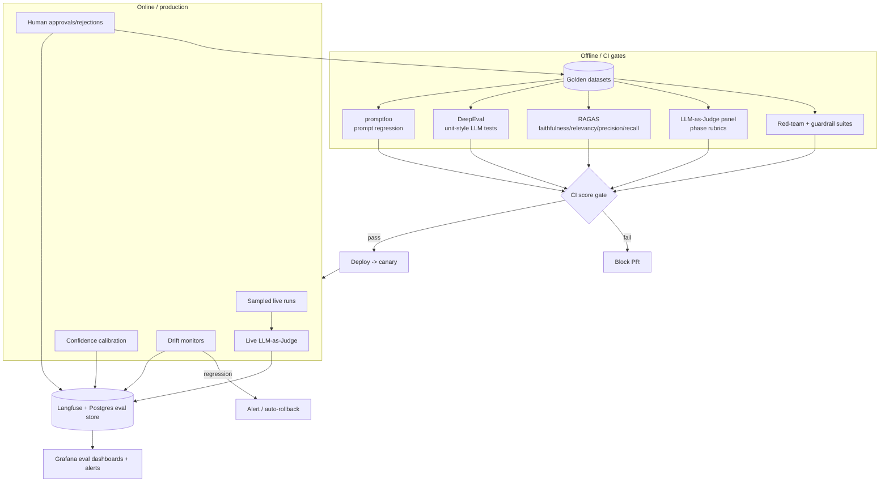
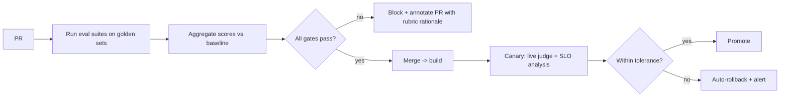

# 16 — Evaluation Framework

> **EDT Platform** (`edt_platform`) — how we measure and gate quality, safety, and cost across every agent and every design-thinking phase.
>
> **Related docs:** [`04` Agent Layer] · [`08` Guardrails] · [`14` Observability] · [`15` Deployment](./15-deployment-architecture.md) · [`17` Example Execution](./17-example-execution.md) · [`18` Sample Outputs](./18-sample-outputs.md) · [`20` Production Readiness](./20-production-readiness-checklist.md)

---

## 1. Evaluation Philosophy

Design-thinking output is **open-ended and subjective** — there is no single golden answer for "a good persona." So we evaluate on two axes and never trust one signal alone:

| Axis | Question | Methods |
|---|---|---|
| **Offline (pre-deploy)** | Did this change make the system better or worse *before* it reaches users? | promptfoo regression, DeepEval unit tests, RAGAS, LLM-as-Judge on golden datasets, red-team suites — run in **CI gates** ([`15`](./15-deployment-architecture.md) §7). |
| **Online (in production)** | Is the system actually good on real runs, and is it drifting? | Live LLM-as-Judge sampling, confidence calibration, human-in-the-loop approvals, drift monitors on Langfuse traces, guardrail hit rates. |

**Core tenets**

1. **Every artifact carries a `confidence` 0–1** (per the canonical contract). Below the agent's threshold → `reflect()`/`self_correct()` retry, then escalate to human.
2. **Judge with rubrics, not vibes.** Every LLM-as-Judge call uses an explicit, versioned rubric returning structured scores + rationale.
3. **Panels beat single judges.** Subjective quality uses a *panel* of judges (different models/prompts) and aggregates to reduce single-model bias.
4. **Gate on trend, not just absolute.** CI blocks on regression relative to the last green baseline, not only on an absolute floor.
5. **Design-thinking-specific rubrics per phase** — generic "helpfulness" is not enough; a persona has different quality criteria than a business case.
6. **Human-in-the-loop is a first-class eval signal.** Approval/rejection at phase gates is captured, labeled, and fed back into golden sets.



---

## 2. Per-Agent Evaluation

Each `BaseAgent` spec includes **Evaluation Criteria** (field 25 of the 25-field template). Every agent gets a test suite keyed to its output schema:

| Layer | What it checks | Tool |
|---|---|---|
| **Schema contract** | Output validates against the Pydantic/JSON-Schema output contract; required fields present; enums valid | pytest + Pydantic |
| **Determinism-safe assertions** | Structural invariants that must always hold (e.g., a Journey Map has ≥1 stage; an Opportunity Matrix has impact & effort in [1,5]) | DeepEval + custom |
| **Quality (subjective)** | Phase rubric scored by LLM-as-Judge panel | promptfoo + judge |
| **Regression** | Same inputs vs. last baseline — score must not drop > tolerance | promptfoo |
| **Cost/latency** | Token + wall-clock within budget for the agent's tier | Langfuse metrics |

Agents are grouped by phase; the CI matrix runs the relevant suites per changed agent (path-filtered) plus a nightly full run.

---

## 3. Prompt Regression — promptfoo

Used for prompt-library changes (`prompts/`). Catches "we improved persona prompt X but silently degraded Y."

```yaml
# eval/promptfoo/persona_builder.yaml
description: Persona Builder — regression + rubric
prompts:
  - file://prompts/discover/persona_builder.system.md
providers:
  - id: anthropic:messages:claude-sonnet-5
    config: { temperature: 0.4, max_tokens: 2000 }
defaultTest:
  options:
    provider: anthropic:messages:claude-opus-4-8   # judge tier
tests:
  - vars:
      research_pack: file://eval/fixtures/genz_bank_research.json
      segment: "Gen-Z urban, thin-file, mobile-first"
    assert:
      - type: is-json
        value: file://schemas/persona.schema.json
      - type: llm-rubric
        value: |
          Score 0-1. A strong persona: (a) is grounded ONLY in the provided
          research (no invented stats), (b) has a specific, non-generic name +
          context, (c) lists real goals, pains, JTBD tied to evidence,
          (d) avoids demographic stereotype. Penalize any fabricated figure.
      - type: latency
        threshold: 15000
      - type: cost
        threshold: 0.05
# CI: promptfoo eval --fail-on-score 0.8  (see 15 §7)
```

Baselines are stored; `promptfoo eval --share` posts a diff to the PR. A drop beyond tolerance vs. the last green baseline blocks merge.

---

## 4. Unit-Style LLM Tests — DeepEval

DeepEval gives `pytest`-style, metric-backed assertions for individual agent behaviors — including **G-Eval** custom criteria, hallucination, and tool-use correctness.

```python
# tests/eval/test_hmw_generator.py
import deepeval
from deepeval.metrics import GEval, FaithfulnessMetric
from deepeval.test_case import LLMTestCase, LLMTestCaseParams

hmw_quality = GEval(
    name="HMW Quality",
    criteria=(
        "A good How-Might-We is: (1) framed as an opportunity not a solution, "
        "(2) neither too broad nor too narrow, (3) traceable to a stated pain "
        "point/insight, (4) actionable and inspiring. Score 0-1."
    ),
    evaluation_params=[LLMTestCaseParams.INPUT, LLMTestCaseParams.ACTUAL_OUTPUT],
    model="claude-opus-4-8", threshold=0.75,
)

def test_hmw_from_insights(hmw_agent, genz_insights):
    out = hmw_agent.run(insights=genz_insights)
    tc = LLMTestCase(input=str(genz_insights), actual_output=out.hmw_statements_text,
                     retrieval_context=genz_insights.evidence)
    deepeval.assert_test(tc, [hmw_quality, FaithfulnessMetric(threshold=0.85)])
```

DeepEval results feed the CI `eval-gates` job ([`15`](./15-deployment-architecture.md) §7) and are logged to Langfuse for trend analysis.

---

## 5. RAG Evaluation — RAGAS

Every retrieval-augmented agent (Customer Research, Market Research, Research Synthesizer, Competitive Intelligence, GraphRAG-backed agents) is evaluated with **RAGAS**:

| Metric | Meaning | Gate (prod) |
|---|---|---|
| **Faithfulness** | Output claims are supported by retrieved context (anti-hallucination) | ≥ 0.85 |
| **Answer Relevancy** | Output actually answers the query | ≥ 0.80 |
| **Context Precision** | Retrieved chunks are relevant (signal vs. noise) | ≥ 0.70 |
| **Context Recall** | Retrieved context covers what's needed (vs. golden answer) | ≥ 0.75 |

```python
# edt_platform/eval/ragas_gate.py (invoked in CI)
from ragas import evaluate
from ragas.metrics import faithfulness, answer_relevancy, context_precision, context_recall
result = evaluate(golden_dataset, metrics=[faithfulness, answer_relevancy,
                                           context_precision, context_recall],
                  llm=judge_llm, embeddings=voyage_embeddings)
assert result["faithfulness"] >= 0.85, f"RAG faithfulness regressed: {result}"
```

Because we use hybrid retrieval + Contextual Retrieval + reranking + GraphRAG, RAGAS also gives us an **ablation harness**: we can measure the marginal contribution of reranking or GraphRAG on the golden set and justify their cost.

---

## 6. LLM-as-Judge Panels & Rubrics

- **Panel composition**: 3 judges — e.g., `claude-opus-4-8` (primary), `claude-sonnet-5` (secondary), plus a differently-prompted Opus (adversarial/skeptic). Scores aggregated by **median** (robust to one outlier); disagreement > 0.3 flags the item for human review.
- **Structured rubric output**: judges return `{ score: float, subscores: {...}, rationale: str, failed_criteria: [] }` — never a bare number, so rationale is auditable.
- **Bias controls**: randomized answer order, self-preference mitigation (a model doesn't judge only its own output), reference-guided scoring where a golden exists, and periodic **judge calibration** against human labels (target Cohen's κ ≥ 0.6 judge-vs-human).

```yaml
# eval/judges/persona_rubric.yaml
rubric_id: persona.v3
scale: [0, 1]
subscores:
  grounding:      "All claims traceable to research; zero fabricated stats"
  specificity:    "Concrete, non-generic; a real person, not a demographic"
  jtbd_quality:   "Jobs/pains/gains are real and evidence-linked"
  bias_safety:    "No demographic stereotype or protected-attribute misuse"
aggregate: median
escalate_if: "disagreement > 0.3 OR bias_safety < 0.7"
```

---

## 7. Golden Datasets

| Dataset | Purpose | Source |
|---|---|---|
| **Reference runs** | Full end-to-end runs (e.g., the retail-bank case in [`17`](./17-example-execution.md)) with human-approved artifacts as gold | curated + expert-reviewed |
| **Per-agent fixtures** | Input→expected-shape pairs per agent | synthetic + real (anonymized) |
| **RAG golden Q/A/context** | Query, ideal answer, ideal context set | SME-authored |
| **Red-team prompts** | Jailbreaks, PII bait, prompt-injection payloads | security team + open corpora |
| **Human-labeled quality set** | Judge calibration | analysts rate artifacts 0–1 |

Governance: golden sets are versioned in Git + DVC, PII-scrubbed, reviewed quarterly, and **grown from production** (approved/rejected artifacts and human overrides flow back in via the online loop, §11).

---

## 8. Design-Thinking Quality Rubrics per Phase

Each phase has a rubric applied to its key artifact(s). Scores 0–1; below **gate** blocks the phase transition (soft-gate → reflect/retry; hard-gate → human).

| Phase | Artifact | Rubric dimensions | Gate |
|---|---|---|---|
| **Discover** | Persona | grounding · specificity · JTBD realism · bias-safety | 0.80 |
| **Discover** | Journey Map | stage completeness · emotion arc plausibility · pain-point evidence · touchpoint coverage | 0.78 |
| **Define** | Problem Statement | clarity · user+need+insight structure · non-solutioning · evidence link | 0.82 |
| **Define** | HMW set | opportunity-framing · right altitude · traceability · diversity | 0.78 |
| **Define** | Opportunity Matrix | impact/effort justified · evidence-linked · dedup | 0.80 |
| **Ideate** | Idea Catalogue | novelty · feasibility · desirability · strategic fit · diversity across catalogue | 0.75 |
| **Ideate** | Idea Scoring | rubric consistency · calibration vs. reference · no scoring collapse | 0.80 |
| **Prototype** | PRD | completeness · testable acceptance criteria · scope clarity · NFRs present | 0.85 |
| **Prototype** | Architecture/API | internal consistency · feasibility · standards compliance · security-by-design | 0.82 |
| **Validate** | Business Case | financial rigor · assumption transparency · sensitivity analysis · ROI defensibility | 0.85 |
| **Validate** | Go/No-Go | evidence-weighted · risk-adjusted · decision-criteria adherence | 0.85 |

**Detailed sub-rubric example — Ideate / Idea Scoring**

| Dimension | 0.0–0.3 | 0.4–0.6 | 0.7–1.0 |
|---|---|---|---|
| **Novelty** | rehash of existing product | incremental twist | genuinely differentiated / blue-ocean |
| **Feasibility** | needs unproven tech | feasible with effort | buildable on current stack |
| **Desirability** | no evidence of demand | inferred demand | tied to a validated pain/JTBD |
| **Strategic fit** | off-mission | adjacent | core to stated business goal |
| **Effort/ROI** | huge cost, unclear return | moderate | high return / low effort |

These rubrics are exactly what the **Idea Critic**, **Quality**, and **Critic** cross-cutting agents apply at runtime — offline eval and runtime critique share the *same* rubric definitions (single source), so CI and production agree on "good."

---

## 9. Confidence Calibration

- Every artifact's self-reported `confidence` is validated against outcomes: we bin predicted confidence vs. actual pass rate (human approval / judge score ≥ gate) and compute **Expected Calibration Error (ECE)** and reliability diagrams.
- If an agent is systematically **overconfident** (says 0.9, passes 0.6 of the time), its confidence threshold and escalation rules are tightened, and prompt guidance is adjusted.
- Calibration is a monitored, drifting quantity — a nightly job recomputes per-agent ECE and alerts on degradation (feeds the Reflection/Quality agents' tuning).

---

## 10. Human-in-the-Loop Evaluation

- **Phase gates** and the **pre-executive-deliverable gate** are approval checkpoints (Human-Approval agent). Approvers rate artifacts and can annotate.
- Every approval/rejection is stored with the artifact version, reviewer, rationale, and edits → this is **labeled eval data**.
- **Disagreement sampling**: items where judge-panel disagreement is high, or confidence is near the threshold, are preferentially routed to humans (active learning).
- **Blind re-rating**: a rotating sample of already-approved artifacts is re-rated blind to detect approver drift/rubber-stamping.

---

## 11. Online Evaluation & Drift Monitoring

- **Live judge sampling**: X% of production artifacts scored by the judge panel in near-real-time; scores land in Langfuse + the eval store.
- **Drift monitors**:
  - *Quality drift* — rolling judge score per agent/phase vs. baseline.
  - *Input drift* — embedding-distribution shift of incoming problem statements (PSI / MMD).
  - *Behavior drift* — tool-call mix, retry rates, escalation rates, token/turn counts.
  - *Model drift* — provider model updates detected by canary golden-set runs.
- **Alerting**: statistically significant regression → Grafana alert → Slack/on-call; severe → automatic canary rollback ([`15`](./15-deployment-architecture.md) §6, Argo Rollouts analysis).

---

## 12. Red-Teaming, Safety & Guardrail Tests

| Test class | What it probes | Method |
|---|---|---|
| **Prompt injection / tool abuse** | Malicious content in research/tickets hijacking an agent or its tools | curated injection corpus + automated fuzzing; assert tool allow-list & policy hold |
| **Jailbreak / policy evasion** | Producing disallowed content | red-team prompt suite; Anthropic safety + Llama-Guard-style classifier must catch |
| **PII leakage** | PII surviving into artifacts or LLM egress | Presidio scan of inputs/outputs; assert redaction |
| **Fabrication / hallucination** | Invented stats, fake citations, fake competitors | RAGAS faithfulness + citation-check judge |
| **Bias / fairness** | Stereotyped personas, discriminatory recommendations | bias rubric + counterfactual swaps (change protected attribute → output shouldn't materially change) |
| **Business-case manipulation** | Cherry-picked assumptions inflating ROI | assumption-transparency + sensitivity-analysis checks |
| **Output-contract escape** | Non-schema output, prompt echo, secrets in output | JSON-Schema validation + secret scan |

Guardrail tests run in CI **and** continuously in prod (guardrail hit-rate is a monitored metric). See [`08` Guardrails] for the enforcement layer; this doc governs its *evaluation*.

---

## 13. CI Gates on Eval Scores

Gates enforced in the `eval-gates` CI job ([`15`](./15-deployment-architecture.md) §7) and again as Argo Rollouts canary analysis:

| Gate | Threshold | On breach |
|---|---|---|
| promptfoo regression (per changed prompt) | ≥ baseline − 0.03 | block PR |
| DeepEval agent suites | all pass at agent threshold | block PR |
| RAGAS faithfulness / relevancy / ctx-precision / ctx-recall | 0.85 / 0.80 / 0.70 / 0.75 | block PR |
| Phase quality rubrics (reference run) | ≥ phase gate (§8) | block PR |
| Red-team pass rate | 100% of must-block payloads blocked | block PR |
| Bias counterfactual delta | ≤ tolerance | block PR |
| Cost/latency budget per agent | within tier budget | warn → block if > 2× |
| Canary online judge score | ≥ baseline − 0.05 over window | auto-rollback |



---

## 14. Eval Data Model & Storage

- Eval results are typed rows in Postgres (`eval_result`: id, target_agent, rubric_id, dataset_version, score, subscores JSONB, judge_panel, run_id, git_sha, created_at) and mirrored to Langfuse for trace-linked drilldown.
- Every score is **traceable to a run/artifact/prompt version/model version** — reproducibility is non-negotiable (see [`20`](./20-production-readiness-checklist.md) Model/Prompt versioning).

---

## 15. Cross-References

- Where these gates plug into CI/CD and canary → [`15` Deployment §6–7](./15-deployment-architecture.md)
- A concrete run showing rubrics, confidence, and a reflection loop firing → [`17` Example Execution](./17-example-execution.md)
- The actual artifacts these rubrics score → [`18` Sample Outputs](./18-sample-outputs.md)
- Operational quality gates in the go-live checklist → [`20` Production Readiness](./20-production-readiness-checklist.md)
