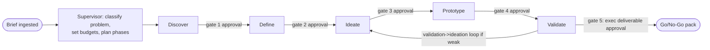

# 17 — Example Execution (End-to-End Walkthrough)

> **EDT Platform** (`edt_platform`) — a full, concrete trace of the five-phase Design Thinking lifecycle on one real business problem, showing supervisor planning, agent orchestration, intermediate outputs, a reflection/critique loop, a human-approval checkpoint, a validation→ideation feedback loop, cost/token accounting, and confidence scores.
>
> **Related docs:** [`02` Orchestration] · [`04` Agent Layer] · [`16` Evaluation](./16-evaluation-framework.md) · [`18` Sample Outputs](./18-sample-outputs.md) (the polished artifacts referenced here)

---

## 0. The Brief

> **Client:** *Northwind Regional Bank* — a US regional bank, ~2.4M retail customers, strong with 45+ but weak with under-30s.
> **Problem as stated by sponsor (VP, Retail Deposits):** *"We're losing Gen-Z customers and our deposit growth is stalling. Under-30 customers open an account, use it as a pass-through, and leave within 18 months. Reduce Gen-Z churn and grow low-cost deposits — without a fintech acquisition."*
> **Constraints:** core banking is FIS (legacy), 9-month delivery window, must satisfy US banking compliance (Reg E, FDIC, BSA/AML, fair-lending), budget cap $6M.
> **Run config:** `run_id = edt-2026-nwb-genz-001`, tenant `northwind`, data-residency `us-east-1`, budget `$120` LLM spend, deliverable due for a Go/No-Go steering committee.

---

## 1. Supervisor Plan (Orchestration Layer)

The **Supervisor Agent** + **Workflow Planner** parse the brief, retrieve any prior Northwind context from memory (Neo4j + Qdrant), and emit a **LangGraph** execution plan wrapped in a **Temporal** durable workflow (so the 5-phase run survives restarts, retries, and human waits).



**Supervisor's plan (abridged, as emitted):**

```json
{
  "run_id": "edt-2026-nwb-genz-001",
  "problem_class": "retention + low-cost-deposit-growth, regulated (banking)",
  "phases": ["discover","define","ideate","prototype","validate"],
  "model_routing": {"extraction":"claude-haiku-4-5","default":"claude-sonnet-5","deep_reason_critique":"claude-opus-4-8"},
  "budgets": {"usd_total": 120, "per_phase_tokens": 900000},
  "gates": ["after_each_phase","before_executive_deliverable"],
  "risk_flags": ["regulated_domain -> Compliance+ResponsibleAI agents mandatory",
                 "no_fintech_acquisition -> constraint agent to enforce"],
  "success_criteria": ["Go/No-Go with ROI + risk register",
                       "concept validated against simulated Gen-Z personas"]
}
```

The Supervisor mandates the **Compliance**, **Security**, and **Responsible-AI** cross-cutting agents on every phase because the domain is regulated.

---

## 2. Phase 1 — Discover

**Phase agent:** `DiscoverPhaseAgent`. It plans a fan-out of worker agents, most consuming Kafka task topics and scaling via KEDA.

| Worker agent | Model tier | Input | Sample intermediate output |
|---|---|---|---|
| Problem Discovery | Sonnet 5 | brief | reframes "losing Gen-Z" → 3 candidate problem spaces |
| Customer Research (RAG) | Sonnet 5 | anonymized transaction + CRM extract, survey data | "Under-30 median balance $340 vs $2,900 for 35–50; 62% churn < 18mo" |
| Voice of Customer (RAG) | Sonnet 5 | app-store reviews, NPS verbatims | theme clusters: *fees feel punitive*, *app feels dated*, *no reason to keep money here* |
| Support Ticket Analyzer | Haiku 4.5 | 40k tickets | top intents: overdraft disputes (23%), transfer speed (18%), card controls (11%) |
| Market Research (RAG+GraphRAG) | Sonnet 5 | market reports | Gen-Z neobank adoption 41%; primary-account switching driven by *goal-based saving* + *early payday* |
| Competitive Intelligence | Sonnet 5 | neobank teardown | Chime early-pay, Cash App round-ups, Step teen cards |
| Persona Builder | Sonnet 5 | synthesized research | **Persona: "Maya, 22"** (see [`18` §1](./18-sample-outputs.md)) — confidence 0.71 → triggers reflection (below) |
| Journey Mapping | Sonnet 5 | persona + tickets | onboarding→pass-through→silent-churn map ([`18` §2](./18-sample-outputs.md)) |
| Research Synthesizer | Opus 4.8 | all above | Insight pack + 6 opportunity areas |

### 2.1 Reflection / Critique loop fires (concrete)

The **Persona Builder** emits *Maya v1* with `confidence = 0.71`, below its `0.80` threshold. Per the BaseAgent contract, `reflect()` → `critique()` runs. The **Critic agent** applies the persona rubric ([`16` §8](./16-evaluation-framework.md)) and returns:

```json
{
  "rubric_id": "persona.v3", "score": 0.68,
  "failed_criteria": ["grounding: 'checks phone 90x/day' is not in the research",
                      "specificity: goals read generic ('wants financial freedom')"],
  "guidance": "Remove fabricated stat. Ground goals in VoC theme 'no reason to keep money here' and Market finding 'goal-based saving'. Add a concrete money moment."
}
```

`self_correct()` re-runs Persona Builder with the critique injected. **Maya v2** removes the invented stat, ties goals to evidence (early-payday, goal-pots), adds a concrete moment ("gets paid Friday, moves it all to Cash App by Saturday"). New `confidence = 0.86` → passes. The whole loop cost ~14k extra tokens and 22s — logged to Langfuse and visible in the trace as a `persona.reflect` span.

### 2.2 Human-approval checkpoint — Gate 1

`edt.approval.requested` CloudEvent → the sponsor's **Approval Inbox**. Reviewer (VP Retail Deposits) sees Maya v2, the journey map, and the 6 opportunity areas. She **approves with one edit**: "Add a segment note — a chunk of our under-30s are *thin-file* (no credit history); that's a constraint and an opportunity." The edit is captured as labeled eval data ([`16` §10](./16-evaluation-framework.md)) and appended to the persona. Gate 1 passes at **T+18 min**.

**Discover deliverables:** Problem space, Persona *Maya v2*, Journey Map, Insight pack, 6 Opportunity Areas. Aggregate phase confidence **0.84**.

---

## 3. Phase 2 — Define

**Phase agent:** `DefinePhaseAgent`.

| Worker | Output |
|---|---|
| Insight Synthesizer / Affinity Mapping | clusters 40+ insights → 6 themes |
| Root Cause + 5-Why + Fishbone | root cause of pass-through behavior: *"No emotional or functional reason to keep balance here; competitors give a job-to-be-done (save toward a goal, get paid early) that Northwind doesn't."* |
| Problem Statement | see [`18` §3](./18-sample-outputs.md) |
| JTBD | 3 statements ([`18` §4](./18-sample-outputs.md)) — e.g. *"When I get paid, I want my money to start working toward a goal immediately, so I feel in control instead of watching it drain on fees."* |
| POV + HMW Generator | 5 HMWs ([`18` §5](./18-sample-outputs.md)) |
| Opportunity Prioritization | Opportunity Matrix ([`18` §6](./18-sample-outputs.md)) — top: *goal-based saving pots* + *early-payday* |
| Constraint agent | enforces "no fintech acquisition", FIS core limits, thin-file segment |
| Risk Discovery | early flags: Reg E on early-pay, fair-lending on any credit feature |

**Gate 2:** approved with no edits at **T+41 min**. Phase confidence **0.87**. The Define outputs are written to Neo4j (Problem→Insight→Opportunity→JTBD edges) so downstream phases and *future* Northwind runs can reuse them (semantic + graph memory).

---

## 4. Phase 3 — Ideate

**Phase agent:** `IdeatePhaseAgent`, using divergent reasoning (Tree-of-Thought) then convergence.

- **Divergence:** Brainstorm, SCAMPER, TRIZ, First-Principles, Blue-Ocean, Reverse-Thinking, AI-Opportunity, and Business-Model agents generate **118 raw ideas** against the top opportunities.
- **Convergence:** Idea Cluster → 14 clusters; Idea Merger combines duplicates; **Idea Scoring** applies the Ideate rubric ([`16` §8](./16-evaluation-framework.md)); **Idea Critic** stress-tests feasibility vs. FIS core; **Idea Ranking/Selector** picks the top set.

**Idea Catalogue excerpt (10 of 118, scored):** see [`18` §7](./18-sample-outputs.md). Top-ranked concept:

> **"GoalPots + PayDay Boost"** — automatic goal-based saving pots with round-ups, plus an opt-in early-payday feature (2-day-early direct-deposit posting) and a thin-file-friendly secured "build" card. Round-ups and goal-completion nudges create a reason to keep balances; early-pay wins primacy.

Idea Critic downgrades two flashy ideas (a crypto-yield pot — compliance-blocked; a BNPL feature — fair-lending risk, off-constraint). Selected concept confidence **0.83**.

**Gate 3:** approved at **T+1h 06m**. The steering sponsor asks to "make sure we test pricing sensitivity" — captured as guidance for Validate.

---

## 5. Phase 4 — Prototype

**Phase agent:** `PrototypePhaseAgent`.

| Worker | Output |
|---|---|
| Solution Architect + Architecture | reference architecture: event-driven "Goals Service" beside FIS core via an anti-corruption layer; see [`18` §11](./18-sample-outputs.md) |
| UX Architect + User Flow + Wireframe + Figma Generator | onboarding→create-pot→round-up→goal-hit flow; wireframes + Figma spec |
| PRD Generator + User Story + Acceptance Criteria | **PRD excerpt with Gherkin acceptance criteria** — see [`18` §9](./18-sample-outputs.md) |
| API Designer + Data Model | OpenAPI for Goals/Pots/Round-ups + payday-boost eligibility — see [`18` §10](./18-sample-outputs.md) |
| React/Prototype Generator | clickable prototype bundle to S3 |

Security + Compliance agents review inline: early-pay eligibility must have clear Reg E disclosures; secured-card path documented for fair-lending. PRD completeness rubric scores **0.88**. **Gate 4** approved at **T+1h 48m**.

---

## 6. Phase 5 — Validate (with the validation→ideation feedback loop)

**Phase agent:** `ValidatePhaseAgent`.

1. **Customer Simulator / Persona Simulation** runs *Maya v2* and 4 sibling Gen-Z personas through the prototype; **Survey/Interview Generators** produce instruments; **Feedback Analyzer** synthesizes.
2. **First result is mixed:** simulated Gen-Z love GoalPots + early-pay (desirability 0.86) but the **secured "build" card** confuses them ("why would I put down a deposit?") and **pricing** of a proposed $3/mo "Boost" subscription triggers churn intent in the sim (they expect it free, like Chime).

### 6.1 Validation → Ideation feedback loop (fires)

The **ValidatePhaseAgent** confidence on the *monetization* sub-concept drops to **0.58** — below gate. Rather than pushing a weak concept to the exec pack, the Supervisor's LangGraph edge routes **back into Ideate** with a scoped brief:

```json
{"loop": "validate->ideate", "reason": "pricing + secured-card weak in sim",
 "scope": "re-ideate monetization and thin-file onramp ONLY; keep GoalPots + early-pay",
 "constraints": ["free core tier", "thin-file friendly", "no BNPL"]}
```

Ideate (scoped) returns two revisions: (a) **drop the $3 subscription**; monetize via interchange + higher primary-account deposit balances + optional $2 instant-early-pay tip (à la Chime, optional/free-default); (b) replace secured card with a **"Round-Up Boost" match** (bank matches 5% of goal round-ups up to $5/mo) as the retention hook. Re-validation: desirability **0.88**, monetization confidence **0.79**, projected churn reduction improves. Loop cost: one extra Ideate+Validate mini-cycle, ~180k tokens, ~6 min.

3. **Financial Analysis / Pricing / ROI** build the business case ([`18` §12](./18-sample-outputs.md)); **Risk / Compliance / Responsible-AI** produce the risk register ([`18` §13](./18-sample-outputs.md)); **Go/No-Go** + **Recommendation** + **Roadmap** finalize.

**Go recommendation** with conditions (see [`18` §14–16](./18-sample-outputs.md)). Validate phase confidence **0.85**.

### 6.2 Gate 5 — Executive deliverable approval

The full Go/No-Go pack (Executive Summary, Business Case, ROI model, Risk Register, Roadmap) goes to the steering committee via the Approval Inbox. Non-repudiable approval logged. **Run complete at T+2h 31m.**

---

## 7. Timeline / Trace

```mermaid
gantt
  title edt-2026-nwb-genz-001 — run trace
  dateFormat  HH:mm
  axisFormat  %H:%M
  section Discover
  Fan-out research + persona          :d1, 00:00, 12m
  Persona reflect/critique loop       :active, d2, 00:12, 4m
  Gate 1 approval (1 edit)            :milestone, 00:18, 0m
  section Define
  Root cause -> HMW -> matrix          :df1, 00:18, 20m
  Gate 2 approval                      :milestone, 00:41, 0m
  section Ideate
  118 ideas -> converge -> select      :i1, 00:41, 22m
  Gate 3 approval                      :milestone, 01:06, 0m
  section Prototype
  PRD + arch + API + prototype         :p1, 01:06, 40m
  Gate 4 approval                      :milestone, 01:48, 0m
  section Validate
  Persona sim (mixed result)           :v1, 01:48, 14m
  Validate->Ideate monetization loop   :crit, v2, 02:02, 6m
  Business case + ROI + risk + Go/NoGo :v3, 02:08, 18m
  Gate 5 exec approval                 :milestone, 02:31, 0m
```



Each bar is an OTel trace span; each agent turn is a Langfuse generation with prompt/model/tokens/cost. The reflection loop and the validate→ideate loop are visible as extra spans (transparency for auditors).

---

## 8. Token / Cost Accounting (sketch)

Model routing keeps Opus for reasoning-heavy steps only; extraction runs on Haiku. Illustrative accounting for the run:

| Phase | Dominant tiers | ~Input tok | ~Output tok | ~Cost (USD) |
|---|---|---|---|---|
| Discover (14 agents + reflect loop) | Haiku/Sonnet, Opus for synth | 1.9M | 240k | $28 |
| Define | Sonnet, Opus (root cause) | 0.7M | 120k | $14 |
| Ideate (118 ideas + convergence) | Sonnet, Opus (critic) | 1.4M | 300k | $24 |
| Prototype (PRD/arch/API) | Sonnet, Opus (arch review) | 1.1M | 260k | $21 |
| Validate + validate→ideate loop | Sonnet, Opus (ROI/Go-NoGo) | 1.3M | 210k | $22 |
| Cross-cutting (critic/quality/compliance/judge) | mixed | 0.6M | 90k | $9 |
| **Total** | | **~7.0M** | **~1.22M** | **~$118** |

Under the **$120 budget** (Cost/Token-Optimization agent enforced the cap; prompt caching of the ontology + retrieved context saved an estimated ~30%). Full cost breakdown attributed per agent/model in Langfuse + Kubecost ([`15` §11](./15-deployment-architecture.md)).

---

## 9. Confidence Scores (rollup)

| Artifact | Final confidence | Notes |
|---|---|---|
| Persona (Maya v2) | 0.86 | after reflect/critique loop (v1 was 0.71) |
| Journey Map | 0.83 | |
| Problem Statement | 0.89 | |
| HMW set | 0.82 | |
| Opportunity Matrix | 0.85 | |
| Selected concept (GoalPots + PayDay Boost, revised) | 0.84 | after validate→ideate loop |
| PRD | 0.88 | |
| Architecture / API | 0.85 | |
| Business Case / ROI | 0.83 | sensitivity analysis included |
| Go/No-Go recommendation | 0.86 | **Go, with 3 conditions** |

Every score is judge-panel-backed and calibrated ([`16` §6, §9](./16-evaluation-framework.md)); anything that had dipped below gate triggered a reflect/loop rather than shipping weak.

---

## 10. Final Deliverables

Persona card · Journey Map · Problem Statement · JTBD · HMW set · Opportunity Matrix · Idea Catalogue · PRD (with Gherkin acceptance criteria) · API spec · Architecture · Business Case + ROI model · Risk Register · Go/No-Go · Roadmap · **Executive Summary**. All rendered polished in **[`18` Sample Outputs](./18-sample-outputs.md)**.

**Headline result the platform produced:** *Go* on **"GoalPots + PayDay Boost + Round-Up Boost match"**, free core tier, 9-month phased delivery within the $6M cap, projected to cut under-30 18-month churn from 62% → ~41% and grow low-cost deposits by ~$180M over 3 years (see the business case for assumptions and sensitivity).

---

## 11. What This Run Demonstrated

- **Supervisor-driven planning** with model routing and budget enforcement.
- **Agent fan-out** across all five phases with typed artifacts and memory writes.
- **A reflection/critique loop** correcting a hallucinated persona stat before a human ever saw it.
- **Human-approval gates** with a real edit captured as eval data.
- **A validation→ideation feedback loop** that killed a weak monetization concept instead of shipping it.
- **Full traceability** — trace, token/cost, confidence, and rubric rationale for every step (auditable, [`16`](./16-evaluation-framework.md)).
