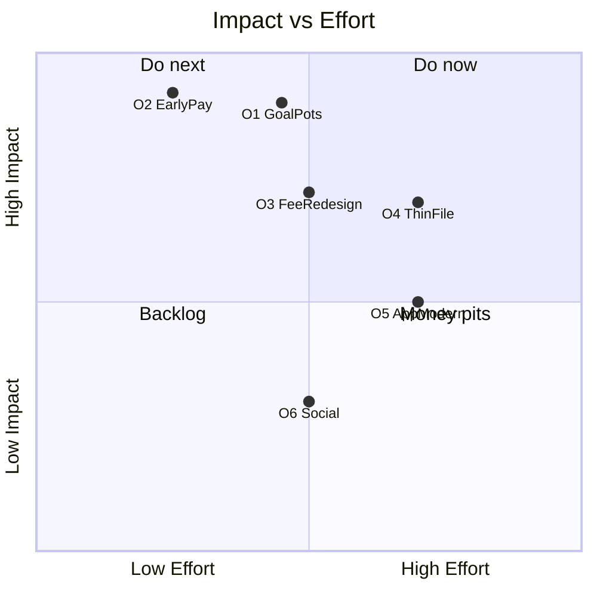
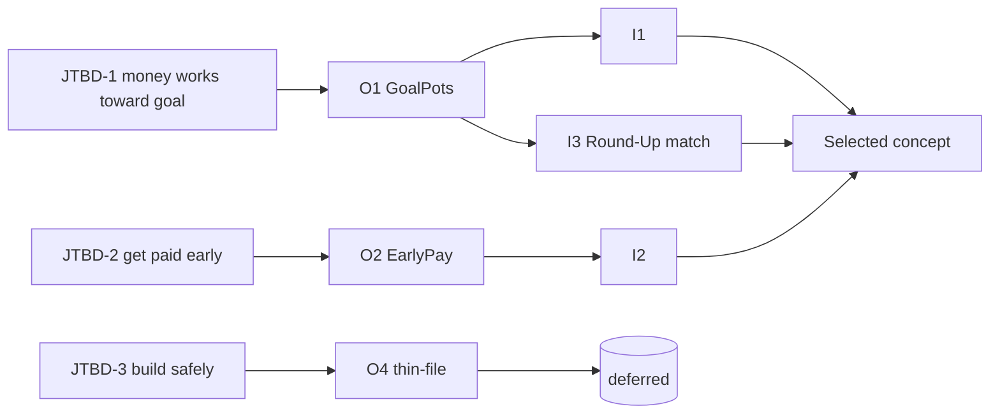
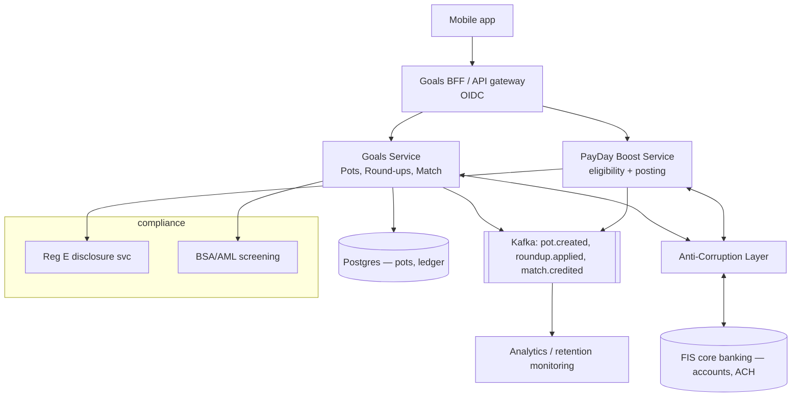
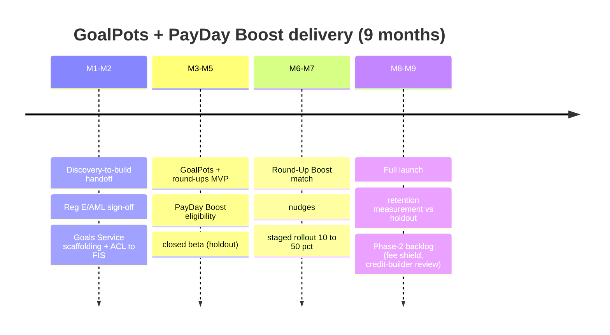

# 18 — Sample Outputs

> **EDT Platform** (`edt_platform`) — realistic, polished sample artifacts for the *Northwind Regional Bank / Gen-Z retention* case introduced in [`17` Example Execution](./17-example-execution.md). These are illustrative of the typed artifacts the platform emits (each has id/version/confidence/provenance in the real system; shown abridged for readability).
>
> **Related docs:** [`16` Evaluation](./16-evaluation-framework.md) (the rubrics that scored these) · [`17` Example Execution](./17-example-execution.md)

---

## 1. Persona Card — "Maya, 22" (v2)

| Field | Value |
|---|---|
| **Name / archetype** | Maya Ellison, 22 — *"The Pass-Through Saver"* |
| **Segment** | Gen-Z, urban, mobile-first, early-career; ~30% of segment is **thin-file** (no credit history) |
| **Context** | First job (retail coordinator, $2,650/mo), lives with a roommate, gig income on weekends |
| **Primary account behavior** | Opens Northwind checking for direct deposit; within a day moves most funds to Cash App / a neobank; keeps ~$340 average balance |
| **Goals** | Save toward a specific goal (Japan trip, emergency $1k); feel in control; get paid as early as possible |
| **Pains** | Fees feel punitive (overdraft, minimums); app feels dated; *"no reason to keep my money here"* |
| **Jobs-to-be-done** | (1) Make money start working toward a goal immediately; (2) get paid early; (3) avoid surprise fees |
| **Money moment** | *"I get paid Friday and it's gone to Cash App by Saturday morning."* |
| **Tech** | Lives in the phone; expects instant, Chime/Cash-App-grade UX; discovers via TikTok |
| **Quote** | *"Your app is where my paycheck lands. It's not where my money lives."* |
| **Evidence** | VoC theme *no-reason-to-stay*; Market *goal-based saving + early-pay*; Transaction data *median $340 balance, 62% churn <18mo* |
| **Confidence** | **0.86** (v1 = 0.71, corrected by reflect/critique loop — [`17` §2.1](./17-example-execution.md)) |

---

## 2. Journey Map — Current-State (Maya)

```mermaid
journey
  title Maya's current relationship with Northwind (0-18 months)
  section Onboard
    Opens account for direct deposit: 4: Maya
    Waits 2 days for funds to post: 2: Maya
  section First weeks
    Gets paid, moves money out same day: 2: Maya
    Hit with a surprise overdraft fee: 1: Maya
  section Pass-through months
    Uses Northwind only as a landing pad: 2: Maya
    Sees no goals, no rewards, dated app: 2: Maya
  section Silent churn
    Balance drifts to near zero: 1: Maya
    Stops logging in; account dormant: 1: Maya
```

| Stage | Doing | Thinking | Feeling | Pain point | Opportunity |
|---|---|---|---|---|---|
| Onboard | Sets up direct deposit | "Fine, my paycheck needs somewhere to land" | Neutral | 2-day posting delay | **Early-payday** |
| First weeks | Moves funds out; hit by fee | "Why am I being punished?" | Frustrated | Punitive fees | Fee redesign, alerts |
| Pass-through | Uses as landing pad | "This app does nothing for me" | Indifferent | No reason to stay | **Goal pots, round-ups** |
| Silent churn | Stops engaging | "Forgot this was even open" | Disengaged | No hook, dated UX | Nudges, matched savings |

---

## 3. Problem Statement

> **Under-30 customers** need **a reason to keep their money at Northwind and a sense of progress toward their goals**, because **today the account is a fee-prone pass-through with no functional or emotional hook** — as evidenced by a **median balance of $340, 62% churn within 18 months, and VoC verbatims dominated by "no reason to keep my money here."**
>
> We will consider this solved when under-30 **primary-account retention at 18 months improves from 38% to ≥ 60%** and **average low-cost deposit balances in the segment grow materially**, without a fintech acquisition and within US banking compliance.

*Structure: user + need + insight + measurable success. Non-solutioning. Confidence 0.89.*

---

## 4. Jobs-To-Be-Done

1. **When I get paid, I want my money to immediately start working toward a goal, so I feel in control instead of watching it drain on fees.**
2. **When I have income, I want access to it as early as possible, so I'm not stuck waiting while bills are due.**
3. **When I'm managing a thin or new financial life, I want to build credit and savings safely without penalties, so I can grow without fear of surprise fees.**

---

## 5. How-Might-We Statements

1. **HMW** give Gen-Z a reason to keep their balance at Northwind by turning saving into visible progress toward a personal goal?
2. **HMW** make payday feel like a win — earlier access and an instant sense of "my money is now working"?
3. **HMW** redesign fees so they feel fair and predictable rather than punitive to a thin-margin customer?
4. **HMW** help thin-file Gen-Z build credit and savings safely, without penalties, inside their primary account?
5. **HMW** make the primary-account experience feel as modern and rewarding as the neobank apps they already use?

---

## 6. Opportunity Matrix

| # | Opportunity | Impact (1–5) | Effort (1–5) | Evidence | Priority |
|---|---|---|---|---|---|
| O1 | Goal-based saving pots + round-ups | 5 | 3 | VoC, Market, JTBD-1 | **Do now** |
| O2 | Early-payday (2-day-early posting) | 5 | 2 | Competitive (Chime), JTBD-2 | **Do now** |
| O3 | Fee redesign (predictable, no surprise OD) | 4 | 3 | Tickets 23% OD disputes | Do next |
| O4 | Thin-file build path (secured/credit-builder) | 4 | 4 | Segment note (Gate 1 edit), JTBD-3 | Do next |
| O5 | App modernization / rewards feel | 3 | 4 | VoC "dated app" | Later |
| O6 | Social/goal-sharing features | 2 | 3 | Weak evidence | Backlog |



---

## 7. Idea Catalogue (excerpt — 10 of 118)

Scored on the Ideate rubric ([`16` §8](./16-evaluation-framework.md)); each dimension 0–1, weighted composite.

| # | Idea | Novelty | Feasibility | Desirability | Strategic fit | **Score** | Verdict |
|---|---|---|---|---|---|---|---|
| I1 | **GoalPots** — named saving pots w/ round-ups & progress bars | 0.7 | 0.85 | 0.9 | 0.95 | **0.86** | Selected |
| I2 | **PayDay Boost** — 2-day-early direct-deposit posting | 0.6 | 0.9 | 0.92 | 0.9 | **0.84** | Selected |
| I3 | **Round-Up Boost match** — bank matches 5% of round-ups (≤$5/mo) | 0.75 | 0.8 | 0.88 | 0.85 | **0.82** | Selected (retention hook) |
| I4 | Goal-completion nudges + TikTok-native share cards | 0.65 | 0.8 | 0.75 | 0.7 | 0.72 | Phase 2 |
| I5 | Credit-builder secured card | 0.5 | 0.6 | 0.55 | 0.7 | 0.58 | **Deferred** (confusing in sim) |
| I6 | $3/mo "Boost" subscription bundle | 0.4 | 0.85 | 0.35 | 0.6 | 0.48 | **Killed** (pricing sim) |
| I7 | Fee "shield" — one fee waiver/quarter | 0.55 | 0.85 | 0.8 | 0.75 | 0.75 | Phase 2 |
| I8 | Crypto-yield pot | 0.7 | 0.3 | 0.6 | 0.3 | 0.35 | **Blocked** (compliance) |
| I9 | BNPL at checkout | 0.6 | 0.5 | 0.65 | 0.3 | 0.40 | **Blocked** (fair-lending/off-constraint) |
| I10 | Gamified savings streaks | 0.6 | 0.75 | 0.7 | 0.65 | 0.68 | Phase 2 |

**Selected concept:** *GoalPots + PayDay Boost + Round-Up Boost match*, free core tier (post validate→ideate loop, [`17` §6.1](./17-example-execution.md)).

---

## 8. Opportunity → Concept Traceability



---

## 9. PRD Excerpt — GoalPots

**Product:** Northwind GoalPots · **Owner:** Retail Deposits · **Status:** Draft for build · **Confidence 0.88**

**Objective:** Give under-30 customers a reason to keep balances at Northwind by turning saving into visible, automated progress toward personal goals.

**In scope (MVP):** create/name/fund pots; automatic round-ups on card spend; 5% round-up match (≤$5/mo); progress visualization; goal-completion nudge.
**Out of scope (MVP):** shared/social pots, crypto, credit-builder card.

**Non-functional:** p95 pot-balance update < 500ms; 99.9% availability; Reg E disclosures on all money movement; PII encrypted at rest (KMS) and in transit.

### User Stories + Acceptance Criteria (Gherkin)

**US-1 — Create a goal pot**
> *As* Maya, *I want* to create a named savings pot with a target amount and date, *so that* I can see progress toward my goal.

```gherkin
Feature: Create a goal pot
  Scenario: Customer creates a valid pot
    Given I am an authenticated Northwind customer with a checking account
    When I create a pot named "Japan Trip" with target $2,000 by "2026-12-01"
    Then the pot is created with balance $0
    And I see a progress bar at 0% with target $2,000
    And an "edt.prototype.pot.created" event is emitted

  Scenario: Reject invalid target
    Given I am creating a pot
    When I set the target amount to $0 or a past target date
    Then creation is rejected with a clear validation message
```

**US-2 — Automatic round-ups with match**
> *As* Maya, *I want* my card spend rounded up into a pot and matched, *so that* saving is effortless and rewarding.

```gherkin
Feature: Round-up with 5% match
  Scenario: Round-up applied and matched within monthly cap
    Given round-ups are enabled on my "Japan Trip" pot
    And my month-to-date match total is $2.00
    When I spend $4.30 on my Northwind card
    Then $0.70 is transferred from checking to the pot
    And a match of $0.035 rounded to $0.04 is credited
    And the match respects the $5.00 monthly cap

  Scenario: Monthly match cap reached
    Given my month-to-date match total is $5.00
    When a new round-up occurs
    Then the round-up transfers but no additional match is credited
```

**US-3 — PayDay Boost eligibility**
```gherkin
Feature: Early direct-deposit posting
  Scenario: Eligible customer is paid early
    Given I have received a qualifying ACH direct deposit for 2 consecutive cycles
    When the employer's ACH file arrives 2 business days before settlement
    Then funds are made available up to 2 days early
    And a Reg E-compliant disclosure is shown on first use
```

---

## 10. API Spec Excerpt (OpenAPI 3.1)

```yaml
openapi: 3.1.0
info: { title: Northwind Goals API, version: 0.3.0 }
paths:
  /v1/pots:
    post:
      summary: Create a goal pot
      security: [{ oidc: [pots:write] }]
      requestBody:
        content: { application/json: { schema: { $ref: '#/components/schemas/PotCreate' } } }
      responses:
        '201': { description: Created, content: { application/json: { schema: { $ref: '#/components/schemas/Pot' } } } }
        '422': { description: Validation error }
  /v1/pots/{potId}/roundups:
    post:
      summary: Toggle round-ups (with optional match)
      security: [{ oidc: [pots:write] }]
      responses: { '200': { description: OK } }
components:
  schemas:
    PotCreate:
      type: object
      required: [name, targetAmount, targetDate]
      properties:
        name:        { type: string, maxLength: 40 }
        targetAmount:{ type: number, exclusiveMinimum: 0 }
        targetDate:  { type: string, format: date }
    Pot:
      allOf:
        - $ref: '#/components/schemas/PotCreate'
        - type: object
          properties:
            id:       { type: string, format: uuid }
            balance:  { type: number, default: 0 }
            progress: { type: number, minimum: 0, maximum: 1 }
  securitySchemes:
    oidc: { type: openIdConnect, openIdConnectUrl: https://id.northwind/realms/edt/.well-known/openid-configuration }
```

---

## 11. Architecture Excerpt

Event-driven **Goals Service** alongside the legacy **FIS core** via an anti-corruption layer — no rip-and-replace (respects the constraint).



**Key decisions:** strangler-fig around FIS; round-up match posted to a segregated ledger; idempotent event processing (exactly-once via Kafka + outbox); all money movement produces an immutable audit event.

---

## 12. Business Case + Financial Model

**Assumptions (transparent, sensitivity-tested):** under-30 base 480k; today 18-mo retention 38% → target 60%; incremental avg low-cost deposit balance +$620/retained customer; net interest margin on low-cost deposits 2.6%; interchange uplift $18/active/yr; program cost = build $4.2M + run $1.1M/yr + match payout.

| Metric | Yr 1 | Yr 2 | Yr 3 |
|---|---:|---:|---:|
| Retained under-30 (incremental) | 34,000 | 78,000 | 112,000 |
| Incremental low-cost deposits ($M) | 21 | 88 | 180 |
| Net interest income ($M) | 0.5 | 2.3 | 4.7 |
| Interchange uplift ($M) | 0.6 | 1.4 | 2.0 |
| Round-up match payout ($M) | (0.4) | (0.9) | (1.3) |
| Run cost ($M) | (1.1) | (1.1) | (1.2) |
| **Net contribution ($M)** | **(0.4)** | **1.7** | **4.2** |
| Cumulative (incl. $4.2M build) | (4.6) | (2.9) | 1.3 |

- **Breakeven:** early Year 3. **3-yr cumulative net:** +$1.3M and a $180M low-cost deposit book (the strategic prize — funds lending cheaply).
- **ROI (3-yr):** ~+24% on the ~$5.3M invested capital, *excluding* the balance-sheet value of $180M in low-cost deposits (which, valued at NIM, dominates the real return).
- **Sensitivity:** if retention lifts only to 50% (not 60%), Year-3 net contribution falls to ~$2.6M, still positive; if match uptake is 2× modeled, run cost +$0.6M/yr — still breakeven within the window.

---

## 13. Risk Register

| ID | Risk | Cat | Likelihood | Impact | Mitigation | Owner |
|---|---|---|---|---|---|---|
| R1 | Reg E non-compliance on early-pay | Compliance | Med | High | Legal-reviewed disclosures; compliance agent gate; audit events | Compliance |
| R2 | FIS integration slips schedule | Delivery | Med | High | Anti-corruption layer isolates core; phased release; buffer sprint | Eng |
| R3 | Round-up match abused / cost overrun | Financial | Med | Med | $5/mo cap; anomaly monitoring; kill-switch | Product/Finance |
| R4 | Low adoption (feature ignored) | Market | Med | High | Onboarding nudges; validated in sim (desirability 0.88); staged rollout w/ holdout | Growth |
| R5 | Fair-lending exposure if credit-builder added | Regulatory | Low (deferred) | High | Deferred from MVP; separate fair-lending review before Phase 2 | Compliance |
| R6 | BSA/AML gaps on new money flows | Compliance | Low | High | AML screening in Goals Service; SAR pipeline reuse | Risk |
| R7 | Data privacy (transaction data for personalization) | Privacy | Low | Med | Minimization, KMS encryption, consent, GDPR/CCPA posture ([`20`](./20-production-readiness-checklist.md)) | Privacy |

---

## 14. Go / No-Go Recommendation

> ### GO — with three conditions
> The concept is **desirable** (simulated Gen-Z desirability 0.88), **feasible** on the existing FIS core via an anti-corruption layer within the 9-month window, and **viable** (breakeven early Year 3, $180M low-cost deposit prize). It respects every constraint: no fintech acquisition, within the $6M cap, and regulator-defensible.
>
> **Conditions:**
> 1. **Free core tier** — no subscription (the $3/mo bundle was killed in validation; [`17` §6.1](./17-example-execution.md)).
> 2. **Reg E / BSA-AML sign-off** on early-pay and money-movement flows *before* build sprint 1.
> 3. **Staged rollout with a holdout** to measure true churn/retention lift before full launch; defer the credit-builder card to a separately-reviewed Phase 2.
>
> **Decision confidence: 0.86.**

---

## 15. Roadmap (abridged)



---

## 16. Executive Summary (one page)

> **Situation.** Northwind's under-30 customers treat us as a pass-through: median balance $340, 62% churn within 18 months, and verbatims that say plainly "no reason to keep my money here." Deposit growth is stalling as this generation banks its balances with neobanks that offer goal-based saving and early pay.
>
> **What we found.** The root cause is not price alone — it's the absence of a functional or emotional *reason to stay*. Neobanks win primacy by giving Gen-Z a job done: save toward a goal and get paid early.
>
> **What we recommend.** Launch **GoalPots + PayDay Boost + a Round-Up Boost match** on a **free core tier**: automated goal-based saving with a small savings match, plus 2-day-early direct-deposit posting. Built beside the FIS core via an anti-corruption layer — no acquisition, no rip-and-replace, within the $6M cap and 9-month window.
>
> **Why it's worth it.** Validated with simulated Gen-Z personas (desirability 0.88), the program is projected to lift 18-month under-30 retention from 38% toward 60%, grow low-cost deposits by ~$180M over three years, and break even in early Year 3 — with the deposit book itself the strategic prize.
>
> **The ask.** Approve **Go** with three conditions (free tier, compliance sign-off, staged rollout with holdout). Defer the credit-builder card to a separately-reviewed Phase 2.
>
> *Decision confidence 0.86 · full evidence, financial model, and risk register attached · produced by the EDT Platform, run `edt-2026-nwb-genz-001`.*
