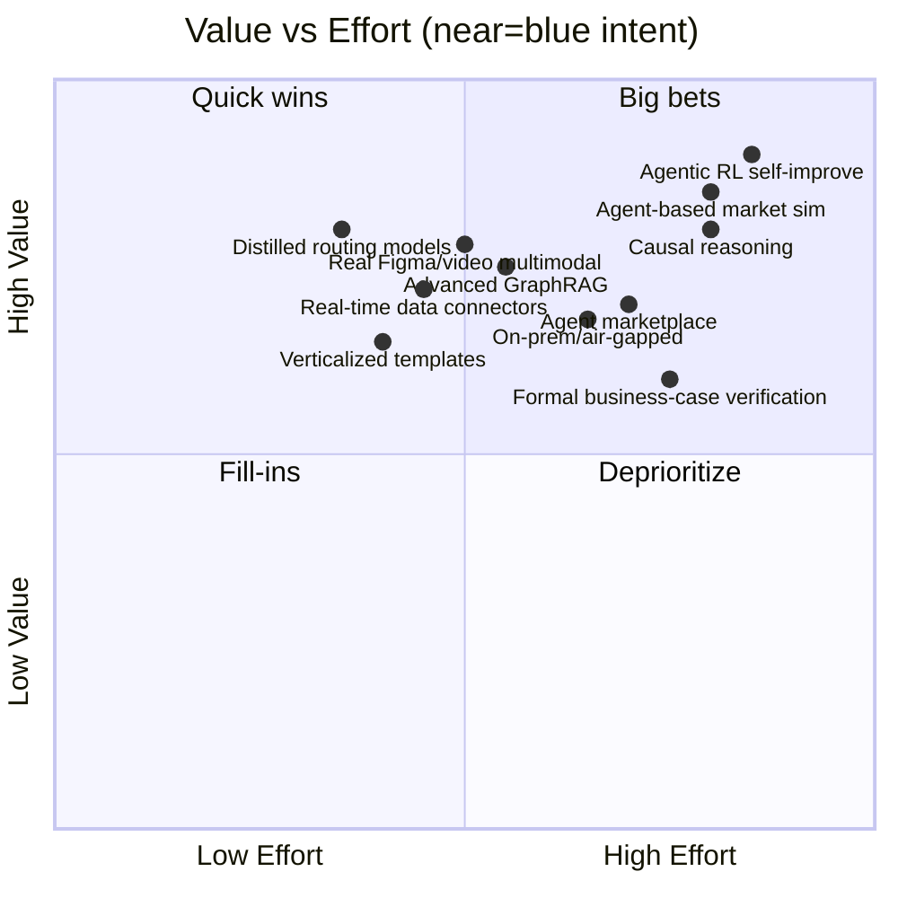
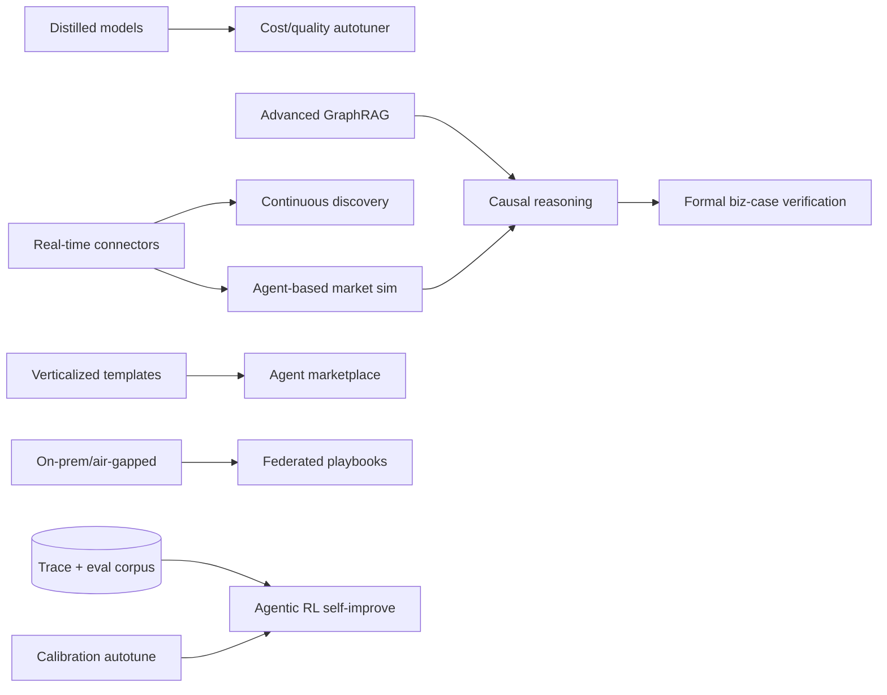

# 19 — Future Enhancements

> **EDT Platform** (`edt_platform`) — prioritized roadmap of enhancements beyond the current architecture, grouped **Near / Mid / Long term** with rationale, dependencies, and rough effort.
>
> **Related docs:** [`03` Architecture] · [`15` Deployment](./15-deployment-architecture.md) · [`16` Evaluation](./16-evaluation-framework.md) · [`20` Production Readiness](./20-production-readiness-checklist.md)

---

## 0. How this roadmap is prioritized

Each item is scored on **value** (impact on output quality, cost, or moat), **effort** (eng + data + eval work), and **risk** (safety, compliance, technical uncertainty). Effort is a rough T-shirt: **S** ≤ 1 sprint, **M** ~1 quarter, **L** ~2–3 quarters, **XL** > 2 quarters + research.

---

## 1. Near-Term (next 1–2 quarters) — harden & sharpen

| # | Enhancement | Rationale | Depends on | Effort |
|---|---|---|---|---|
| N1 | **Distilled / fine-tuned routing & extraction models** | Fine-tune small models (or distill from Opus traces) for high-volume, narrow tasks — ticket classification, affinity clustering, extraction — cutting cost and latency vs. always calling frontier models. Complements existing model routing ([`15` §11](./15-deployment-architecture.md)). | Trace corpus, eval golden sets ([`16`](./16-evaluation-framework.md)) | M |
| N2 | **Real Figma & richer multimodal prototyping** | Move from Figma *spec generation* to actual Figma file creation via the Figma API/plugin, plus screenshot/vision feedback loops so the UX Architect can critique real renders. | Figma API MCP server, vision eval | M |
| N3 | **Real-time data connectors** | First-class connectors for live enterprise data — CRM (Salesforce), analytics (Snowflake/BigQuery), support (Zendesk), app-store/social — as MCP servers, so Discover runs on *current* data, not stale extracts. | MCP server framework, Tool Registry, governance/PII ([`20`](./20-production-readiness-checklist.md)) | M |
| N4 | **Verticalized templates** | Pre-built phase playbooks, ontologies, personas, rubrics, and compliance profiles per vertical (banking, insurance, healthcare, retail). Faster time-to-value; better grounding. The Northwind run ([`17`](./17-example-execution.md)) becomes a reusable *banking* template. | Procedural memory / playbook registry | S–M |
| N5 | **Confidence-calibration auto-tuning** | Close the loop from [`16` §9](./16-evaluation-framework.md): auto-adjust per-agent confidence thresholds and escalation rules from observed calibration error. | Online eval store | S |
| N6 | **Cost/quality Pareto autotuner** | Automatically search model-routing + retrieval-depth configs against eval + cost to sit on the efficient frontier per phase. | Eval harness, FinOps telemetry | M |

---

## 2. Mid-Term (2–4 quarters) — differentiate

| # | Enhancement | Rationale | Depends on | Effort |
|---|---|---|---|---|
| M1 | **Advanced GraphRAG** | Community detection, multi-hop reasoning, and temporal knowledge graphs over Neo4j so agents reason across the *entire* portfolio of past runs (entities: Problem/Persona/Insight/Opportunity/Idea/Risk). Turns cross-project memory into a genuine moat. | Neo4j memory, GraphRAG pipeline | L |
| M2 | **Agent-based market / customer simulation** | Upgrade the Validate phase from LLM persona role-play to a **multi-agent simulated market**: hundreds of heterogeneous synthetic customers with budgets, preferences, and competitor options interacting over simulated time to estimate adoption, churn, and price elasticity with uncertainty bands. Directly strengthens business cases ([`18` §12](./18-sample-outputs.md)). | Simulation engine, calibration data, eval | XL |
| M3 | **Agent marketplace** | A registry where teams publish/version/consume specialized worker agents and MCP tools (with Agent Cards, eval scores, cost profiles, and provenance). Network effects; enterprises add proprietary agents. | A2A registry, signing, eval gating, sandboxing | L |
| M4 | **On-prem / air-gapped deployment** | For regulated/defense customers: fully self-hosted mode (Bedrock-in-VPC or on-prem model serving, no external egress), with the cloud-agnostic Terraform/Helm already in place ([`15`](./15-deployment-architecture.md)) extended for disconnected installs. | Model-serving abstraction, egress removal, offline eval | L |
| M5 | **Causal reasoning layer** | Move beyond correlation: causal graphs / do-calculus and quasi-experimental reasoning so root-cause (Define) and ROI (Validate) claims are causally, not just statistically, defensible. Counterfactual "what if we change price?" answered with a causal model, not vibes. | Data connectors, KG, simulation | XL |
| M6 | **Deeper human-AI co-creation UX** | Real-time collaborative canvas where humans and agents co-edit personas, HMWs, and idea boards, with agent suggestions inline — beyond approve/reject gates. | Console (Next.js), A2A streaming | M |

---

## 3. Long-Term (4+ quarters) — research bets

| # | Enhancement | Rationale | Depends on | Effort |
|---|---|---|---|---|
| L1 | **Agentic RL / self-improvement** | Agents that learn from outcome signals (human approvals, downstream business results, judge scores) via RL/preference optimization on their own traces — improving planning, tool selection, and critique over time. The reflection/critique loop ([`17` §2.1](./17-example-execution.md)) becomes a *learning* loop, not just a per-run correction. Highest-value, highest-risk: needs rigorous eval + safety guardrails to avoid reward hacking. | Massive trace corpus, robust eval + red-team ([`16`](./16-evaluation-framework.md)), safety review | XL |
| L2 | **Formal verification of business cases** | Encode financial models as checkable constraints (units, accounting identities, sensitivity bounds) and *formally verify* internal consistency and assumption transparency — catching cherry-picked or arithmetically impossible ROI before it reaches a steering committee. Extends the business-case rubric ([`16` §8](./16-evaluation-framework.md)) from judged to *proven*. | Model DSL, SMT/constraint solver, causal layer (M5) | L |
| L3 | **Autonomous continuous discovery** | Always-on agents monitoring live market/competitor/customer signals (via connectors N3) that proactively surface new opportunities and re-open design-thinking runs when the environment shifts — from project tool to continuous product-strategy platform. | Real-time connectors, drift monitors, cost governance | XL |
| L4 | **Self-optimizing prompt & playbook evolution** | Automated prompt/playbook search (evolutionary + eval-guided) that proposes, evals, and promotes better procedural memory — with human sign-off — turning the prompt library into a self-curating asset. | Eval harness, procedural memory, guardrails | L |
| L5 | **Multi-modal generative prototyping** | Generate not just wireframes/React but production-grade interactive prototypes, short explainer videos, and synthesized user-test footage — end-to-end concept-to-demo. | Video/image gen, vision eval, cost controls | XL |
| L6 | **Cross-enterprise federated learning of playbooks** | Privacy-preserving sharing of *anonymized* design-thinking playbooks/patterns across tenants (federated, differential-privacy) so every customer benefits from aggregate learnings without exposing proprietary data. | On-prem (M4), privacy tech, governance | XL |

---

## 4. Sequencing & dependencies

**Guiding sequence:** Near-term items make the platform *cheaper, fresher, and reusable* (and generate the trace/eval corpus everything else needs). Mid-term items build the *moat* (GraphRAG, simulation, marketplace, on-prem). Long-term items are the *research bets* (RL self-improvement, causal + formal verification, continuous discovery) that should only ship behind hardened evaluation and safety gates — see [`16`](./16-evaluation-framework.md) and [`20`](./20-production-readiness-checklist.md).

---

## 5. Explicitly out of scope (for now)

- Fully autonomous execution *without* human approval gates — the human-in-the-loop model is a deliberate safety and trust choice, not a limitation to remove.
- Building our own foundation models — we route across Anthropic tiers and distill/fine-tune small task models; frontier training is not on the roadmap.
- Replacing enterprise systems of record — EDT Platform *feeds* PRDs/business cases into existing delivery tooling; it is not an ERP/PLM.
